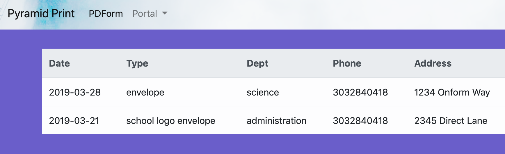
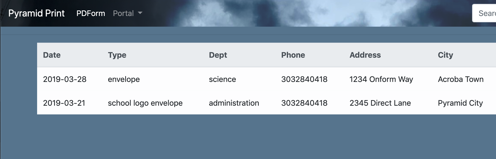

# 2019-03-24 | #021

\#100DaysofCode

- [2019-03-24 | #021](#2019-03-24--021)
  - [Today's Menu](#todays-menu)
    - [Main Course](#main-course)
    - [CUE_](#cue)
    - [Extras](#extras)
  - [Session Log](#session-log)
    - [13:21 -∫- Session Init](#1321--%E2%88%AB--session-init)
    - [13:29 -+- What's In a Rename?](#1329----whats-in-a-rename)
    - [13:35 -+- Static](#1335----static)
    - [13:55 -+- Models and Migrations](#1355----models-and-migrations)
    - [03:06 -+- Session Finite](#0306----session-finite)

---

## Today's Menu

### Main Course

    GOAL_ : Get a working prototype going for the online PDF form  
        --∫--
    TASK√01 : Python - just write something to a PDF - Hell o'Whireld!
    TASK_02 : Python - take input + place it in correct location on PDF
    TASK_03 : Write HTML forms (probably [Django forms](https://docs.djangoproject.com/en/2.1/topics/forms/)) to gather all input data
    TASK_04 : Python - save input data to database
    TASK_05 : Python - write input data to PDF (also using some CSS, JS and/or HTML)
    TASK_06 : Python - email finished PDF out to relevant parties
    TASK_07 : JavaScript - display the filled out PDF (not necessary for prototype)

--------∫--------

### CUE_  

    TASK_02 : Python - take input + place it in correct location on PDF

    TASK_00 : Set up (sub)domain for PDF form  

--------∫--------

### Extras

---

## Session Log

### 13:21 -∫- Session Init

Alrighty then...  
Time to get down to it creating the forms.

### 13:29 -+- What's In a Rename?

Realized that the app I'm building in Django still has the old name 'PDForm'.  
It's not a bad name. But I like OnForm more and want to try to rename the app.

I really hope this doesn't break anything significant...  
I chickened out and looked up how to do this without breaking everything.  
I just don't want to waste time fixing it now or later.

Found [this checklist](https://stackoverflow.com/questions/8408046/how-to-change-the-name-of-a-django-app) on stackoverflow

1. Rename app directory in project root
2. Change any references to the app in dependencies
   1. views.py
   2. urls.py
   3. manage.py
   4. settings.py
3. Edit the database table django_content_type
4. ...
5. ...

Actually...  
I remember now that I wanted to recreate the entire project in a clean directory so it can have its own distinct git repository before starting on the "production" system.

So I will name the new one OnForm and leave this one as PDForm.

    IDEA_ : Another name - OneForm  

But that does mean I have to edit yesterday's journal directory to match.  
...Meh I'll just leave it.

Keep em on their toes, y'know?

### 13:35 -+- Static  

Created the directory for static files like .css and such.

    $ mkdir -p static/pdform/;
        cd $_;
        pwd
    > /portal/pdform/static/pdform
    $ touch main.css
    > stylin!

Truly style is onform with this cloudy textured background with blended navbar.

Well...maybe not quite yet.

Found a [nice little article](https://css-tricks.com/basics-css-blend-modes/) on CSS blend modes. I've had plenty of fun with blending modes in Photoshop and Illustrator, so it's pretty sweet that they're a thing at all.

I think hard light looks the best:

    body {
        background-color: #55738E;
    }

    nav {
        background-image: url("cloudy-texture.jpeg");
        background-blend-mode: hard-light;
        background-size: cover;
    }

Ok enough of that - back to the real shizz.

### 13:55 -+- Models and Migrations

Last subject until next time.  
Unfortunately, not getting to the form part this session.

Created a model for the relevant fields.

    from django.db import models
    from django.utils import timezone

    class input_data(models.Model):
        date_requested = models.DateTimeField(default=timezone.now)
        type_choices = (
            ("envelope", "Envelope"),
            ("school logo envelope", "School Logo Envelope"),
        )
        type = models.CharField(
            max_length=80, choices=type_choices, default="envelope"
        )
        department = models.CharField(max_length=80)
        phone = models.PositiveIntegerField()
        address = models.CharField(max_length=140)
        city = models.CharField(max_length=80)
        state = models.CharField(max_length=2)
        zip_code = models.PositiveIntegerField()

Making the initial migration:

    $ python manage.py makemigrations
    > Migrations for 'pdform':
        pdform/migrations/0001_initial.py
        - Create model input_data

Checking out the SQL code:

    $ python manage.py sqlmigrate pdform 0001
    > BEGIN;
        --
        -- Create model input_data
        --
        CREATE TABLE "pdform_input_data" ("id" serial NOT NULL PRIMARY KEY, "date_requested" timestamp with time zone NOT NULL, "type" varchar(80) NOT NULL, "department" varchar(80) NOT NULL, "phone" integer NOT NULL CHECK ("phone" >= 0), "address" varchar(140) NOT NULL, "city" varchar(80) NOT NULL, "state" varchar(2) NOT NULL, "zip_code" integer NOT NULL CHECK ("zip_code" >= 0));
        COMMIT;

Running the initial migration:

    $ python manage.py migrate
    > Operations to perform:
            Apply all migrations: admin, auth, contenttypes, pdform, sessions
        Running migrations:
            Applying pdform.0001_initial... OK

Ok that's enough for now. Going to stop while I'm ahead of the errors...

### 03:06 -+- Session Finite

As usual with this type of thing, the setup takes a while.  
But it will be worth it because this app will be much more robust with these systems in place.

Progress is happening!

I'm such a progressive.

Ok I'm done.

Hasta Bañanas, Mi Amiga.
