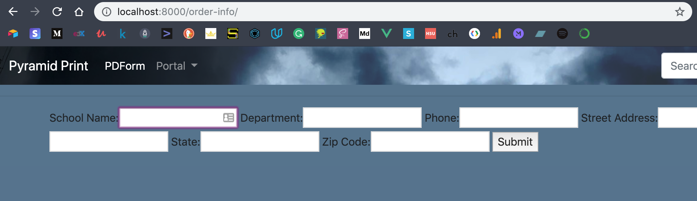
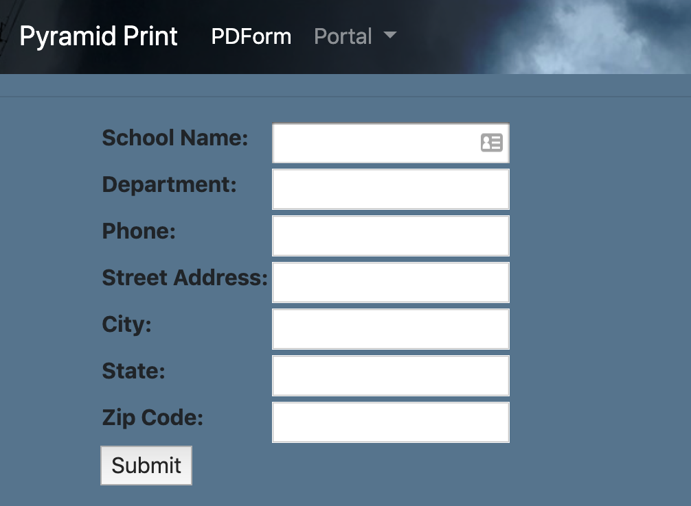

# 2019-03-26 | #023

\#100DaysofCode

- [2019-03-26 | #023](#2019-03-26--023)
  - [Today's Menu](#todays-menu)
    - [Main Course](#main-course)
    - [Extras](#extras)
  - [Session Log](#session-log)
    - [22:30 -+- Session Init](#2230----session-init)
    - [22:31 -+- DummyData](#2231----dummydata)
    - [23:13 -+- Forms](#2313----forms)
    - [23:55 -+- Rendered Form](#2355----rendered-form)
    - [00:18 -+- Stylez](#0018----stylez)
    - [00:20 -+- Session Finite](#0020----session-finite)

---

## Today's Menu

### Main Course

    GOAL_ : Add Django Forms To The Template + Save Form Data To Database
--∫--

TASK_01 : Write HTML forms into home template (probably [Django forms](https://docs.djangoproject.com/en/2.1/topics/forms/)) to gather all input data  
TASK_02 : Python - save input data to database  
TASK_03 : Python - take input + place it in correct location on PDF  

--------∫--------

### Extras

---

## Session Log

### 22:30 -+- Session Init

Initialization...  
COMPLETE!

No more chinese laundry.

---

### 22:31 -+- DummyData

Ayyye glad I went back to figure out all that database + models + admin stuff because the template successfully brought in data from the database via the FormData model and displayed it on the page. WOOP.

Formatted the date field to make it how I like it:

    {{ formdata.request_date|date:"Y-m-d H:i" }}

---

### 23:13 -+- Forms

Creating new app within the django project to deal with users.

    $ python manage.py startapp users
    > BOOM

However, I don't want to go through the process of setting up the user registration right now.

First, I'm going to add a form to the home page of the app pdform.html that takes in the information that will go on the order form. I will edit the model again once I know how the fields will best be laid out / labeled.

Created pdform/forms.py with the class:

    from django import forms

    class OrderForm(forms.Form):
        school = forms.CharField(label="School Name", max_length=80)
        department = forms.CharField(label="Department", max_length=80)
        phone = forms.CharField(label="Phone", max_length=10)
        address = forms.CharField(label="Street Address", max_length=140)
        city = forms.CharField(label="City", max_length=80)
        state = forms.CharField(label="State", max_length=2)
        zip_code = forms.CharField(label="Zip Code", max_length=5)

Added the view in views.py:

    def order_info(request):
    if request.method == "POST":
        form = OrderForm(request.POST)

        if form.is_valid():
            return HttpResponseRedirect("/submitted/")

    else:
        form = OrderForm()

    return render(request, "order_info.html", {"form": form})

Created order_info.html and added the url to urls.py.

Now to try it out on the dev server.

And BOOM! Just like that, no more Chinese laundry.

---

### 23:55 -+- Rendered Form

**Looks amazing, eh?**

Now, time to make it look and work **good**.

Some fields that could be useful to add:  

    message = forms.CharField(widget=forms.Textarea)
    email = forms.EmailField()
    cc_email = forms.EmailField()
    copy_to = forms.EmailField()

Here are [the docs](https://docs.djangoproject.com/en/2.1/topics/email/) for sending email with django.

Oh noice it looks like it's super easy to use a table to lay out the form fields:

    {{ form.as_table }}

I'm not sure about this though, I might light the first layout more...

In order to get the form even more laid, I see by looking at the rendered html (and by reading the docs) that each field is assigned an id. I'm hoping I can use those to style the forms via the static css file.

Also, I might split the form up into a few distinct forms. i.e. one for school information one for other information, and one for meta info like email and whatnot.

---

### 00:18 -+- Stylez

Gonna give the styling a go as the last thing before bed.

The CSS doesn't seem to be updating. Going to try to restart the server.

Nope—still not updating on either page of the app.

---

### 00:20 -+- Session Finite

I'll figure it out next time.
