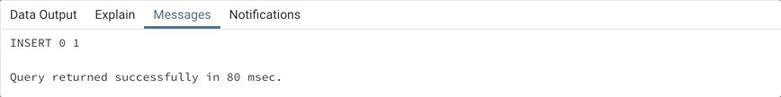
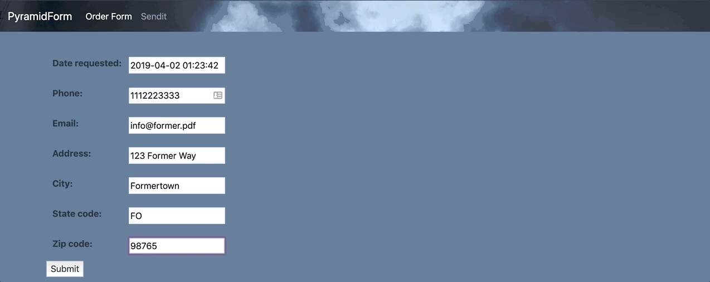

# 2019-04-01 | #029

\#100DaysofCode

- [2019-04-01 | #029](#2019-04-01--029)
  - [Today's Menu](#todays-menu)
    - [Main Course](#main-course)
    - [SELECT * FROM session](#select--from-session)
      - [Soundtrack](#soundtrack)
      - [Extras](#extras)
  - [Session Log](#session-log)
    - [20:57 -+- Sessionit](#2057----sessionit)
    - [20:57 -+- iPython Funtime](#2057----ipython-funtime)
    - [21:36 -+- Admin Page](#2136----admin-page)
    - [21:43 -+- User Views Form](#2143----user-views-form)
    - [22:10 -+- Templates n Forms](#2210----templates-n-forms)
    - [23:17 -+- Data-to-the-Bass](#2317----data-to-the-bass)
    - [01:17 -+- Successful](#0117----successful)

---

## Today's Menu

### Main Course

    GOAL_ : Write To Database Using Html Form In Django  

--------∫--------

### SELECT * FROM session

    CUE_01 : Next time I practice building this, just use the name 'form' instead of 'orderform'  
    CUE_02 : Next iteration of this build will be called 'sendit'  
    CUE_03 : Message field for user notes  
    CUE_04 : Create new view / etc for sendit_detail for when user clicks on a record in 'sendit' table  

#### Soundtrack

- [A straight ^^ CLASSIC](https://youtu.be/eIyQVP3IUyg)

#### Extras

- pass

---

## Session Log

--------∫--------

### 20:57 -+- Sessionit

Just FYI, I'm not going to copy over all of the Django AND postgres code into this session's directory. So I'll be using / updating the same codebase as yesterday:

    01_Code/028_Django_PDFormer/PDFormer/*

--------∫--------

### 20:57 -+- iPython Funtime

    $ python manage.py shell
    > Traceback (most recent call last):
        File "manage.py", line 8, in <module>
          from django.core.management import execute_from_command_line
      ModuleNotFoundError: No module named 'django'

Accidentally ran that command from the wrong terminal window which had a different virtual environment active. Whoops—that scared me a bit too much.

    $ python manage.py shell
    In [1]: from former.models import OrderForm

That's better!

    In [2]: OrderForm.objects.all()
    Out[2]: ProgrammingError: relation "former_orderform" does not exist
            LINE 1: ...form"."state", "former_orderform"."zip_code" FROM "former_or...

That doesn't look good at all—and that's only the last two lines of a HUGE error output log.

I believe I remember this happening before when using postgres.  
I believe it has something to do with there not being any data in the database yet.  
I'm going to try using some straight up SQL to input a record then try again.

    INSERT INTO former_formdata (
        date_requested,
        phone,
        email,
        address,
        city,
        state,
        zip_code
    )

    VALUES (
        '2019-04-01',
        '3033033033',
        'fyi@tobyreaper.com',
        '2345 Six Way',
        'Seven Town',
        'CO',
        '80221'
    )

Also, I remember this error coming up when trying to run that INSERT statement:

    ERROR:  value "3033033033" is out of range for type integer
    LINE 13:  '3033033033',
            ^
    SQL state: 22003
    Character: 127

So I'm going to change up the model a bit to make the phone and zip code fields generic character fields. I'm also going to change the name of the 'state' field because I think there is an SQL keyword with the same name, which would be the second part of that error.

models.py:

    class OrderForm(models.Model):
        date_requested = models.DateTimeField(default=timezone.now)
        phone = models.CharField(max_length=10)
        email = models.EmailField()
        address = models.CharField(max_length=140)
        city = models.CharField(max_length=80)
        state_code = models.CharField(max_length=2)
        zip_code = models.CharField(max_length=10)

Migrations, migrate:

    $ python manage.py makemigrations
    > Did you rename orderform.state to orderform.state_code (a CharField)? [y/N] y
      Migrations for 'former':
        former/migrations/0004_auto_20190401_2113.py
          - Rename field state on orderform to state_code
          - Alter field phone on orderform
          - Alter field zip_code on orderform

    $ python manage.py migrate
    > Operations to perform:
        Apply all migrations: admin, auth, contenttypes, former, sessions
      Running migrations:
        Applying former.0003_auto_20190401_2032... OK
        Applying former.0004_auto_20190401_2113... OK

Now for the SQL INSERT statement again (after fixing the table name):

    INSERT INTO former_orderform (
        date_requested,
        phone,
        email,
        address,
        city,
        state_code,
        zip_code
    )

    VALUES (
        '2019-04-01',
        '3033033033',
        'fyi@tobyreaper.com',
        '2345 Six Way',
        'Seven Town',
        'CO',
        '80221'
    )

And the result:

    INSERT 0 1

    Query returned successfully in 80 msec.

Looks good!  
Looks *real* good.

Now let's give that shell a go again...

    In [1]: from former.models import OrderForm

    In [2]: OrderForm.objects.all()
    Out[2]: <QuerySet [<OrderForm: OrderForm object (1)>]>

Ah yusssss! That is such a nice little QuerySet. So cute.

    In [3]: from django.utils import timezone

    In [4]: order = OrderForm(phone="9998887770", email="info@smartass.life", address="777 Heaven Way", city="Best Place Ever", state_code="CO", zip_code="80223")

    In [5]: order.save()

    In [6]: order.id()
    ---------------------------------------------------------------------------
    TypeError                                 Traceback (most recent call last)
    <ipython-input-6-86a2f5846bc0> in <module>
    ----> 1 order.id()

    TypeError: 'int' object is not callable

    In [7]: order.id
    Out[7]: 2

    In [8]: order.address
    Out[8]: '777 Heaven Way'

    In [9]: OrderForm.objects.all()
    Out[9]: <QuerySet [<OrderForm: OrderForm object (1)>, <OrderForm: OrderForm object (2)>]>

Time to make that a little more useful with a str dunder method. I guess because there is now name on this one that I'll just use the email.

former/models.py:

    class OrderForm(models.Model):
        date_requested = models.DateTimeField(default=timezone.now)
        phone = models.CharField(max_length=10)
        email = models.EmailField()
        address = models.CharField(max_length=140)
        city = models.CharField(max_length=80)
        state_code = models.CharField(max_length=2)
        zip_code = models.CharField(max_length=10)

        def __str__(self):
            return self.email

Now back into the shell to take a gander:

    $ python manage.py shell
    In [1]: from former.models import OrderForm

    In [2]: OrderForm.objects.all()
    Out[2]: <QuerySet [<OrderForm: fyi@tobyreaper.com>, <OrderForm: info@smartass.life>]>

    In [3]: OrderForm.objects.filter(email__startswith="fyi")
    Out[3]: <QuerySet [<OrderForm: fyi@tobyreaper.com>]>

--------∫--------

### 21:36 -+- Admin Page

Creating the superuser:

    $ python manage.py createsuperuser
    Username (leave blank to use 'tobias'): order_admin
    Email address: admin@former.info
    Password: orderadmin
    Password (again):
    Superuser created successfully.

Time to look around the admin page.

Logged in successfully. That's always nice.

Making the former app modifiable in the admin area:

former/admin.py:

    from django.contrib import admin
    from .models import OrderForm

    admin.site.register(OrderForm)

And tharr she blows!

--------∫--------

### 21:43 -+- User Views Form

To start out, this site is only going to have two pages aside from the admin page:

1. Orderform - the user inputs data and submit the form
2. Sendpdf   - displays the resulting pdf with option to send it to email(s)

    CUE_01 : Next time I practice building this, just use the name 'form' instead of 'orderform'  

    CUE_02 : Next iteration of this build will be called 'sendit'  

Adding some more views - former/views.py:

    def orderform(request):
        return HttpResponse("Hello there, check this form out.")

    def sendit(request, orderform_id):
        response = "Hey there, check out this option to SEND IT %s."
        return HttpResponse(response % orderform_id)

former/urls.py:

    urlpatterns = [
        path("", views.orderform, name="orderform"),
        path("sendit/<int:orderform_id>/", views.sendit, name="sendit"),
    ]

And now when I go to localhost:8000/former/sendit/1/ I see the appropriate response above.

--------∫--------

### 22:10 -+- Templates n Forms

Created a directory for the templates:

    PDFormer/former/templates/former/

And for the static files like css and images:

    PDFormer/former/static/former/

Also created former/forms.py:

    from django.forms import ModelForm
    from .models import OrderForm
    class OrderFormForm(ModelForm):

        class Meta:
            model = OrderForm
            fields = (
                "date_requested",
                "phone",
                "email",
                "address",
                "city",
                "state_code",
                "zip_code",
            )

Would be useful to have a message field as well, where users can input a short message.  
Not necessary right now though.

    CUE_03 : Message field for user notes  

Wheeeeeeeeewwww I just added so much code all at once and I only have to find two easy errors! I'm back to having a form on a darn page with css and images and e'rythang. Aaaaand what's even better is the form is directly based off of the model fields. They are already all matched up. So niiiiice.

Haven't been able to figure out how to show the orders yet but that will come...

Well, I got the page to load with the table header but no data in the table itself.

And BOOOOOOM goes *all* the Chinese laundry!

Just for posterity, here's some of the code:

---

former/views.py:

    from django.http import HttpResponseRedirect
    from django.shortcuts import render
    from .models import OrderForm
    from .forms import OrderFormForm

    def orderform(request):
        if request.method == "POST":
            form = OrderFormForm(request.POST)

            if form.is_valid():
                return HttpResponseRedirect("/sendit/")

        else:
            form = OrderFormForm()

        template = "former/orderform.html"
        return render(request, template, {"form": form})

    def sendit(request):
        template = "former/sendit.html"
        context = {"orderform": OrderForm.objects.all()}
        return render(request, template, context)

---

former/forms.py:

    from django.forms import ModelForm
    from .models import OrderForm

    class OrderFormForm(ModelForm):
        class Meta:
            model = OrderForm
            fields = (
                "date_requested",
                "phone",
                "email",
                "address",
                "city",
                "state_code",
                "zip_code",
            )

---

former/urls.py:

    from django.urls import path
    from . import views

    urlpatterns = [
        path("", views.orderform, name="orderform"),
        path("sendit/", views.sendit, name="sendit"),
    ]

---

--------∫--------

### 23:17 -+- Data-to-the-Bass

Time to get the fields to write to the database.

    Home stretch, baby!
    ----∫----
    It's been a rough weekend of hard work, but the end is in sight.

Another useful feature would be the ability to click on a row in the 'sendit' table and be taken to a detail page which lays that record out and allows it to be sent as pdf.

    CUE_04 : Create new view / etc for sendit_detail for when user clicks on a record in 'sendit' table

I'm going to worry about that later. I want to get something written to the database using the form.

I'm kind of scared to just press submit.

Might as well see what happens...

Threw an error, as I was expecting. Nothing broke though, as far as I can tell.

It's looking for /orderform/ but isn't finding it. Not sure why it's looking there.

--∫--

So it looks like I'll have to create that sendit_detail page anyways in order to do the POST request.

former/urls.py:

    urlpatterns = [
        path("", views.orderform, name="orderform"),
        path("sendit/", views.sendit, name="sendit"),
        path(
            "sendit/<int:orderform_id>/", views.sendit_detail, name="sendit_detail"
        ),
    ]

former/views.py:

    def sendit_detail(request, orderform_id):
        order = get_object_or_404(OrderForm, pk=orderform_id)
        order.save()
        return HttpResponseRedirect(
            reverse("former:sendit_detail", args=(orderform.id,))
        )

Nope, that didn't do it.

hoooo man I just spent way too long stuck on why none of the urls were working. Forgot to add the leading 'former' in front of the sendit...

    http://localhost:8000/former/sendit/1/

YESSSSSSSSS....!!

I got a record to show detail depending on the url, which passes in the orderform_id. This will allow the drilling down from sendit to sendit_detail as long as I link up the urls correctly.

One step closer.

--------∫--------

### 01:17 -+- Successful

Damn it finally happened!

Submitted a form, and it posted the data to the database, then redirected to the sendit page with that row added in.

Shoutout to Corey Shafer for giving me the final piece to the puzzle with his [User Registration video](https://youtu.be/q4jPR-M0TAQ) (in his really awesome Django series).

Holy jeezecakes that took forever but I knew I had to get it tonight. If I didn't I'd be one unhappy (and stressed) panda tomorrow.

Ok all of the functionality is now present in the app. All I need to do now is fix the sendit_detail page so it shows the correct format then allows the file to be downloaded and/or emailed.

Whew I'm so glad that worked out.

Buenos DATBASSSSS, Amigos!