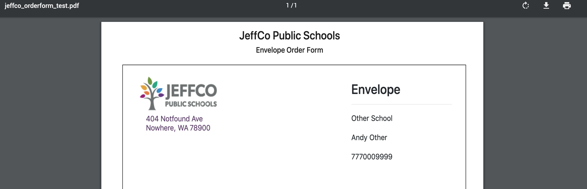
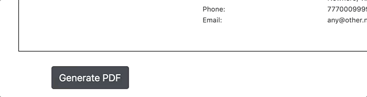

# 2019-04-03 | #031

\#100DaysofCode

- [2019-04-03 | #031](#2019-04-03--031)
  - [Today's Menu](#todays-menu)
    - [Main Course](#main-course)
    - [SELECT * FROM session](#select--from-session)
    - [Reminders](#reminders)
      - [Soundtrack](#soundtrack)
      - [Extras](#extras)
  - [Session Log](#session-log)
    - [13:15 -+- Sessionit(ialize)](#1315----sessionitialize)
    - [13:17 -+- js(PDF)](#1317----jspdf)
    - [13:41 -+- jsPrint the Page](#1341----jsprint-the-page)
      - [html2canvas.js](#html2canvasjs)
    - [14:16 -+- H(tes)TML](#1416----htestml)
    - [15:09 -+- Aesthetics](#1509----aesthetics)
    - [17:00 -+- DeSessionit](#1700----desessionit)
      - [Generate that PDF, yO0o!](#generate-that-pdf-yo0o)

---

## Today's Menu

### Main Course

    GOAL_ : Create and save a worthwhile PDF from the Django app

---

### SELECT * FROM session

--------∫--------

### Reminders

    TASK_00 : Add model to django to capture pricing and quantities  

#### Soundtrack

- [Octopath Traveler OST](https://www.youtube.com/watch?v=AAC-1wySMLM)

#### Extras

- [jsPDF JavaScript library](https://parall.ax/products/jspdf) for client-side PDF generation

---

## Session Log

--------∫--------

### 13:15 -+- Sessionit(ialize)

I returned my Django app to the state where I can at least print out the data from the database as text.

I had a brief video chat with my coding mentor Philip:

- Potentially try some different forms of SVG encoding to see if that could work
- Otherwise the best way forward would probably be to utilize JavaScript to print the screen to PDF
  - I already have the page laid out like I would want it to print
  - One workaround would be to simply have the users print to PDF from their browser
  - Or, write client-side logic with JavaScript / [something like jsPDF](https://parall.ax/products/jspdf) to do it for them
    - This would be the best, as I'm not sure that the end users will be very technical
    - Also I feel like depending on the browser that might not work great
- So hopefully I can get it done today with JavaScript

---

### 13:17 -+- js(PDF)

    TASK√01 : Copy jsPDF library into /static/orderform directory for use in app  

Copied it over, as I had downloaded the library when I first embarked on this project.  
Let's get some PDFs printed via JavaScript.

    TASK√02 : Print a PDF using JavaScript  

Not sure why I had such a difficult time of it last time I tried, but I got it to print to PDF!

Here's the bottom section of the page with that code in it.

> ../static/orderform/orderdetail.html

    <body>
    ...

        

            <button id="pdfer" type="button" class="btn btn-dark">Generate PDF</button>
        

        

        <!-- JS / Bootstrap libraries -->

        
    
    ...
    </body>

When the button is clicked, it prompts to save the file that was created in the function. Man, it feels nice to make some real progress again, however small.  

*Spinning wheels suck.*

--∫--

I think that calls for making a commit to the repo!

---

### 13:41 -+- jsPrint the Page

    NOTE_jsPDF-01 : I got jsPDF to work using jspdf.debug.js — did not work when using jspdf.js / main.js  

I've done the most basic form of creating a PDF via js. Now I need to figure out how to print the page that is displayed.

#### html2canvas.js

Downloaded another js library called html2canvas to render an HTML page, which I can hopefully then pass into jsPDF to save that as a PDF.

- Here's the [GitHub repo](https://github.com/niklasvh/html2canvas)
- And, of course, [the documentation](https://html2canvas.hertzen.com/documentation)
- [Example of taking a "screenshot"](https://html2canvas.hertzen.com/) of the browser viewport.

--∫--

Added the html2canvas library to the page and moved the actual JavaScript code to a separate script:

> ../static/orderform/orderdetail.html

    
    

That actually caused a 404 error so I'm just going to leave it as it was and fix that later.

Scared myself by trying it out again and receiving a blank document. Turns out I didn't quite finish my train of action when passing in parameters to the jsPDF() function.

Now it's working again.

---

### 14:16 -+- H(tes)TML

Gave the html2canvas thing a shot and had some success! It didn't print out nicely formatted but it still printed some of the page. I put all the tests into a directory called XX_Test_Outputs in case you want to take a gander.

Trying it out again, this time only grabbing the div that contains the envelope.

Nice, that's perfect though still needs some finagling to get right.

--∫--

Sweeeeet. Got it to work relatively well using custom dimensions for the page, with option to print either just the div or the whole page.

Here's some js code that shows how I did it thus far:

    function pagePDF() {
    html2canvas(document.body).then(function (canvas) {
        var img = canvas.toDataURL("image/png");
        var pdf = new jsPDF('portrait', 'mm', 'letter');
        pdf.addImage(img, 'JPEG', 0, 0, 216, 127);
        pdf.save("jsPDF_page_test.pdf");
      });
    }

    document.getElementById("pagePDF").onclick = function () {
        pagePDF();
    }

--∫--

I believe this calls for a commit, before I get rid of the buttons and finalize the layout!

---

### 15:09 -+- Aesthetics

    TASK√03 : Use only the logo + set the Model information underneath  

Got the logo all gucci but for some reason they aren't printing to the pdf. I'm going to export them as png and try again.

---

### 17:00 -+- DeSessionit

And just like that, the first working prototype of the app is complete!

I'm uploading screenshots of the PDFs to the GitHub repo because they're large files.  
The reason, I assume, is because the html2canvas function I'm using converts the page to an image first, then places that image on a PDF. That's why the text on the page isn't selectable once it's rendered to PDF. I'll keep refining it to make it into a real PDF.

#### Generate that PDF, yO0o!

I think that calls for another commit!

Hasta Bananas, Amigas!