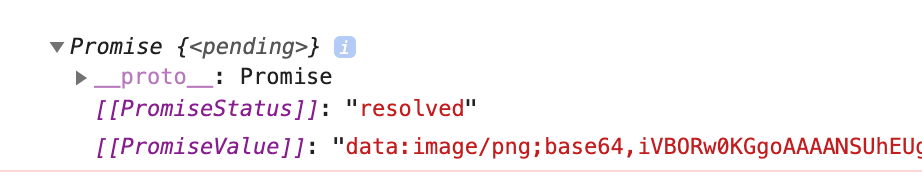
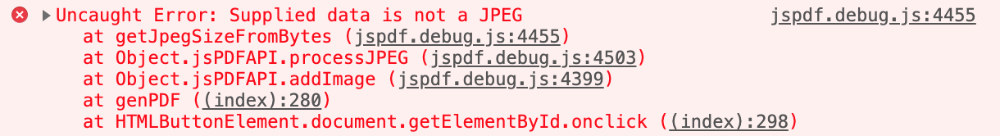
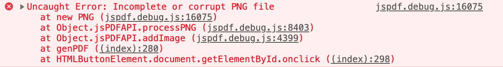
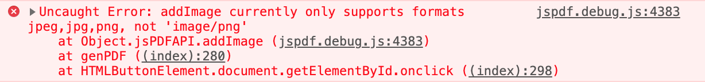

# 2019-04-05 | #033

\#100DaysofCode

- [2019-04-05 | #033](#2019-04-05--033)
  - [Today's Menu](#todays-menu)
    - [Main Course](#main-course)
    - [SELECT * FROM session](#select--from-session)
      - [Soundtrack](#soundtrack)
      - [Extras](#extras)
  - [Session Log](#session-log)
    - [08:46 -+- Sessionit](#0846----sessionit)
    - [09:59 -+- Base64 DataURL](#0959----base64-dataurl)
    - [10:09 -+- JavaScript Promises](#1009----javascript-promises)
    - [11:21 -+- Cutting Not Gained](#1121----cutting-not-gained)
    - [12:02 -+- Onwards and Downwards](#1202----onwards-and-downwards)
    - [12:17 -+- Solutions and Resolutions](#1217----solutions-and-resolutions)
    - [12:31 -+- DeSessioned](#1231----desessioned)

---

## Today's Menu

### Main Course

    GOAL_01 : Iteration of PDForm app that outputs real PDF

    GOAL_02 : Add user login functionality  
    GOAL_03 : Deploy to the web  

--------∫--------

### SELECT * FROM session

#### Soundtrack

- pass

#### Extras

- [Finagle:](https://www.merriam-webster.com/dictionary/finagle) To obtain by indirect or involved means

---

## Session Log

--------∫--------

### 08:46 -+- Sessionit

It's nice coming back to this after getting a little break. A fresh mind comes up with fresh ideas—or is more likely to, anyways

    TASK√01 : Set up document layout via variables and arithmetic  

This JavaScript function is getting a bit unwieldy but I'll have to fix it / break it out into its own script.js file later because I don't want to worry about that sort of detail right now. I need to focus on getting the functionality right before the stylistic and optimization choices right.

---

### 09:59 -+- Base64 DataURL

    TASK√02 : Draw an image into the PDF  

I've been having some trouble getting the logo image to convert to a base64 DataURL. This is the required input for jsPDF to draw the image. One workaround I used—to simply test that the image would draw with the correct format passed in—was I uploaded the image to an image-converter site that just spat out a string. I took that string and assigned a variable to it. That worked, but it made the script even more unwieldy.

The method I originally wanted to was to use (and which I am attempting to now that I know the image will draw with the correct input) is the toDataURL() function. This is what is used in the html2canvas code I used in pdf_portal v0.1, and is a much more succinct way of going about it.

It's already taken me a bit of finagling, with the benefit of finally learning a tiny bit about those JS promises I've been hearing so much about.

---

### 10:09 -+- JavaScript Promises

I see now after [reading up a bit on promises](https://developers.google.com/web/fundamentals/primers/promises), that this is why the html2canvas function I've been using has that ".then()" section proceeding it. *That* is the promise.

    promise.then(function(result) {
      console.log(result); // "Stuff worked!"
    }, function(err) {
      console.log(err); // Error: "It broke"
    });

Good to know!

However, I see that this function's promise does not have a callback for the failure case. In fact, both the success and failure callbacks are [optional](https://developers.google.com/web/fundamentals/primers/promises#promises_arrive_in_javascript).

----∫----

    TASK_03 : Draw an image into the PDF using the toDataURL functionality  

A bit more finagling has resulted in some...dare I say __*promising*__ results.

From looking at the results above in the console it seemed promising, as I said, but when I try to put that in the doc.addImage() I'm not getting the promised results...

Then I tried with 'PNG' as the second argument.

Then just for funzies tried 'image/png' and actually got some useful information from that result. I'm going to console.log the dataURL again so I can compare it to the string I used earlier (that worked).

----∫----

I did forget some semi-colons, but I'm not sure if that will make a difference or not.

At first the two strings looked the same, but of course the string returned by the promise is much longer than the "correct" one. Only the first 15 or so characters are the same.

You can [take a look](base64_compare_1.txt) if you like.

So now the question is *why?*

My first response would be that the html2canvas part of it is screwing things up somehow.

---

### 11:21 -+- Cutting Not Gained

I've spent at least an hour trying to figure this base64 thing out without success.

I got the code for a blank image/png to be generated, but that's about it.

...

So I'm just going to use the base64 strings I got from the online converter, and move on.

    CUE_01 : At some point figure out how to properly use the todataURL function  

Kept trying even after writing that, but I really am stuck.

I tried using "image/jpeg" in order to reduce the size of it (based on [this stackoverflow](https://stackoverflow.com/questions/37472404/todataurl-javascript-of-canvas-is-creating-a-corrupt-png-file-after-upload-to)).

    function returnDataURL(id) {
        var dataURL = html2canvas(document.getElementById(id)).then(canvas => {
            var c = canvas.toDataURL("image/jpeg", 0.5);
            console.log(c);
            return c;
        });
        console.log(dataURL);
        return dataURL;
    }

I did, however, manage to move the JavaScript over to its own file. I'm guessing the reason it threw the error the last time I tried that was because it wasn't in the 'static' directory. I had put it in with the templates. Django doesn't look in there for static files.

---

### 12:02 -+- Onwards and Downwards

Downwards isn't necessarily bad. I am thinking of the fact that we read left > right / top > bottom. So in that context (within that scope...) progress means going downward.

Continuing to build the output pdf bit by bit.

I am making progress! Take the filesize, for example, which includes one of the two images that will be included in the output PDF:

    -rw-r--r--@  1 Tobias  staff    57K Apr  5 11:57 text_test (8).pdf
    -rw-r--r--@  1 Tobias  staff   2.5K Apr  5 01:04 text_test.pdf

That is a lot better than 20MB+...

Just gotta finish this layout bidness and we'll be *golden*, pony boiiii.

    TASK_04 : Finish rough layout of output PDF using the new methods  

    CUE_02 : Clean out the django app's directories by removing all the files not being used, such as the scripts written for ReportLab  

    IDEA_01 : Write a JavaScript function that centers text on the page  

With both images included, it's still a small file. Just how I like it:

    -rw-r--r--@  1 Tobias  staff   146K Apr  5 12:14 text_test (9).pdf

You know what they say about small files...?

---

### 12:17 -+- Solutions and Resolutions

I just thought of a new issue that might cause some really big changes to how I'm doing it this time...

I don't know how I'll pass in the data from Python into the genPDF() function.

One way to get around this wouldn't require much change in the code, as using jsPDF to draw the PDF is very similar to ReportLab. I could easily port over the JavaScript code into Python such that ReportLab would draw the same thing.

However....

> That f***ing PIL issue with ReportLab...

I don't want to go down that rabbit hole again.

PIL (Python Image Library) is utilized by ReportLab to render images. It is *required*.

That would be fine, except that whoever was maintaining PIL is doing so no longer—and haven't been for years. I spent way too many hours already struggling to find a workaround for that. No success...and I dopn't see any success in the future if I went down that path again. Better stick to this as it's going relatively well.

One way I could do it is to render any of the variable data from the database using html2canvas and draw that as an image. That would reduce the size a little bit but I would end up with a very similar problem, albeit with some better layout flexibility and whatnot.

Time for a break to eat a little bit and take a walk. My resolution is to work on the solution when I return from my walk.

---

### 12:31 -+- DeSessioned

Done more than the hour, so whatever else I do I probably won't be keeping track here.