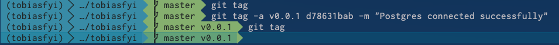

# 2019-04-07 | #035

\#100DaysofCode

---

## Today's Menu

### Main Course

    GOAL_ : First prototype of tobias.fyi  

--------∫--------

### SELECT * FROM session

#### Soundtrack

- pass

#### Extras

- pass

---

## Session Log

--------∫--------

### 17:05 -+- Sessionit

Only have time to work for 20 minutes or so right now, but will continue the session later this evening.

---

### 17:05 -+- Git (Check)Sum More

I hadn't previously thought about using git tags. Could be a good habit to start. Here are some notes from the Git Pro book.

Two types of tags:

1. Lightweight
   1. Similar to a branch that doesn't change
   2. Pointer to a specific commit
2. Annotated
   1. Stored as full objects in the Git database
   2. Chechsummed
   3. Contain the tagger name, email, and date
   4. Tagging message
   5. Can be signed and verified with GNU Privacy Guard (GPG)

It's generally recommended to create annotated tags so all of that information is stored.

#### Annotated Tags: -a

    $ git tag -a [tagname] -m "message"
    $ git tag
    list
    of
    tags

To show the tag data along with the commit:

    $ git show [tagname]
    tag information
    is shown
    in more
    detail

Lightweight tags don't have any of the options, and only shows the commit when looking at detail:

    $ git tag [tagname]

Commits can be tagged retroactively. First find the commit by looking at history:

    $ git log --pretty=oneline
    d78631bab94f9e53838215485ee48306aca7346e (HEAD -> master, origin/master, origin/HEAD) Successful Postgres connection and migration
    5745f84b230fac12682334a39c019f14bd7dc844 Created Styleguide
    713935ae476cb4d032e773d6a41f0c0bd4a368d1 Created main Django project tobiasfyi_project
    259b4e69bb7eb885e347e1cb15a331fe786775aa Project tobias.fyi - Initialize
    f8e32a883c836a810a10c604dea3706634a2bd9f Initial commit

Specify the commit checksum (or just part of it) at the end of the command:

    $ git tag -a v0.0.1 d78631bab -m "Postgres connected successfully"
    $ git tag
    v0.0.1
    (END)

I see that the way I have my iTerm set up, it shows in the git section of the prompt:

Ain't that neat?

#### Sharing Tags

By default, the git push command doesn't transfer tags to remote servers. Tags must be explicitly pushed to the shared server after creation. Similar to sharing remote branches, run: 

    $ git push origin <tagname>
    Counting objects: ...

Or to push all of the tags at once:

    $ git push origin --tags
    Counting objects: ...

#### Git Branching

Decided to name the first app showcase. This app with hold all relevant data regarding my professional life, which can be accessed and used to automatically build a tailored resume.

    $ git branch showcase
    $ git log --oneline --decorate
    shows where the branch pointers are pointing.

    $ git checkout showcase
    moves HEAD to point to the showcase branch