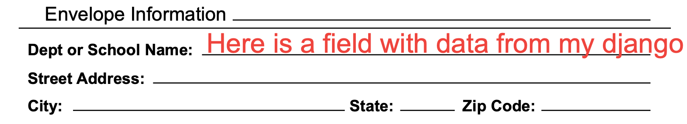
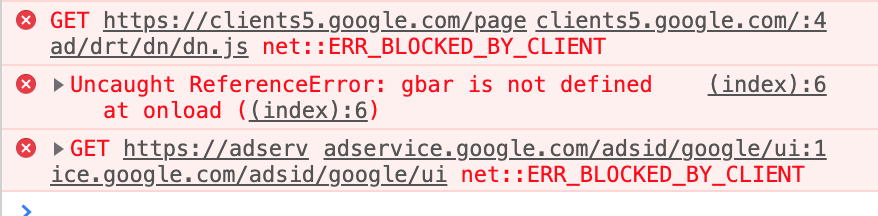

# 2019-04-14 | #042

\#100DaysofCode

- [2019-04-14 | #042](#2019-04-14--042)
  - [SELECT * FROM Project](#select--from-project)
    - [Abstract](#abstract)
    - [Loxocache](#loxocache)
  - [SELECT * FROM Session](#select--from-session)
    - [Attenoir](#attenoir)
      - [Extras](#extras)
  - [Session.log](#sessionlog)
    - [22:19 -+- Session.init](#2219----sessioninit)
    - [22:20 -+- Positionalisms](#2220----positionalisms)
    - [22:53 -+- Associate With Fancy Arrays](#2253----associate-with-fancy-arrays)
    - [22:06 -+- Testies](#2206----testies)
    - [23:25 -+- de.Session](#2325----desession)

---

## SELECT * FROM Project

### Abstract

    GOAL__ : Web app for editing and sending PDFs  

### Loxocache

    TASK__ : Collect tags from other documents  

--------∏--------

## SELECT * FROM Session

### Attenoir

    GOAL_042 : Deploy v0.2 to the web + add basic tests  

#### Extras

- Mark Slee has [some super rad mixes](https://soundcloud.com/mcslee/avril-gentle) for working

---

## Session.log

--------∏--------

### 22:19 -+- Session.init

Time to fill out this bad boy! (Referring to the table below).

---

### 22:20 -+- Positionalisms

I finally figured out how to set the origin / zero point of a document in InDesign! I looked around a bit last night but didn't find anything.

This makes it much easier to get the measurements / positions. I set the origin to the bottom left as it is in pdf-lib.

x, y - coordinates (in points) from the origin (bottom left) of page.

    field_name              x   y
    **Information**
    order_dept-school       184 680  
    order_street_address    142 655  
    order_city              72  631  
    order_state_code        360 631  
    order_zip_code          485 631  
    order_phone             84  606  

    **Options**
    box_qty_1               525 490  
    box_qty_2               525 461  
    box_qty_3               525 343  
    box_qty_4               525 314  

    **Billing**
    billing_name            84  208  
    billing_dept-school     130 184  
    billing_address         98  158  
    billing_city            72  132  
    billing_state_code      360 132  
    billing_zip_code        485 132  
    billing_phone           84  106  
    billing_fax             360 106  
    billing_email           84  82  

Now I just need to set these up as variables in the JavaScript code. That multicurser functionality really makes things like this much *much **much*** easier. I can't believe I went my whole life up to a couple months ago without ever knowing that existed. My life is forever changed for the better.

    order_dept-school     = [184, 680]
    order_street_address  = [142, 655]
    order_city            = [72 , 631]
    order_state_code      = [360, 631]
    order_zip_code        = [485, 631]
    order_phone           = [84 , 606]

    box_qty_1             = [525, 490]
    box_qty_2             = [525, 461]
    box_qty_3             = [525, 343]
    box_qty_4             = [525, 314]

    billing_name          = [84 , 208]
    billing_dept-school   = [130, 184]
    billing_address       = [98 , 158]
    billing_city          = [72 , 132]
    billing_state_code    = [360, 132]
    billing_zip_code      = [485, 132]
    billing_phone         = [84 , 106]
    billing_fax           = [360, 106]
    billing_email         = [84 , 82 ]

Exported the new version of the PDF on which the data will be placed. Not much changed except I lined up a few more of the fields.

> /static/orderform/formeasure01.pdf

---

### 22:53 -+- Associate With Fancy Arrays

Decided to get a little fancy with setting these variables. Instead of them each being their own separate thing, I'm putting them into one big nested array.

I tried using camelCase...I really did. I just find it to be much more difficult to read than snake_case.

Or I'm just a Python-lover / used to Python. Or both.

    let field_coordinates = {
        order_info: {
            school: [184, 680],
            address: [142, 655],
            city: [72, 631],
            state_code: [360, 631],
            zip_code: [485, 631],
            phone: [84, 606],
        },
        boxes: {
            qty1: [525, 490],
            qty2: [525, 461],
            qty3: [525, 343],
            qty4: [525, 314],
        },
        billing_info: {
            name: [84, 208],
            school: [130, 184],
            address: [98, 158],
            city: [72, 132],
            state_code: [360, 132],
            zip_code: [485, 132],
            phone: [84, 106],
            fax: [360, 106],
            email: [84, 82],
        },
    };

I think that looks rather nice, don't you?

---

### 22:06 -+- Testies

Time to give it a whirl and see how it works!

Oh ya, gotta get some other things set up first, like the button to actually download the file and the javascript to convert the Uint8Array that comes out of pdf-lib back into a PDF. I did this by converting it into a blob, which is passed into a dataURL. Once the URL exists, then it can be assigned to the button.

Here is the last bit of the function that processes the initial pdf file (as a Uint8Array):

    ...
    // Create blob from output of PDFWriter instance
    const pdfFileData = new Blob([pdfBytes], { type: "application/pdf" })

    //Create the URL from which the file will be downloadable
    const pdfURL = window.URL.createObjectURL(pdfFileData);

    // Download that bad boii!
    document.getElementById("download_link").href = pdfURL;

Just thought of a useful feature:

    CUE_01 : Save the output PDF into a django/postgres table  

This would allow the PDF to be downloaded again easily. Also, it would be assigned an ID, which would then be passed into the filename when exported / downloaded. 

Maybe make it so each download has a unique filename?

Not sure what the value of that would be yet, but I'll think about it more later.

Oh ya, here's the code for the button as well:

    

        <a id="download_link" download="env_order.pdf" href="">
            <h3>Download PDF</h3>
        </a>
    

I forgot how neat it is to be able to write code in the devtools console in chrome to play around with the javascript that's loaded on the page—good fun!

I had some minor errors in the code that were causing the file to at first be corrupt, then to not have any new text on it...then...

It worked!! Wooooop we are just about there, amigos and amigas!

Check that ish out, yo.

And just for good measure / to wrap things up nicely such that someone who can't see the code for whatever reason can see the piece of code where that text comes from:

    const contentStream = pdfDoc.createContentStream(
        drawText(helveticaFont.encodeText('Here is a field with data from my django form'), {
            x: field_coordinates.order_info.school[0],
            y: field_coordinates.order_info.school[1],
            size: 24,
            font: 'Helvetica',
            colorRgb: [0.95, 0.26, 0.21],
        }),
    );

That feels güd.

I just realized I can just leave a copy of the whole js file in this session's directory. I'll do that as well.

Now it's just a matter of hooking up the django data and we're so golden you can call us *El Dorado*!

I love that movie. One of my all-time favorite animated films, particularly as a youngen.

This is pretty great. I inadvertently left the console open and got this error when searching for the gif below.

Thanks, Adblock!

---

### 23:25 -+- de.Session

Well that was quite a nice little session. I love making progress after struggling, particularly when it looks this darn good!

It's off to hit the hay for this guy.

Hasta dorados, amigos!

