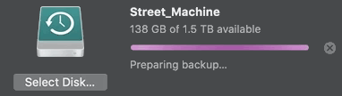

# 2019-04-16 | #044

\#100DaysofCode

---

## SELECT * FROM Project

### Project.abstract

    GOAL__ : Generate PDFs with user data

### Project.loxocache(2019-04)

--------Ω--------

## SELECT * FROM Session

### Session.abstract

    GOAL_044 : Finish Prototype 2 and deploy to the web  

#### Session.cache

- pass

---

## Session.journal(2019-04-16)

### Loxocache

    TASK_043 : Add ids to the ModelFields (use jinja to generate the string)  
    TASK_043 : Preview the generated PDF on orderdetail.html  
    TASK_043 : Allow user to choose number of boxes once preview is generated  

--------Ω--------

### 09:51 -+- Session.init

Goo time.

    TASK_043 : Add billing_info + box qty fields to Django model  
    TASK_044 : Make the Django forms CRISPY AF  
    TASK_044 : Ask if billing address is the same, if so, fill in automatically  
    TASK_044 : Set up template inheritance  

---

### 10:20 -+- Django CRISPR ModelForms

For CRISPR today I'm receiving help from:

- [This article](https://simpleisbetterthancomplex.com/tutorial/2018/08/13/how-to-use-bootstrap-4-forms-with-django.html)
- [This article](https://simpleisbetterthancomplex.com/tutorial/2018/11/28/advanced-form-rendering-with-django-crispy-forms.html)
- And of course, [the docs](https://django-crispy-forms.readthedocs.io/en/latest/)

    TASK_044 : Make the Django forms CRISPY AF  

Added crispy forms to the django project's installed apps and defined the template pack.

> pdf_portal/settings.py

    INSTALLED_APPS = [
        ...
        "orderform.apps.OrderformConfig",
        "crispy_forms",
    ]

    CRISPY_TEMPLATE_PACK = "bootstrap4"

That was funny—I've been getting used to writing javascript again and put a semi-colon in automatically before realizing that I'm back to Python.

I just realized that I never set up a base.html for this project.

    TASK_044 : Set up template inheritance  

That, however, is not high up on the priority list right now.

--------Ω--------

    TASK_043 : Add billing_info + box qty fields to Django model  

> orderform/templates/models.py

    from django.db import models
    from django.utils import timezone

    class Order(models.Model):
        order_id = models.AutoField(primary_key=True)
        order_school = models.CharField(max_length=140)
        order_address = models.CharField(max_length=140)
        order_city = models.CharField(max_length=80)
        order_state = models.CharField(max_length=2)
        order_zip = models.CharField(max_length=5)
        order_phone = models.CharField(max_length=10)

        order_date = models.DateTimeField(default=timezone.now)

        def __str__(self):
            return self.order_school

    class Boxes(models.Model):
        order_id = models.ForeignKey(
            Order, on_delete=models.CASCADE, to_field=Order.order_id
        )
        box_qty1 = models.IntegerField(blank=True)
        box_qty2 = models.IntegerField(blank=True)
        box_qty3 = models.IntegerField(blank=True)
        box_qty4 = models.IntegerField(blank=True)

        def __str__(self):
            return self.order_id

    class Billing(models.Model):
        order_id = models.ForeignKey(
            Order, on_delete=models.CASCADE, to_field=Order.order_id
        )
        bill_name = models.CharField(max_length=70)
        bill_school = models.CharField(max_length=140)
        bill_address = models.CharField(max_length=140)
        bill_city = models.CharField(max_length=80)
        bill_state = models.CharField(max_length=2)
        bill_zip = models.CharField(max_length=5)
        bill_phone = models.CharField(max_length=10)
        bill_fax = models.CharField(max_length=10)
        bill_email = models.EmailField()

        def __str__(self):
            return self.bill_name

I started changing up the model and adding a couple new models, but realized that this would potentially mess things up permanently if the migrations are applied.

Not sure why—as I'm in a time-crunch right now—but I kind of want to start an entirely new django project to finish this thing off. If anything I could just start a new django app within the current project.

This would allow me to get warmed up and ready again, with the added benefit of adding in User Auth / Reg / Login earlier on in the build.

The reason I'm hesitant to do the migration on this working prototype is because once I do, I don't think it's very easy to roll back the database to a previous state. I can't do it via Git, and I want to be sure I have a working version at all times.

A fresh version would also be nice because it won't have all the baggage that's accumulated over the course of this build.

---

### 11:01 -+- Fresh Churns

Creating this project directory in a new Projects folder directly in my home:

Going back to one of the original names of the project, with a little change (added underline):

- *onform ø on_form Ø

----ø----

    Project Title: on_form
    Project Symbol: Ø (^ + alt + O) plus the child ø
    øØø

According to [Urban Dictionary:](https://www.urbandictionary.com/define.php?term=on%20form)

    on form:

    For a person to be "on form" they have to be at a level of magnificence in their perspective endeavor as to match that of Tottenham Hotspur's Egyptian Megastar Hossam Ghaly.

    In fact, no person will ever achieve said level of performance, so the term can and will only ever be used for Ghaly himself.

---

### 11:10 -+- The Churn Begins

    TASK_044.01 : Create new virtual environment + install dependencies  

    $ conda create -n on_form python=3.7 django pylint pep8 psycopg2

    $ conda activate on_form

    $ conda install black
    $ conda install ipython
    $ conda install django-crispy-forms
    $ conda install django-extensions
    $ conda install django-model-utils
    $ conda install django-taggit
    >> ...done

> ~/Projects

    $ git clone git@github.com:tobias-fyi/on_form.git
    >>

> ~/Projects/on_form

    $ mkdir 00-Admin
    $ mkdir 01-Docs
    $ mkdir 08-DB_Data
    >>

    $ touch .gitignore

> created vscode workspace

    $ code .
    $ code .gitignore
    >> copied over from pdf_portal
    >> then edited to fit the new naming convention
    >> I switched to using dashes between the leading number and the title

> on_form.code-workspace (workspace settings)

    {
        "folders": [
            {
                "path": "/Users/Tobias/Projects/on_form"
            }
        ],
        "settings": {
            "python.pythonPath": "/anaconda3/envs/onform/bin/python",
            "python.linting.pylintEnabled": true,
            "python.formatting.provider": "black",
            "python.formatting.blackPath": "/anaconda3/envs/onform/bin/black",
            "python.formatting.blackArgs": [
                "--line-length=79"
            ],
            "editor.formatOnSave": true,
            "files.exclude": {
                "**/.git": true,
                "**/.svn": true,
                "**/.hg": true,
                "**/CVS": true,
                "**/.DS_Store": true,
            },
        }
    }

> Made initial commit + push

**Continued in the project directory for now.**

    TASK_044 : Copy session from on_form build journal

---

### 21:10 -+- de.Tour

Taking fifteen minutes to brush up on some simple straightforward Python scripting. I want to start the script that will allow me to enforce my naming conventions on a project-wide scale.

Of course there are things I want to do first...

I have this urge to uninstall Anaconda3 and start *really* fresh. I texted my good friend and mentor asking what package manager he uses and he said, "Pip! Only pip. pip is de jesus." He has been a developer for quite a while now at a number of different companies, including a few senior developer positions. He's been mentoring me over the last few months, and he's one of the people I hold in utmost esteem. Although I'd been thinking about switching to pip over the last month or so, I didn't have a really good reason to until now, so I'm going in whole hog!

Just to beat that horse a little more deader—I also really want to get good at deploying apps that I work on, and pipenv is the recommended virtual environment manager according to python.org.

----ø----

That being said, I'm taking a fresh backup of my computer before I uninstall. I don't think I have anything that should break without anaconda, but as I've been creating / managing all my of my virtual environments with conda, I'd like to have the ability to retrieve them as they are now.

Along with the time machine backup that's running right now, I'm going to manually copy all of my current project directories onto at least one other HD. Overkill? Maybe. But those directories are miniscule compared to the ones where I store all of my visual assets. I can't wait until I have the financial slack to invest in a good home server / data storage and retrieval system.

Making do makes me appreciate it more when it comes.

...this backup has been stuck at "Preparing Backup" for what seems like forever...

I know it's been taking longer lately because it has to delete old backup files, but still.

I really love `rsync -ah --info=progress2 --append-verify` - it's made my data life easier.

----ø----

I've been getting this error whenever I sync up my iPhone to my MBP:

    Attempting to copy to the disk "Macintosh HD" failed. An unknown error occurred (-54).

Not sure what exxactly is going on but if I remember correctly it stops my phone from finishing its sync. All of the content seems to sync up just fine, but it sticks on the last step of the sync process: 

    Syncing Artwork to "TobiPhone" (Step 6 of 6)
            Waiting for items to copy

It just sits there with the loading bar completely full. Just chilling like nothing's wrong. Then when I cancel the sync it sticks on "canceling sync". I imagine it has something to do with the error message about not being able to copy some file.

----ø----

In case you didn't notice, backing things up got me in the mood to do some cleaning up. My computer has been needing some internal TLC and this seemed like a good time to do it so I can start from the freshest slate possible.

...jesus the time machine backup is *still being prepared*...

But this downtime is giving me time to do some things that have been on the backburner, such as organize files on files on files on HDs on hard drives on SSDs on clouds.

I want to remove all my google photos so I'm downloading all of them to backup on a hard drive then I'm going to delete all of them. I also imported all of my iPhone images to update that backup on the current external plus duplicate it onto another.

A very useful script I could write - reformat the naming of the directories that are exported out of iPhoto. They don't lead with the date or anything so they're sorted alphabetically...why would anyone ever find that useful?

Ahhhh that felt amazing to delete every single photo out of Photos on my MBP - just made redundant backups and still have them on my phone. I didn't need them on my comp but wanted to back them up and used my comp as the hub. I used to use Google Photos but now I don't want Google analyzing every image that goes through my phone.

----ø----

Ok this is absolutely ridiculous...the backup is still preparing. It's been at least an hour.

I really hope nothing is seriously wrong with either the backups or the HD I use for time machine.

----ø----

Maybe I don't have to uninstall it, though I kind of want to start fresh now that I'm thinking about it. [Here's a cool article](https://medium.com/@henriquebastos/the-definitive-guide-to-setup-my-python-workspace-628d68552e14) I found about setting up an awesome development workflow that allows for different distributions and whatnot.

[Here's another good article that's based on the previous one](https://liatas.com/posts/anaconda-vs-pyenv-pipenv/) more. The more I read, the more that I learn that I'd probably want to use pyenv-virtualenv and pyenv-virtualenvwrapper. So that would be pip + pyenv + pyenv-virtualenv + pyenv-virtualenvwrapper

I guess I should've read more about pipenv before jumping to conclusions. I thought at first it was a package for managing virtual environments, but it's for managing packages. That's why I didn't see the environment pop up in my terminal prompt. However, why did it for the author of the book, then?

William Vincent literally says:

    ... and Pipenv to manage our virtual environments.

oh jeez. I'm on a roll the last day or two. Here's a passage taken directly from the pipenv documentation > Frequently Encountered Pipenv Problems:

☤ shell does not show the virtualenv’s name in prompt.  
This is intentional. You can do it yourself with either shell plugins, or clever PS1 configuration. If you really want it back, use `pipenv shell -c` instead (not available on Windows).

Ok so hmm. It doesn't really answer my question though, because my prompt *does* show the current virtual environment. I'm going to try the -c and -c what happens.

Nope that didn't work. It still shows anaconda3 in the parantheses.

----ø----

Going through a phase of struggles the last couple of days, where things just don't seem to work quite right. Nothing really terrible happened. I'm just a little off. Lack of sleep probably—definitely—has something to do with it.

There's definitely something funky with the backup. It ain't doing shit like it's s'posed to.

---

### 23:12 -+- Pipenv is Dope

Shoutout once again to probably my favorite Python teacher thus far, Corey Schafer, for teaching me [more about pipenv and how awesome it is](https://youtu.be/zDYL22QNiWk). His tutorials are always on point and give me hope for understanding the complexities of development. Not sure what it is but the way he explains / goes through stuff really works for me. His Django series is one of the main reasons I'm so stoked on Django right now.

Ok time for bed but tomorrow I'm going to cut the conda umbilical and get down and dirty with pipenv.

----ø----

Ayyyyyy the backup actually went through! Crazy. It did end up taking arond 2 hours.

----ø----

Hasta Bananas, Yamigos!