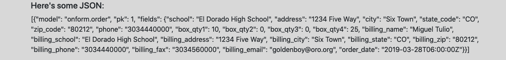

# 2019-04-20 | #100DaysofCode

## Day 048 / 100

- [2019-04-20 | #100DaysofCode](#2019-04-20--100daysofcode)
  - [Day 048 / 100](#day-048--100)
  - [SELECT * FROM Project](#select--from-project)
    - [Project.abstract](#projectabstract)
    - [Project.loxocache(2019-04)](#projectloxocache2019-04)
  - [SELECT * FROM Session](#select--from-session)
    - [Session.abstract](#sessionabstract)
      - [Session.cache](#sessioncache)
  - [Session.journal(2019-04-20)](#sessionjournal2019-04-20)
    - [Loxocache](#loxocache)
    - [17:49 -+- Session.init](#1749----sessioninit)
    - [17:50 -+- JSerializerON](#1750----jserializeron)
    - [18:04 -+- Systematerializations](#1804----systematerializations)
    - [18:15 -+- Save Yourself](#1815----save-yourself)
    - [19:02 -+- MoreClass](#1902----moreclass)
    - [19:20 -+- de.Sassy](#1920----desassy)

---

## SELECT * FROM Project

### Project.abstract

    GOAL_OnForm : Create a simple way to fill out a PDF form online

### Project.loxocache(2019-04)

    TASK_044 : Ask if billing address is the same, if so, fill in automatically  
    TASK_047 : Figure out a way to have the navbar change the "active" page  

    CUE_043 : Set up script to automatically post parts of this coding journal to blog app  
    CUE_043 : Save the output PDF into a django/postgres table  

    IDEA_047 : Write CLI tool that sets up the basic Django template with a couple of commands  

    CUE_047 : Start learning Django REST Framework  
    CUE_047 : Read up on REST = Representational State Transfer  

--------ø--------

## SELECT * FROM Session

### Session.abstract

    GOAL_049 : Serialize the model data and pass to orderdetail.html  

#### Session.cache

- pass

---

## Session.journal(2019-04-20)

### Loxocache

    TASK_048 : Write to the database via the form  
    TASK_048 : Write to the database via the admin page  
    TASK_048 : Add checkbox / functionality for same address as above  
    TASK_048 : Fix black so it autoformats  

--------ø--------

### 17:49 -+- Session.init

Installed the fyinit script in the challenges environment...

    $ pip install -e Projects/fyinit
    Obtaining file:///Users/Tobias/workshop/Challenges/100DaysofX/01_Code/Projects/fyinit
    Collecting Click (from fyinit==0.1)
    Using cached https://files.pythonhosted.org/packages/fa/37/45185cb5abbc30d7257104c434fe0b07e5a195a6847506c074527aa599ec/Click-7.0-py2.py3-none-any.whl
    Installing collected packages: Click, fyinit
    Running setup.py develop for fyinit
    Successfully installed Click-7.0 fyinit

---

### 17:50 -+- JSerializerON

I wrote some code in the orderdetail view that might work for serializing an order's data and passing it to the template. I'm not super experienced with this kind of thing so it's a bit of guess-work.

    def orderdetail(request, order_id):
        try:
            order = get_object_or_404(Order, pk=order_id)
        except Order.DoesNotExist:
            return Http404("Order does not exist.")
        json_data = serialize("json", Order.objects.get(pk=order_id))
        return render(
            request, "orderdetail.html", {"order": order, "json_data": json_data}
        )

It actually worked! Wow that was a nice surprise. It doesn't look pretty but the data is there! That's totally tubular, bruchacho!

Now I need to figure out how to pick out specific data from the json in a systematic way. I tried passing only the current order into the serializer but it threw an error saying that the object is not iterable.

I would like to turn the single order data into an iterable, though I guess I could pass the pk as the "selector" to pick out the data from the entire model's data.

Another method would be to write to a JSON file that holds the data. This file could get rewritten each time the view is called.

---

### 18:04 -+- Systematerializations

First method I'm going to try is using the order_id that's already being passed to the template to choose the specific data from the entire model's jason data.

Ok I think I was just doing it wrong when I tried serializing the single order. I had used the .get() method instead of .filter(). When I used the filter method it worked! As there's only one order in the system right now, I can't tell if it actually only pulled the one or not. And that reminds me...

I still can't write to the database using the form. That's pretty important, so I'm going to fix that first.

    TASK_048 : Write to the database via the form  

Another way to write to the form would be through the admin page.

    TASK_048 : Write to the database via the admin page  

---

### 18:15 -+- Save Yourself

Ok after some finagling I wasn't able to get it to work - it says that it can't find orderdetail.html, which I'm guessing is due to the responseredirect line in the orderform view:

    return HttpResponseRedirect(
        reverse("onform:orderdetail", args=(order.id,))
    )

The reasoning for me thinking this is that I moved the templates directory to the project root. However, now it's just returning me to the same page without saving the data to the database.

----ø----

I set up the orders page, where all the orders are simply listed out in table format. And I successfully used a ClassBasedView!

    class Orders(ListView):
        model = Order
        template_name = "orders.html"
        context_object_name = "orders"

----ø----

For some reason black isn't auto-formatting the code anymore. I'll have to figure that out at some point or switch to autopep8, though I think the problem would be the same: pointing vscode to the correct instance of black.

    TASK_048 : Fix black so it autoformats correctly on save  

---

### 19:02 -+- MoreClass

I found a good article on [how to use the CreateView](https://www.agiliq.com/blog/2019/01/django-createview/). I attempted to use it earlier in the build but couldn't get it to work within a reasonable time frame so didn't use it. The thing I got stuck on was passing the argument into the redirect function. It seems this article goes over how to do that correctly.

Let's get to it!

--ø--

This article actually has a section on populating the form with initial data, which might be useful when implementing the "same address as above" functionality.

    def get_initial(self, *args, **kwargs):
        initial = super(BookCreateView, self).get_initial(**kwargs)
        initial['title'] = 'My Title'
        return initial

--ø--

Here's what I did after reading the article...

> onform/views.py

    class OrderFormView(CreateView):
        template_name = "orderform.html"
        form_class = OrderForm

> onform/models.py

    def get_absolute_url(self):
        return reverse('onform:orderdetail', args=[self.id])

---

### 19:20 -+- de.Sassy

I'm still not getting the redirect to orderdetail.html, but while I'm on a roll creating ClassBasedViews, I'm going to just implement them into OrderDetail as well.

That is for next time.

Hasta bananas, amigas!