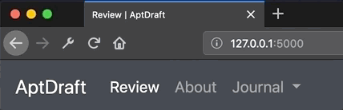

# 2019-05-02 | #100DaysofCode

## Day 060 / 100

- [2019-05-02 | #100DaysofCode](#2019-05-02--100daysofcode)
  - [Day 060 / 100](#day-060--100)
  - [SELECT * FROM Project](#select--from-project)
    - [Project.abstract](#projectabstract)
    - [Project.loxocache(2019-05)](#projectloxocache2019-05)
  - [SELECT * FROM Session](#select--from-session)
    - [Session.abstract](#sessionabstract)
      - [Session.cache](#sessioncache)
  - [Session.journal(2019-05-02)](#sessionjournal2019-05-02)
    - [Loxocache](#loxocache)
    - [22:58 ~ Session.init](#2258--sessioninit)
    - [23:11 ~ AptForms](#2311--aptforms)
    - [23:51 ~ Sessions](#2351--sessions)
    - [00:21 ~ db.session](#0021--dbsession)

## SELECT * FROM Project

### Project.abstract

    GOAL__: Book review application with Flask / Postgres  

### Project.loxocache(2019-05)

    TASK__: Collect any other tags from relevant entries  

--------∫--------

## SELECT * FROM Session

### Session.abstract

    GOAL_060 : Finish Flask + SQL lectures while building AptDraft / Project 1  

#### Session.cache

- [CS50w Lecture 2 - Flask](https://youtu.be/j5wysXqaIV8)

---

## Session.journal(2019-05-02)

### Loxocache

--------∫--------

### 22:58 ~ Session.init

Back at the ol' Flask to do some Apt Drafting. I didn't quite finish the Flask lecture last time, but I'm still stoked on how nice the code is that automatically sets the current page to active in the menu bar.

It's the little / simple things.

This time my goal is to finish the Flask lecture and the next one, which is on SQL. If there is any time left over, I'll continue working on Project 1.

----∫----

Just realized I can use the same general idea as the active page to also set the title automatically.

    <title>{{ active_page|title() }} | AptDraft</title>

Nice! It worked!

---

### 23:11 ~ AptForms

I created a form that submits a book title which is then displayed on a different page.

    @app.route("/journal", methods=["POST"])
    def journal():
        title = "journal"

        book = request.form.get("book")
        headline = f"A Review of {book}"

        return render_template(
            "journal.html", title=title, headline=headline, book=book
        )

However, I want to try to have the form submit to the same page, with the new book title added to the list of books. From the part of the lecture I was watching literally as I typed that last sentence, I can use a list of methods to do this.

I ran into the "method not allowed" error when I first tried to do it. So maybe this will let me get around that.

Sweet I got it to work!

    @app.route("/", methods=["GET", "POST"])
    def review():
        title = "review"
        headline = "Here are some books"
        books = [
            "Turing's Cathedral",
            "Walkaway",
            "The Design of Everyday Things",
            "Django For Beginners",
        ]

        book = request.form.get("book")
        if book:
            books.append(book)

        return render_template(
            "review.html", title=title, headline=headline, books=books
        )

Obviously not the prettiest block of code in the world, and it doesn't do a whole lot. But it mostly works as intended. The reason I say "mostly" is that every time a book is submitted it just replaces the previous one. I think if I put the list of books outside of the review function it should work better.

    books = [
        "Turing's Cathedral",
        "Walkaway",
        "The Design of Everyday Things",
        "Django For Beginners",
    ]

    @app.route("/", methods=["GET", "POST"])
    def review():
        title = "review"
        headline = "Here are some books"

        book = request.form.get("book")
        if book:
            books.append(book)

        return render_template(
            "review.html", title=title, headline=headline, books=books
        )

Yup! Now it adds them on even if I keep submitting them.

---

### 23:51 ~ Sessions

Starting out with an example that is basically the same as what I created above. Decided to write it again from scratch as the journal endpoint.

    entries = []

    @app.route("/journal", methods=["GET", "POST"])
    def journal():
        headline = "A Journal For Your Reading Journey"

        if request.method == "POST":
            entry = request.form.get("entry")
            entries.append(entry)

        return render_template("journal.html", headline=headline, entries=entries)

As long as the server continues to run, the list / global variable being used to store the submitted data will continue to hold the data that was appended to it.

Now time to make it personal. I don't want everyone looking at my junk.

The Flask Session functionality allows me to make it so the entries that I submit are only appended to my own unique "session" list instead of to the global list that is accessible by anyone else. Pretty neat.

    from flask import Flask, render_template, request, session
    from flask_session import Session

    @app.route("/journal", methods=["GET", "POST"])
    def journal():
        headline = "A Journal For Your Reading Journey"

        session["entries"] = []
        if request.method == "POST":
            entry = request.form.get("entry")
            session["entries"].append(entry)

        return render_template("journal.html", headline=headline, entries=session["entries"])

However, the above code would reset the session list every time a note is submitted. So the below change is implemented...

    ...
    if session.get("entries") is None:
        session["entries"] = []
    if request.method == "POST":
        entry = request.form.get("entry")
        session["entries"].append(entry)
    ...

It *should* work...however, I'm getting an error saying that...

    ModuleNotFoundError: No module named 'flask_session'

Not going to worry about it now because I want to get on with the DB side of things.

---

### 00:21 ~ db.session

Might have to start on the base of data tomorrow as it's getting late.

Buenos Fuegos, Amigos!