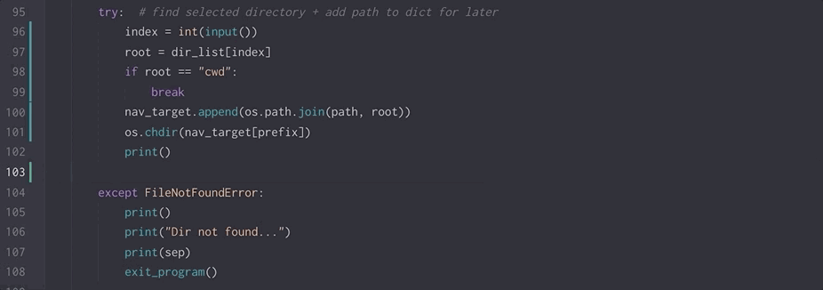

# 2019-05-10 | #100DaysofCode

## Day 068 / 100

- [2019-05-10 | #100DaysofCode](#2019-05-10--100daysofcode)
  - [Day 068 / 100](#day-068--100)
  - [SELECT * FROM Project](#select--from-project)
    - [Project.abstract](#projectabstract)
    - [Project.loxocache(2019-05)](#projectloxocache2019-05)
  - [SELECT * FROM Session](#select--from-session)
    - [Session.abstract](#sessionabstract)
      - [Session.cache](#sessioncache)
  - [Session.sojourn(2019-05-10)](#sessionsojourn2019-05-10)
    - [Loxocache](#loxocache)
    - [14:09 ~ Session.init](#1409--sessioninit)
    - [14:11 ~ Troubleshootin' Time](#1411--troubleshootin-time)
    - [14:31 ~ People Make Mistakes](#1431--people-make-mistakes)
    - [14:43 ~ Practical Optimization](#1443--practical-optimization)
    - [14:59 ~ Practicalizations](#1459--practicalizations)
    - [15:15 ~ Some Thots](#1515--some-thots)

---

## SELECT * FROM Project

### Project.abstract

    GOAL-fyinit : CLI tool for intuitive productivity  

    TASK-fyinit : Allow creation of various types of entries (not just Challenges)  
    TASK-fyinit : Function to insert characters into multiple lines i.e. each line with quotes  
    TASK-fyinit : Tag collection  
    TASK-fyinit : Allow for time delta  
    TASK-fyinit : Random {•}.generator  
    TASK-fyinit : Name generator based on my ideabox wordname list  

### Project.loxocache(2019-05)

- Click
  - [GitHub repo](https://github.com/pallets/click)
  - [Page on The Pallets Project](https://palletsprojects.com/p/click/)
  - [Documentation](https://click.palletsprojects.com/en/7.x/)

--------ƒ--------

## SELECT * FROM Session

### Session.abstract

    GOAL-067 : workon the fyinit CLI tool to add more general usefulness  

    IDEA-068 : practical optimization  

#### Session.cache

- extras

---

## Session.sojourn(2019-05-10)

### Loxocache

--------ƒ--------

### 14:09 ~ Session.init

Back at it with fyinit.

---

### 14:11 ~ Troubleshootin' Time

When I left off last time I had the idea to comment out the try/except statement to get the results of the errors.

Commented those lines out and tried it again.  
Found out that the issue is happening because of how I'm appending and retreiving the list of paths.  
The way I wrote it, I was not accessing the previous path that was appended, I was appending the new directory name straight onto the base (where the program was initiated from).

I changed it up already to get it to work but I think I can get it back to how it looked before I fixed it.

    def dir_picker(path):
        """Allows user to choose from list of paths in cwd."""

        os.chdir(path)

        prefix = 0
        nav_target = []

        root = ""

        while True:
            dir_list = os.listdir(os.getcwd())
            dir_list.sort()

            # removes files from list - .DS_STORE, README, etc.
            for d in dir_list:
                if os.path.isfile(d):
                    dir_list.remove(d)
            # TODO: also remove other .file directories like .git

            dir_list.insert(0, "cwd")

            print(sep)
            print(justify_center(root, v_width, s_icon))
            table_printer(dir_list, "Choose-a-Dir", 8, 25)
            print(sep)
            print(sep_ps)

            try:  # find selected directory + add path to dict for later
                index = int(input())
                root = dir_list[index]
                if root == "cwd":
                    break
                nav_target.append(os.path.join(path, root))
                os.chdir(nav_target[prefix])
                print()

            except FileNotFoundError:
                print()
                print("Dir not found...")
                print(sep)
                exit_program()

            prefix += 1

That is what it was before I fixed it...

Here is the working version.

    def dir_picker(path):
        """Allows user to choose from list of paths in cwd."""

        os.chdir(path)
        nav_target = [path]
        prefix = 0
        root = ""

        while True:
            dir_list = os.listdir(os.getcwd())
            dir_list.sort()

            # removes files from list
            for d in dir_list:
                if os.path.isfile(d):
                    dir_list.remove(d)

            dir_list.insert(0, "cwd")

            print(sep)
            print(justify_center(root, v_width, s_icon))
            table_printer(dir_list, "Choose-a-Dir", 8, 25)
            print(sep)
            print(sep_ps)

            try:  # find selected directory + add path to dict for later
                index = int(input())
                root = dir_list[index]
                if root == "cwd":
                    break
                new_root = os.path.join(nav_target[prefix], root)
                nav_target.append(new_root)
                os.chdir(nav_target[prefix + 1])
                print()

            except FileNotFoundError:
                print()
                print("Dir not found...")
                print(sep)
                exit_program()

            prefix += 1

Now that I have it working, I can navigate down a directory path indefinitely then choose "cwd" when I get to the one in which I want to create the entry.

There's something important missing, however...and it should be pretty obvious to most people.

---

### 14:31 ~ People Make Mistakes

That is a truth. I want to be able to account for mistakes in directory choosing.

Therefore, an option to go up a directory should also be available.

And I think I have a crude way of doing that already in mind.

Now that I think about it a bit more I believe an even better way has come to mind. I'm going to do the first one to see if it works then take a stab at the second one.

The first idea basically does the same thing as the "cwd" except instead of breaking the loop, it sets the nav target back a step instead of forward.

Nice...it worked!

    index = int(input())
    root = dir_list[index]
    if root == "cwd":
        break
    elif root == "..":
        os.chdir(nav_target[prefix - 1])
    else:
        new_root = os.path.join(nav_target[prefix], root)
        nav_target.append(new_root)
        os.chdir(nav_target[prefix + 1])

Not perfect but I got it to work on the first try. Not bad. Already thinking of better ways to implement this feature. That's what it's all about...

...practical optimization.

---

### 14:43 ~ Practical Optimization

One of the ways I believe I can optimize this function is by taking advantage of some built-in tools in [os.path](https://docs.python.org/3/library/os.path.html) and [pathlib](https://docs.python.org/3/library/pathlib.html#module-pathlib). I should be able to access certain portions of the current path instead of relying on the list.

In particular, for the "back" functionality, I should be able to access the parent directory—all the parent directories, in fact.

I could technically do it by using the .split() method on the path then calling the [-1] index or something to that effect...

    In [17]: os.path.abspath(os.getcwd()).split("/")
    Out[17]: ['', 'Users', 'Tobias', 'workshop', 'Fineyedesign']

But I bet there's an even better way.

Here are some examples I used to test out certain methods I thought might possibly be useful:

> /Users/Tobias/workshop/Fineyedesign

    # could be used to navigate up one directory
    In [20]: os.path.split(os.getcwd())
    Out[20]: ('/Users/Tobias/workshop', 'Fineyedesign')

    # could be used in a similar fashion to os.path.split()
    In [21]: os.path.dirname(os.getcwd())
    Out[21]: '/Users/Tobias/workshop'

---

### 14:59 ~ Practicalizations

I thought of a potential reason why the code I wrote to remove files from the list of directories wasn't working as expected.

    # removes files from list
    for d in dir_list:
        if os.path.isfile(d):
            dir_list.remove(d)

My thought is that I'm not pointing the .isfile() method at the correct thing. I'll try doing a join to make sure the entire path is passed into that method.

    cur_dir = os.getcwd()
    # removes files from list
    for d in dir_list:
        if os.path.isfile(os.path.join(cur_dir, d)):
            dir_list.remove(d)

Still not removing them correctly. So I'm going to rewrite this section how I should've done it in the beginning—additive rather than subtractive. I shouldn't even add the .dirs and files to the list in the first place.

    cur_dir = os.getcwd()
    dir_list = []

    for d in os.listdir(cur_dir):
        if (
            os.path.isdir(os.path.join(cur_dir, d))
            and d.startswith(".") is False
        ):
            dir_list.append(d)

    dir_list.sort()

It works great!

---

### 15:15 ~ Some Thots

I still want to optimize the code as I was going to a couple of time stamps above—namely with the .dirname() method.

That will have to wait until next time.

The thots I was alluding to in the stamp header have to do with some leftovers from the fyinit project being exclusively a `Challenges` utility...it still:

- creates a directory automatically instead of giving the option
- may not open the correct workspace
- uses the day_num variable for the 100 Day Challenge

Basically, the script needs to be generalized more.

Next time! On #100DaysofCode...

Hasta proxima, amiga!