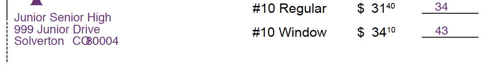
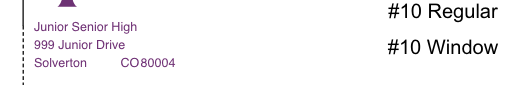
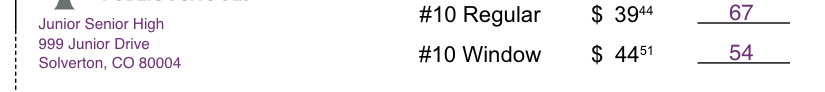

# 2019-05-13 | #100DaysofCode

## Day 071 / 100

- [2019-05-13 | #100DaysofCode](#2019-05-13--100daysofcode)
  - [Day 071 / 100](#day-071--100)
  - [SELECT * FROM Project](#select--from-project)
    - [Project.abstract](#projectabstract)
    - [Project.loxocache(2019-05)](#projectloxocache2019-05)
    - [Global.loxicache(2019-04)](#globalloxicache2019-04)
  - [SELECT * FROM Session](#select--from-session)
    - [Session.abstract](#sessionabstract)
      - [Session.cache](#sessioncache)
  - [Session.sojourn(2019-05-13)](#sessionsojourn2019-05-13)
    - [10:45 ~ Session.init](#1045--sessioninit)
    - [10:55 ~ Recondite Render](#1055--recondite-render)
    - [11:51 ~ Telestic Troubles](#1151--telestic-troubles)
    - [12:05 ~ Lygophiliac Learning Lyncean Loops](#1205--lygophiliac-learning-lyncean-loops)
    - [12:43 ~ Collections](#1243--collections)
    - [13:13 ~ List phrontistery.info/l.html](#1313--list-phrontisteryinfolhtml)
    - [14:45 ~ Onsite Klondike](#1445--onsite-klondike)
    - [15:45 ~ Fluviological Functions](#1545--fluviological-functions)
    - [16:27 ~ Font Format Frescade](#1627--font-format-frescade)
      - [IDEA-133 : Write script to scrape Phrontistery](#idea-133--write-script-to-scrape-phrontistery)
      - [IDEA-133 : Use Phrontistery API to automatically tweet out words](#idea-133--use-phrontistery-api-to-automatically-tweet-out-words)
    - [17:58 ~ Sizing Scaffmaster](#1758--sizing-scaffmaster)
      - [IDEA√050 : render_pdf.js - loop through field_data for drawText](#idea050--render_pdfjs---loop-through-field_data-for-drawtext)
    - [18:14 ~ Ibidem Integration](#1814--ibidem-integration)
    - [21:40 ~ First Things Firkins](#2140--first-things-firkins)
    - [22:54 ~ Mostly Complete](#2254--mostly-complete)
      - [TASK-134 : Edit PDF Template - take out top header line](#task-134--edit-pdf-template---take-out-top-header-line)
    - [23:03 ~ Session Schwärmerei](#2303--session-schwärmerei)
      - [TASK-134 : Pass the Uint8Array from pdf-lib to Django / Python instead of using Node](#task-134--pass-the-uint8array-from-pdf-lib-to-django--python-instead-of-using-node)

---

## SELECT * FROM Project

### Project.abstract

    GOAL-OnForm : Intuitive online PDF order form  

### Project.loxocache(2019-05)

    LVL1-054 : Set production Postgres to only accept connections from application  
    LVL1-051 : Install + Configure Nginx Web Server  
    LVL1-051 : Configure SSL on subdomain  
    LVL1-050 : Add success message to orderdetail  

    LVL2-050 : Implement email feature  
    LVL2-050 : Serialize model data  
    LVL2-050 : Display PDF on OrderDetail  
    LVL2-050 : Fix labels on OrderFormView  

    LVL3-044 : Ask if billing address is the same, if so, fill in automatically  
    LVL3-050 : Randomish numbering scheme for orders  
    LVL3-050 : Fix formatting of OrderDetail info @top - unless displaying PDF  

    IDEA√050 : render_pdf.js - loop through field_data for drawText  

### Global.loxicache(2019-04)

    CUE-043 : Set up script to automatically post parts of this coding journal to blog app  
    CUE-047 : Start reading up on Django REST Framework  

--------Ø--------

## SELECT * FROM Session

### Session.abstract

    GOAL-071 : Send filled PDF in test environment  

    TASK-134 : Edit PDF Template - take out top header line  
    TASK-134 : Pass the Uint8Array from pdf-lib to Django / Python instead of using Node  

#### Session.cache

- [Mozilla JavaScript Guide](https://developer.mozilla.org/en-US/docs/Web/JavaScript/Guide)
  - [Loops & Iteration](https://developer.mozilla.org/en-US/docs/Web/JavaScript/Guide/Loops_and_iteration)
  - [Indexed Collections](https://developer.mozilla.org/en-US/docs/Web/JavaScript/Guide/Indexed_collections#Array_object)
  - [HTML Collections](https://developer.mozilla.org/en-US/docs/Web/API/HTMLCollection)

---

## Session.sojourn(2019-05-13)

--------Ø--------

### 10:45 ~ Session.init

To get my brain warmed up, I'm going to try to complete one of the tags above. Namely...

    IDEA-050 : render_pdf.js - loop through field_data for drawText  

I think that I know how to do it in at least one way that would greatly reduce the length of that part of the script.

NIce to have that node app set up so I don't have to spin up the entire Django server to test things out with some javascript.

---

### 10:55 ~ Recondite Render

> ~/workshop/Fineyedesign/../render_pdf

Basically, I have this section of the render_pdf.js script that simply lists out every field that I want to draw onto the PDF. However, it feels very WET—not DRY—and has at least one rather simple solution.

    const contentStream = pdfDoc.createContentStream(
        // Group 1 - Envelope Info
        drawText(helveticaFont.encodeText(field_data.order_info.school.data), {
            x: field_data.order_info.school.pos[0],
            y: field_data.order_info.school.pos[1],
            size: font_size,
            font: 'Helvetica',
            colorRgb: custom_colors.jeffco,
        }),
        ...
        ...
        ...
        drawText(helveticaFont.encodeText(field_data.billing_info.email.data), {
            x: field_data.billing_info.email.pos[0],
            y: field_data.billing_info.email.pos[1],
            size: font_size,
            font: 'Helvetica',
            colorRgb: custom_colors.jeffco,
        }),
    );

Not shown above is the 17 additional drawText instances between the top and bottom ones.  
In total, the contentStream object is around 140 lines long. Not ideal, especially when there relatively simple ways of shortening / simplifying it.

The one that I'm thinking of involves writing a function, then looping that function through the field_data array in order to create each instance of drawText.

---

### 11:51 ~ [Telestic](http://phrontistery.info/t.html) Troubles

Unfortunately, I'm not really getting anywhere right now. I tried converting the array into a list of lists to make it iterable but went wrong somewhere. Not sure where.

Here's the general structure I came up with. Ugly AF, I know. That's javascript for you...

    let modelData = [
        {
            form_group: [
                {
                    fields: [
                        {
                            data: [
                                order_school,
                                [184, 680]
                            ]
                        }
                    ]
                },
                ...
                {
                    fields: [
                        {
                            data: [
                                order_box_qty4,
                                [525, 314],
                            ]
                        }
                    ]
                },
            ]
        },
        {
            form_group: [
                {
                    fields: [
                        {
                            data: [
                                order_billing_name,
                                [84, 209],
                            ]
                        }
                    ]
                },
                ...
                {
                    fields: [
                        {
                            data: [
                                order_billing_email,
                                [84, 82],
                            ]
                        }
                    ]
                },
            ]
        },
    ];

Something is wrong with how I set it up. Whenever I tested out my function (below) that loops through and logs the items, I got an error that `fields` is not iterable...

    function fieldData(modelDataArray) {
        for (let form_group of modelDataArray) {
            for (let field of form_group.field) {
                for (let data of field.data) {
                    console.log(data)
                }
            }
        }
    }

The error:

    ╭─ Fineyedesign » tobiasfyi » ..-Node/render_pdf »  master ● ?     19.05.13 ∫ 11:36:25
    ╰─ node renderloop_test.js
    /Users/Tobias/workshop/Fineyedesign/08-Projects/10-SketchBox/32-Node/render_pdf/renderloop_test.js:339
            for (let fields of form_group.fields) {
                                        ^

    TypeError: form_group.fields is not iterable

---

### 12:05 ~ [Lygophiliac](http://phrontistery.info/l.html) Learning [Lyncean](http://phrontistery.info/l.html) Loops

This presents a really great learning opportunity for me. I want to be an expert at structuring information and data / information architecture. Thus, learning how to do this is just what I want to be doing.

Here are a couple of good resources to dig into once I come back to this subject:

- [Mozilla JavaScript Guide](https://developer.mozilla.org/en-US/docs/Web/JavaScript/Guide)
  - [Loops & Iteration](https://developer.mozilla.org/en-US/docs/Web/JavaScript/Guide/Loops_and_iteration)
  - [Indexed Collections](https://developer.mozilla.org/en-US/docs/Web/JavaScript/Guide/Indexed_collections#Array_object)

---

### 12:43 ~ Collections

I wrote the following to try and get the exhibitor names from the webpage...

    coList = document.getElementsByClassName("exhibitorName");

What is returned is an [HTML Collection](https://developer.mozilla.org/en-US/docs/Web/API/HTMLCollection).

I tried some other queries..

    $ list = document.querySelector("a.exhibitorName").textContent;
    > "HI-TEC Outdoor & Sports"

For some reason it doesn't work if I use the `.querySelectorAll` selector...ok actually it was just showing up as undefined when I entered the command. Upon further inspection, there are items in the resulting NodeList. It is the same list as `coList`...

    var list = document.querySelectorAll("a.exhibitorName")

Yesss! From the NodeList / HTMLCollection I can access .textContent...

    $ console.log(list[0].textContent)
    »» HI-TEC Outdoor & Sports

---

### 13:13 ~ List phrontistery.info/l.html

Woop woop! I got the list of exhibitors to print to the console with a for loop...

    for (let i = 0; i < list.length; i++) {
        console.log(list[i].textContent);
    }

    HI-TEC Outdoor & Sports         debugger eval code:2:13
    Pelican Products                debugger eval code:2:13
    Bliss Hammocks, Inc.            debugger eval code:2:13
    ...
    Zodiac Event Displays           debugger eval code:2:13
    Zotefoams                       debugger eval code:2:13
    Z-Shade Co., Ltd.               debugger eval code:2:13

Noice!

    var list = document.querySelectorAll("a.exhibitorName");

    var exhArray = new Array(list.length);

    for (let i = 0; i < list.length; i++) {
        exhArray[i] = list[i].textContent;
    }

Now that I have a new array (exhArray) with only the company names, I need to find a good way to save that to a JSON or JS file. Did a little searching on Mozilla docs...

Here's some good info on [Client-Side Storage](https://developer.mozilla.org/en-US/docs/Learn/JavaScript/Client-side_web_APIs/Client-side_storage). However, I'm just using the [Firefox Dev Console](https://developer.mozilla.org/en-US/docs/Tools). So all I really need is to figure out how to save information out of the console.

Here is some info on the [Web Console specifically](https://developer.mozilla.org/en-US/docs/Tools/Web_Console/The_command_line_interpreter).

    pprint()
        Formats the specified value in a readable way; this is useful for dumping the contents of objects and arrays.

    copy()
        New in Firefox 38. Copy the argument to the clipboard. If the argument is a string, it's copied as-is. If the argument is a DOM node, its outerHTML is copied. Otherwise, JSON.stringify will be called on the argument, and the result will be copied to the clipboard.

I'm going to try the copy() command and see what happens...it worked great! I pasted into a js file and added a variable assignment...

const exhibitorList = [
    "HI-TEC Outdoor & Sports",
    "Pelican Products",
    "Bliss Hammocks, Inc.",
    "iKamper",
    "2undr",
    "4ocean",
    "5.11 Tactical",
    "8BPLUS",
    "A Plus Chan Chia",
    ...
    "Zippo Manufacturing Company",
    "Ziyu Enterprise Co., Ltd.",
    "Zodiac Event Displays",
    "Zotefoams",
    "Z-Shade Co., Ltd."
]

Boom! No more Chinese laundry.

---

### 14:45 ~ Onsite Klondike

What I'm going to do is restructure the data to be something like this:

    const field_data = [
        [order_school, 184, 680],
        [order_address, 142, 655],
        ...
        [order_billing_fax, 360, 106]
        [order_billing_email, 84, 82],
    ]

I believe that should make both levels iterable. I don't really need to prop names while doing the loop, because they will just be `[i]`. Computers are good at that type of thing.

    for (let i = 0; i < field_data.length; i++) {
        for (let x = 0; x < field_data[i].length; x++) {
            console.log(field_data[i][x])
        }
    }

It looks like it worked for the most part!

All of the values were logged to the console successfully. However, I received a TypeError message at the end.

    ╭─ Fineyedesign » tobiasfyi » ..-Node/render_pdf »  master ● ?                                19.05.13 ∫ 15:27:58
    ╰─ node rendertest2.js
    Junior Senior High
    184
    680
    ...
    (549)309-8904
    84
    106
    /Users/Tobias/workshop/Fineyedesign/08-Projects/10-SketchBox/32-Node/render_pdf/rendertest2.js:55
        for (let x = 0; x < field_data[i].length; x++) {
                                        ^
    TypeError: Cannot read property 'length' of undefined
        at Object.<anonymous> (/Users/Tobias/workshop/Fineyedesign/08-Projects/10-SketchBox/32-Node/render_pdf/rendertest2.js:55:39)

Not sure exactly why I'm getting that error, though it seems to not happen until the end, which makes me thing that there is something going on with the length. I'm going to try hard-coding the length into the loop to see if it still throws the error...

...actually, nevermind. I think I found the mistake. When going into the js code to rewrite the look I noticed that there was a missing comma on the second to last item in the list...

This mistake can actually be seen in the code snippet above, in which I showed the new data structure.

Trying it again with the comma...aaaaaand we are gold, pony boiiii!

    ╭─ Fineyedesign » tobiasfyi » ..-Node/render_pdf »  master ● ?             19.05.13 ∫ 15:41:43
    ╰─ node rendertest2.js
    Junior Senior High
    184
    680
    999 Junior Drive
    142
    655
    ...
    (549)309-8914
    360
    106
    junior@senior.edu
    84
    82

Groovy. Now time to build the function that puts the values into the drawText function.

---

### 15:45 ~ [Fluviological](http://phrontistery.info/f.html) Functions

Copied the origina render_pdf.js into a new render-pdf.js file to mess around with it—though the "original" in this case is not actually the original, but the original *copy*.

I need to access specific elements within each of the outer loops iterations. Therefore I don't actually need the inner loop...I can just write it like this (proof-of-concept):

    for (let i = 0; i < field_data.length; i++) {
        console.log(field_data[i][0]);
        console.log(field_data[i][1]);
        console.log(field_data[i][2]);
    }

Correct! The result is the same as the loop above, but now I can easily access each element within the inner array, which is what I needed anyways.

Instead of logging each of those elements, I assigned them to their corresponding variable then passed that into the drawText function. The result is a much simpler solution than I had even set out to create. Looks quite nice-ish...

    for (let i = 0; i < field_data.length; i++) {
        var text = field_data[i][0];
        var x = field_data[i][1];
        var y = field_data[i][2];

        drawText(helveticaFont.encodeText(text), {
            x: x,
            y: y,
            size: font_size,
            font: 'Helvetica',
            colorRgb: custom_colors.jeffco,
        })
    }

Now to test it out...aaaaaand error.

First, I got this:

    ╭─ Fineyedesign » tobiasfyi » ..-Node/render_pdf »  master ● ?             19.05.13 ∫ 15:51:13
    ╰─ node render-pdf.js
    /Users/Tobias/workshop/Fineyedesign/08-Projects/10-SketchBox/32-Node/render_pdf/node_modules/pdf-lib/lib/core/pdf-structures/factories/PDFStandardFontFactory.js:111
                    .split('')
                    ^
    TypeError: text.split is not a function

Then I saw that I had assigned the variables to the incorrect indexes. Fixed it and then got this...

    ╭─ Fineyedesign » tobiasfyi » ..-Node/render_pdf »  master ● ?             19.05.13 ∫ 15:58:43
    ╰─ node render-pdf.js
    /Users/Tobias/workshop/Fineyedesign/08-Projects/10-SketchBox/32-Node/render_pdf/render-pdf.js:105
    page.addContentStreams(pdfDoc.register(contentStream));
                                        ^
    ReferenceError: contentStream is not defined

I forgot to call the function inside of the contentStream method. Whoops...fixed it and tried again...

It took a little bit of fanciful finagling to get right, but I believe that I did it, Watson!

    ╭─ Fineyedesign » tobiasfyi » ..-Node/render_pdf »  master ● ?             19.05.13 ∫ 16:19:17
    ╰─ node render-pdf.js
    PDF file written to: /Users/Tobias/workshop/Fineyedesign/08-Projects/10-SketchBox/32-Node/render_pdf/assets/2019-05-13-onform.pdf

I thought about trying out a [forEach loop](https://developer.mozilla.org/en-US/docs/Web/JavaScript/Reference/Global_Objects/Array/forEach), but never got around to it. Could be useful to call a function over an array.

The way I did it makes sense now, but it took me a little while to get there. I was used to creating one giant contentStream which I then register once. However, after not being able to figure out how to run the function many times within one contentStream, I realized that I would have to create the contentStream and register it *within* the loop.

Once I tried that, it went through...

    function textDrawer(dataArray, i) {
        var text = dataArray[i][0];
        var x = dataArray[i][1];
        var y = dataArray[i][2];

        const contentStream = pdfDoc.createContentStream(
            drawText(helveticaFont.encodeText(text), {
                x: x,
                y: y,
                size: font_size,
                font: 'Helvetica',
                colorRgb: custom_colors.jeffco,
            })
        );

        page.addContentStreams(pdfDoc.register(contentStream));
    }

    for (let i = 0; i < field_data.length; i++) {
        textDrawer(field_data, i);
    };

Looks like there was a tiny little bug in there somewhere, as can be seen below. However, I don't think it will be too hard to fix.

---

### 16:27 ~ Font Format [Frescade](http://phrontistery.info/f.html)

While thinking about how to fix that bug, I came up with the idea of adding the font size to the array that already holds all of the text and coordinates for each field.

I mean I could really have every option within the drawText function be an element in that list. I don't see a need for having different fonts or colors right now, but there may come a time.

For now I'm just going to add the font_size to the end of the array, and refactor the code accordingly.

Also, in case the Phrontistery never gets back to me about creating that API, I can just do it myself. It will be relatively easy to pull the table data for each letter (maybe even write a Python script to do all of the pages automatically?)

#### IDEA-133 : Write script to scrape Phrontistery  

#### IDEA-133 : Use Phrontistery API to automatically tweet out words  

---

### 17:58 ~ Sizing [Scaffmaster](http://phrontistery.info/s.html)

Decided to add the font size to the field_data array. Now I'm going through and adding that field to the textDrawer function.

    // [0]-text | [1]-x | [2]-y | [3]-font size |
    const field_data = [
        ...
        [order_school, 27, 477, 10],
        [order_address, 27, 463, 10],
        ...
    ]

    function textDrawer(dataArray, i) {
        ...
        var font_size = dataArray[i][3];
        ...
    }

I'm so glad I refactored this code into a function like this. Before I did, te script was 355 lines...

Can you guess how much it was reduced by?

...I'd guess around 150 lines.

The new version of the script clocks in at 125 lines. That's a reduction of...

    ╭─ Fineyedesign » tobiasfyi » ..-Node/render_pdf »  master ●               19.05.13 ∫ 18:11:04
    ╰─ node linecalc.js
    The og script is 355 lines.
    The new script is 125 lines.
    That's a reduction of 230 lines!

Feels good to slim down by half! And that's not to mention being more maintainable and flexible.

Those are all legitimate gains as well, as I had already taken out most of the comments and such, and even added in some lines that created the date / filepath.

#### IDEA√050 : render_pdf.js - loop through field_data for drawText  

---

### 18:14 ~ [Ibidem](http://phrontistery.info/i.html) Integration

Next up is integrating Node into Django to run this app, then integrating the email functionality to email it after it is generated.

I'm realizing now that I really don't know much about node. I'm going to have to spend some time learning in order to integrate it into Django.

---

### 21:40 ~ First Things [Firkins](http://phrontistery.info/f.html)

Before the whole integration thing, I should probably test out the font sizing to be sure it works as expected and if there are any tweaks to the font size or positioning.

Looks like I'll have to move the preview addresses up a bit and fix the spacing on the bottom line.

I want to see if there's a way of figuring out how many points per character, so I can space things automatically. Or maybe use the drawLinesOfText function (or whatever it's called) instead of drawText.

---

### 22:54 ~ Mostly Complete

...duh. I can just use the backticks and create a string for the line of text. Perfect!

Creating the one string out of the City, State, Zip is just what I wanted. Makes that way easier. Not sure why I didn't think to do that before.

One thing to do tomorrow at the shop is edit the template as Tom said—take out the top line of each header. He thinks it makes it look like another field that should be filled out is empty. I can see that and want to make it as straightforward as possible.

#### TASK-134 : Edit PDF Template - take out top header line  

---

### 23:03 ~ Session [Schwärmerei](http://phrontistery.info/s.html)

Managed to get quite a bit of coding in today. And I actually got a good amount done. Solid day.

One thing I'm a bit worried about is how to finish this feature off...

From what I've read about using Node and Django side-by-side, it doesn't seem like it's done all that much. I'll potentially give it a go on my local machine to see if I can get it to work, but I'm not going to place any huge bets on it working. That's not to mention having it work on the linux server as well...

One avenue to success I am thinking about is somehow converting the Uint8Array that comes out of the JavaScript code into Python that I can then use on the server. I don't see any reason why that is not possible, as I think it's composed of bytes, which Python can obviously handle. If I can do that, my life will be a lot easier.

#### TASK-134 : Pass the Uint8Array from pdf-lib to Django / Python instead of using Node  

Hasta la proxima vez, amigos!
