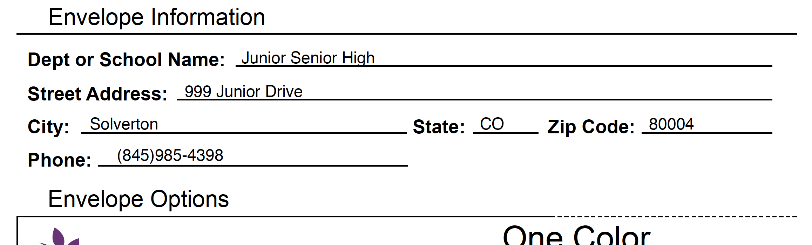

# 2019-05-17 | #100DaysofCode

    GOAL-05-17 ~ Finish JeffCo Email functionality  

## Day 075/100 | 137/365

- [2019-05-17 | #100DaysofCode](#2019-05-17--100daysofcode)
  - [Day 075/100 | 137/365](#day-075100--137365)
    - [11:40 -+- Session.init](#1140----sessioninit)
    - [11:50 ~ Discon](#1150--discon)
    - [11:51 ~ Raad ReportLab](#1151--raad-reportlab)
    - [11:56 ~ Workon Whodunitry](#1156--workon-whodunitry)
      - [TASK√141 : Generate a basic plain-text PDF with reportlab](#task141--generate-a-basic-plain-text-pdf-with-reportlab)
    - [13:52 ~ Rearrange My Lines](#1352--rearrange-my-lines)
    - [14:14 ~ Ombrophilous Objects](#1414--ombrophilous-objects)
    - [14:33 ~ Methods Magnicaudate](#1433--methods-magnicaudate)
    - [15:07 ~ More Test and Tentation](#1507--more-test-and-tentation)
    - [IT](#it)
    - [FUCKING](#fucking)
    - [WORKED](#worked)
    - [15:12 ~ Success Sarsonet](#1512--success-sarsonet)
    - [15:26 ~ Fatiloquent FileData Flow](#1526--fatiloquent-filedata-flow)
      - [LVL2-141 : Button / field to email another copy of PDF](#lvl2-141--button--field-to-email-another-copy-of-pdf)
    - [15:39 ~ Impavid Integration](#1539--impavid-integration)

---- Tasks ----

    LVL1-137 : Write PDF from within OnForm Django application  
    LVL1-137 : Figure out how to pull data from database for PDF  

    LVL2-137 : Add success message to confirm that PDF was generated and sent  
    LVL2-137 : Create EnviroVar for destination filepath  
    LVL2-137 : Fix the Form Labels  
    LVL2-137 : Button / field to email another copy of PDF  

    TASK√137 : Generate a basic plain-text PDF with reportlab  
    TASK√137 : Use coordinates to layout PDF with reportlab  

    CUE-137 : Industrial Fasteners Online Order Form  

---- Notes ----

    CUE-137 : Workflow for playlisting / music organization  
    CUE-137 : Khan Academy course on Algorthms  

---- Resources ----

- I found [a stack overflow answer](https://stackoverflow.com/questions/1180115/add-text-to-existing-pdf-using-python) that goes over how to read files into ReportLab using PyPDF2, edit them, then export them also using PyPDF2
- The answer above references the [PyPDF2 watermark example](https://github.com/mstamy2/PyPDF2/blob/master/Sample_Code/basic_features.py)
- I found another pure-python library for generating and modifying PDFs [called pdfrw](https://github.com/pmaupin/pdfrw)

---- Sojourn ----

### 11:40 -+- Session.init

Got set up on the triple screen dealio. at Philip's place. I need to get this going at my workstation at home.

Discussed the pdf email situation with Philip when I was working in his office last week. He recommended that I keep as much of the logic for generating the PDF on the server itself.

For some reason my computer is not connecting to the internet here at the shop. I'm going to try restarting it.

---

### 11:50 ~ Discon

Seems to still be running into the same problem...ok I was finally able to get it. NordVPN kept trying to connect but xfinity doesn't let users run VPNs on their internet. Lame.

Well...I am connected to the wifi but not getting any up/down.

I'll worry about it later.

---

### 11:51 ~ Raad ReportLab

Raad: Electric catfish.

I just saw on the ReportLab site that one of the last updates (though back in 2014) added Pillow as the dependency to replace PIL. My suspicions are true!

---

### 11:56 ~ Workon Whodunitry

First things first, I'm going to test out some basic PDF generation using ReportLab / Pillow. One of my problems when I last tried to use ReportLab was not taking the time to learn the most basic functionality before trying to get going with the advanced stuff.

#### TASK√141 : Generate a basic plain-text PDF with reportlab  

I'm going to use the same project / environment as the current OnForm on my computer. If I need to revert, I can recreate the virtual environment and revert the repo.

    ╭─ onform » tobiasfyi » ..s/ReportLab/Code »  renderer ● ?                              19.05.17 ∫ 12:00:26
    ╰─ pip install pillow
    ...
    Successfully installed pillow-6.0.0

Now for the reportlab install...

    ╭─ onform » tobiasfyi » ..s/ReportLab/Code »  renderer ● ?                              19.05.17 ∫ 12:01:24
    ╰─ pip install reportlab
    ...
    Requirement already satisfied: pillow>=4.0.0 in /Users/Tobias/.vega/onform/...
    Installing collected packages: reportlab
    Successfully installed reportlab-3.5.17

Ok time to test things out with the most basic example in the reportlab [documentation](https://www.reportlab.com/documentation/)...

> ~/workshop/onform/01-Docs/ReportLab/Code/01-basic_pdfgen.py

    from reportlab.pdfgen import canvas
    def hello(c):
    c.drawString(100,100,"Hello World")
    c = canvas.Canvas("hello.pdf")
    hello(c)
    c.showPage()
    c.save()

It generated a PDF at least! That's something.

    ╭─ onform » tobiasfyi » ..s/ReportLab/Code »  renderer ● ?                              19.05.17 ∫ 12:04:55
    ╰─ python 01-basic_pdfgen.py

    ╭─ onform » tobiasfyi » ..s/ReportLab/Code »  renderer ● ?                              19.05.17 ∫ 12:05:00
    ╰─ l
    ...
    -rw-r--r--  1 Tobias  staff   158B May 17 12:04 01-basic_pdfgen.py
    -rw-r--r--  1 Tobias  staff   1.4K May 17 12:05 hello.pdf

Now to see if it worked...and it did! It generated a PDF with "Hello World" near the bottom left corner.

I'm glad that the coordinate system works the same in reportlab as in pdf-lib.

---

### 13:52 ~ Rearrange My Lines

After some rearrangement and finagling I managed to get it to run using a loop that (hopefully) loops through the data and writes it to the PDF...

```python
pdf = canvas.Canvas("report-onform.pdf")

def text_drawer(pdf):
    for string in format_data:
        text, x, y, font_size = string
        pdf.drawString(x, y, text)

text_drawer(pdf)
pdf.showPage()
pdf.save()
```

Time to take a looksee...ok it wrote the text to the pdf, but I took out the part that defines the paper size. It seems to have defaulted to A4 size...added the sizing back in.

```python
from reportlab.lib.pagesizes import letter
...
pdf = canvas.Canvas("report-onform.pdf", pagesize=letter)
width, height = letter
```

Ok trying it again...

Looks like the right size. Checked with the rulers in Acrobat to confirm.

----ƒ----

Now, if I can read in a PDF and write this text on top of it, we're already back in business!

If need be I can draw out everything on the PDF manually using lines and such. It would take a bit longer (probably) but would probably work relatively well. I don't necessarily need to include the images at this point, because the user could download the version that's working right now on the site if they want the images. We don't necessarily need the images.

---

### 14:14 ~ Ombrophilous Objects

According to the reportlab documentation...

    For the dedicated presentation of text in a PDF document, use a text object. 

    The text object interface provides detailed control of text layout parameters not available directly at the canvas level. In addition, it results in a smaller PDF that will render faster than many separate calls to the drawString methods.

        textobject.setTextOrigin(x,y)
        textobject.setTextTransform(a,b,c,d,e,f)
        textobject.moveCursor(dx, dy) # from start of current LINE
        (x,y) = textobject.getCursor()
        x = textobject.getX(); y = textobject.getY()
        textobject.setFont(psfontname, size, leading = None)
        textobject.textOut(text)
        textobject.textLine(text='')
        textobject.textLines(stuff, trim=1)

    The text object methods shown above relate to basic text geometry.
    A text object maintains a text cursor which moves about the page when text is drawn. For example the setTextOrigin places the cursor in a known position and the textLine and textLines methods move the text cursor down past the lines that have been missing.

---

### 14:33 ~ Methods Magnicaudate

I found [a stack overflow answer](https://stackoverflow.com/questions/1180115/add-text-to-existing-pdf-using-python) that goes over how to read files into ReportLab using PyPDF2, edit them, then export them also using PyPDF2.

The answer above references the [PyPDF2 watermark example](https://github.com/mstamy2/PyPDF2/blob/master/Sample_Code/basic_features.py)...

```python
from PyPDF2 import PdfFileWriter, PdfFileReader
...
output = PdfFileWriter()
input1 = PdfFileReader(open("document1.pdf", "rb"))
...
# add page 4 from input1, but first add a watermark from another PDF:
page4 = input1.getPage(3)
watermark = PdfFileReader(open("watermark.pdf", "rb"))
page4.mergePage(watermark.getPage(0))
output.addPage(page4)
...
# finally, write "output" to document-output.pdf
outputStream = file("PyPDF2-output.pdf", "wb")
output.write(outputStream)
```

Just as a note, I found another pure-python library for generating and modifying PDFs [called pdfrw](https://github.com/pmaupin/pdfrw). The last commit was a year ago, so not actively under development but hasn't been too long...

----ƒ----

Here's another example from the same stack overflow answer mentioned above.

```python
from PyPDF2 import PdfFileWriter, PdfFileReader
import io
from reportlab.pdfgen import canvas
from reportlab.lib.pagesizes import letter

packet = io.BytesIO()
# create a new PDF with Reportlab
can = canvas.Canvas(packet, pagesize=letter)
can.drawString(10, 100, "Hello world")
can.save()

#move to the beginning of the StringIO buffer
packet.seek(0)
new_pdf = PdfFileReader(packet)

# read your existing PDF
existing_pdf = PdfFileReader(open("original.pdf", "rb"))
output = PdfFileWriter()

# add the "watermark" (which is the new pdf) on the existing page
page = existing_pdf.getPage(0)
page.mergePage(new_pdf.getPage(0))
output.addPage(page)

# finally, write "output" to a real file
outputStream = open("destination.pdf", "wb")
output.write(outputStream)
outputStream.close()
```

This looks very promising! I'm gonna hafta give it a whirl.

First things first, I need to install PyPDF2...

    ╭─ onform » tobiasfyi » ..s/ReportLab/Code »  renderer ● ?                   19.05.17 ∫ 14:50:47
    ╰─ pip install pypdf2
    ...
    Installing collected packages: pypdf2
    Running setup.py install for pypdf2 ... done
    Successfully installed pypdf2-1.26.0

---

### 15:07 ~ More Test and Tentation

I wrote another script that adds onto the one I wrote earlier. If all goes well it should combine the form_data with the blank PDF. Time for some tentation (experiment by trial and error)...

```python
from reportlab.pdfgen import canvas
from reportlab.lib.pagesizes import letter
import io
from PyPDF2 import PdfFileReader, PdfFileWriter
...
def text_drawer(canv, array):
    """Write content of array to the canvas"""
    for string in array:
        text, x, y, font_size = string

        canv.drawString(x, y, text)

# Create the buffer
packet = io.BytesIO()

# Create PDF with the text data using ReportLab
c = canvas.Canvas(packet, pagesize=letter)
text_drawer(c, format_data)
c.showPage()
c.save()

# Seek to the beginning of the buffer
packet.seek(0)
pdf = PdfFileReader(packet)

# Read in existing PDF
form_blank = PdfFileReader(open("onform-blank.pdf", "rb"))
output = PdfFileWriter()

# Merge the two PDFs
form = form_blank.getPage(0)
text = pdf.getPage(0)
form.mergePage(text)
output.addPage(form)

# Write the output to file
output_stream = open("onform-filled.pdf", "wb")
output.write(output_stream)
output_stream.close()
```

I got a really weird error from a PyPDF2 method...

    ╭─ onform » tobiasfyi » ..s/ReportLab/Code »  renderer ● ?                   19.05.17 ∫ 15:09:27
    ╰─ python 02-pypdf.py
    PdfReadWarning: Xref table not zero-indexed. ID numbers for objects will be corrected. [pdf.py:1736]

However, it did generate *something*...

    ╭─ onform » tobiasfyi » ..s/ReportLab/Code »  renderer ● ?                   19.05.17 ∫ 15:09:43
    ╰─ l
    ...
    -rw-r--r--  1 Tobias  staff   2.5K May 17 15:07 02-pypdf.py
    -rw-r--r--@ 1 Tobias  staff   149K May 17 14:47 onform-blank.pdf
    -rw-r--r--  1 Tobias  staff   160K May 17 15:09 onform-filled.pdf

---

### IT

### FUCKING

### WORKED

---

### 15:12 ~ Success Sarsonet

Sarsonet: Fine and soft silk; soft or gentle.

Holy shit! I got it to work...now I'm on the home stretch baby! That is one beautiful sight. Oh me, oh my...I could cry.



Now all I need to hook up is the email functionality. From Corey Schafer's video, it seemed pretty easy.

---

### 15:26 ~ Fatiloquent FileData Flow

Wrote down the following flow on the window to visualize it / help solidify it in my mind before the final build.

1. User fills out form
2. Submit button is pressed
   1. PDF is generated and saved to server
   2. PDF is sent to Tom via email
   3. User is redirected to the Order Detail page
3. PDF is displayed from the file on the server

And that is about it. One other thing that would be useful is to write in a button to email another copy.

#### LVL2-141 : Button / field to email another copy of PDF  

---

### 15:39 ~ Impavid Integration

It is time to integrate this new python into my local django repo.

Hasta integration, amigos!
