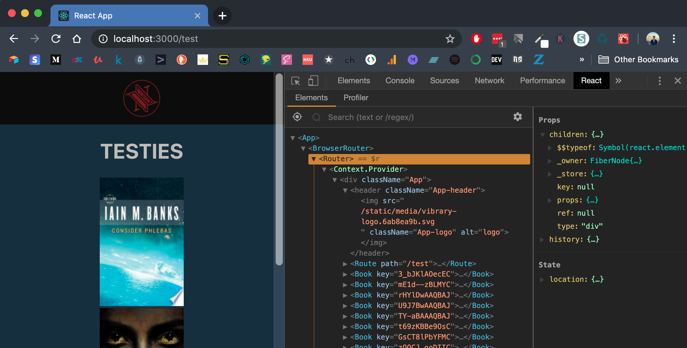

# 2019-06-02 | #100DaysofCode

    GOAL-06-02 ~ workon Vibrary+  

## Day 091/100 | 153/365

- [2019-06-02 | #100DaysofCode](#2019-06-02--100daysofcode)
  - [Day 091/100 | 153/365](#day-091100--153365)
    - [React Rhumatics](#react-rhumatics)
      - [11:16 ~ Lint Plugins Thermogenesis](#1116--lint-plugins-thermogenesis)
      - [11:42 ~ Gurgle Chlurm](#1142--gurgle-chlurm)
      - [11:48 ~ Lintationator](#1148--lintationator)
      - [12:00 ~ The Final Countups](#1200--the-final-countups)
      - [12:32 ~ Behither Beddy By Buy](#1232--behither-beddy-by-buy)

---- Sojourn ----

### React Rhumatics

#### 11:16 ~ Lint Plugins Thermogenesis

Ok watching the video from the filesystem using Quicktime. Let's see how it goes...aaaaaand we're back up to 175˚...

Now it's time to install some dev dependencies for linting.

    ╭─ vibrary » tobiasfyi » ../vibrary/vibrary »  master ●            19.06.02 ∫ 11:21:13
    ╰─ npm install --save-dev eslint eslint-config-airbnb eslint-plugin-react
    + eslint@5.16.0
    + eslint-config-airbnb@17.1.0
    + eslint-plugin-react@7.13.0
    added 7 packages from 7 contributors, updated 2 packages and audited 889369 packages in 22.423s
    found 0 vulnerabilities

Then initialized eslint...

    ╭─ vibrary » tobiasfyi » ../vibrary/vibrary »  master ●            19.06.02 ∫ 11:22:38
    ╰─ eslint --init
    ? How would you like to configure ESLint? Use a popular style guide
    ? Which style guide do you want to follow? Airbnb (https://github.com/airbnb/javascript)
    ? Do you use React? Yes
    ? What format do you want your config file to be in? JavaScript
    Checking peerDependencies of eslint-config-airbnb@latest
    The config that you've selected requires the following dependencies:
    eslint-config-airbnb@latest eslint@^4.19.1 || ^5.3.0 eslint-plugin-import@^2.14.0 eslint-plugin-jsx-a11y@^6.1.1 eslint-plugin-react@^7.11.0
    ? Would you like to install them now with npm? Yes
    Installing eslint-config-airbnb@latest, eslint@^4.19.1 || ^5.3.0, eslint-plugin-import@^2.14.0, eslint-plugin-jsx-a11y@^6.1.1, eslint-plugin-react@^7.11.0
    + eslint@5.16.0 + eslint-plugin-react@7.13.0 + eslint-config-airbnb@17.1.0
    + eslint-plugin-jsx-a11y@6.2.1 + eslint-plugin-import@2.17.3
    added 16 packages from 6 contributors, updated 5 packages and audited 889494 packages in 21.266s
    Successfully created .eslintrc.js file in /Users/Tobias/workshop/vibrary/vibrary

I would like to use the displayport because the colors and such are much better. So I'm going to do some more testing...streaming the video from Firefox again to see if it is as bad as with the displayport cable.

Copied over the eslint configuration from the course files...and the fan is just chugging away again. So I'm going to switch back to displayport.

Fan is still chugging. Now I'm going to test it out with Chrome.

#### 11:42 ~ Gurgle Chlurm

Gosh darnit...I don't want Chrome to work better because I like Firefox more...but so far it's doing fine.

Adding rules to the eslint configuration by going to the rule using `fn+f8` and finding the rule name in the warning / error. Lines can be ignored by adding `//eslint-disable-line`, or the whole file by adding a comment at the top.

Chrome did much better while watching from the filesystem. Tesing it out now streaming the video through Chrome / LUT site.

#### 11:48 ~ Lintationator

Ugh it's almost 2am and I'm feeling awake still. My schedule is all messed up. I want to have more of my day tomorrow! Gonna hit the hay soon.

Before that...we'll be converting the `Book.js` component into a functional stateless component. Pulling out the static proptypes and other class-based things...leaving us with...

```jsx
const Book = props => (
  <div>
    <h3>{props.book.volumeInfo.title}</h3>
  </div>
);

export default Book;

// static propTypes = {
//   book: PropTypes.shape({
//     volumeInfo: PropTypes.shape({
//       title: PropTypes.string.isRequired,
//     }),
//   }),
// }
```

With commented-out propTypes - they are a class-based thing, at least as they *were* defined. Now they can be defined like so...

```javascript
Book.propTypes = {
  book: PropTypes.shape({
    volumeInfo: PropTypes.shape({
      title: PropTypes.string.isRequired,
    }),
  }).isRequired,
};
```

Went back up to the function and changed it a bit to take out the `props`...

```jsx
const Book = ({ book }) => (
  <div>
    <h3>{book.volumeInfo.title}</h3>
  </div>
);
```

#### 12:00 ~ The Final Countups

Just started on the last video of the night: Understanding React Router.

The moment I've been waiting for...pulling in the images. I'm using the image link provided in the API object, as opposed to what he uses for his API.

Dun dun DUNNNN...drumroll pweeeeeez...aaaaaaand...

...

It worked! Fuck ya. Way too much fun right now. I decided to search for Banks' full name as it is for the Culture Series books: Iain M. Banks.

```javascript
const res = await fetch('https://www.googleapis.com/books/v1/volumes?q=inauthor=iain+m+banks&prettyPrint=true&key=N0tY0Ur4P1k3Y!');
```

Now more of the books are Culture Books, though there is at least one that's not even by Banks. Not sure why but I'm sure I could figure it out...here's some info from the object in question:

    authors: Array[1]
      0: "Hannu Rajaniemi"
    ...
    description: "Jean le Flambeur is a post-human criminal, mind burglar, confidence artist, and trickster. His origins are shrouded in mystery, but his exploits are known throughout the Heterarchy- from breaking into…"

Hmm...and the book after that is also not by him. Those (the last) two in the array, plus `books[4]` are all not Banks' books. Can't see any pattern as to why these were returned, but oh well...

...I haven't thought about the fan on my computer since switching to Chrome...damnit...

Maybe it's a bug or something, as I don't recall this happening last night when I was doing this in Firefox.

Imported the routing library...

    ╭─ vibrary » tobiasfyi » ../vibrary/vibrary »  master ● ?          19.06.02 ∫ 02:17:10
    ╰─ npm install react-router-dom
    npm WARN deprecated core-js@1.2.7: core-js@<2.6.8 is no longer maintained. Please, upgrade to core-js@3 or at least to actual version of core-js@2.
    + react-router-dom@5.0.0
    added 19 packages from 89 contributors and audited 889559 packages in 21.148s
    found 0 vulnerabilities

Then imported into the app...

```javascript
import React from 'react';
import {
  BrowserRouter as Router,
  Route
} from 'react-router-dom';
import logo from './vibrary-logo.svg';
import './App.css';
```

...wrapper the app in `<Router>` tags.

```jsx
render() {
  return (
    <Router>
      <div className="App">
      ...
      </div>
    </Router>
  );
}
```

Adding a route within the app just for testing purposes.

```jsx
...
</header>
<Route path="/test" component={Test} />
...
// http://localhost:3000/test
```

Going to the route `/test` renders the component that was passed into the `<Route>` tag. And thus, TESTIES are rendered. Good to note that it rendered the component on top of everything else.

Oh ya, happy June!



Man now that things are starting to get more fun I want to keep learning even more...but I know I should hit the hay. If I watched this next one, it would keep me for at least another 20-25 mins...

#### 12:32 ~ Behither Beddy By Buy

I'm gonna go to bed...actually though. I'm doing it. I want to have most of my *day* tomorrow, if possible.

And now I'm even more stoked to get back to it. Good motivation to be productive.

Hasta mañanamana, amamnamaniga!
