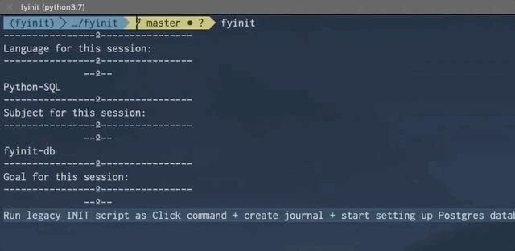

# 2019-03-23 | #020

\#100DaysofCode

- [2019-03-23 | #020](#2019-03-23--020)
  - [Today's Menu](#todays-menu)
    - [Main Course](#main-course)
    - [LVL0_](#lvl0)
    - [LVL1_](#lvl1)
    - [LVL2_](#lvl2)
    - [LVL3_](#lvl3)
    - [Extras](#extras)
  - [Session Log](#session-log)
    - [00:05 -∫- Session Init](#0005--%E2%88%AB--session-init)
    - [00:19 -+- Session Finit](#0019----session-finit)

---

## Today's Menu

### Main Course

--------∫--------

### LVL0_  

    GOAL_ : Run Legacy Init Script As Click Command + Create Journal

--------∫--------

### LVL1_  

--------∫--------

### LVL2_  

--------∫--------

### LVL3_  

--------∫--------

### Extras

---

## Session Log

### 00:05 -∫- Session Init

Spent the last hour inserting my old Python INIT script into a single monolothic function inside of a click command. This means that as long as fyinit is installed in the current environment, I'll at least be able to kick off a session with a single word:

    $ fyinit
    > And BOOM!

If you don't know what that's from, [smh...](https://www.youtube.com/watch?v=L4aX0c6ffuI)

### 00:19 -+- Session Finit

I originally wanted to work on setting up the Postgres database to hold journal entries and other such things. However, as I spent over an hour working on that, I'll count that as my hour for day #019.

It is *technically* Day #020 now and I still want to work on that database for at least an hour.

I'll use the [that journal](../020_Sql_Postgres/020_journal.md) to write those notes.

Hasta allí, Amigo!

----∫----

Next time I work on the script:

TASK_ : To get boilerplate journal use template.md + [file.read()](https://youtu.be/Uh2ebFW8OYM?t=370)