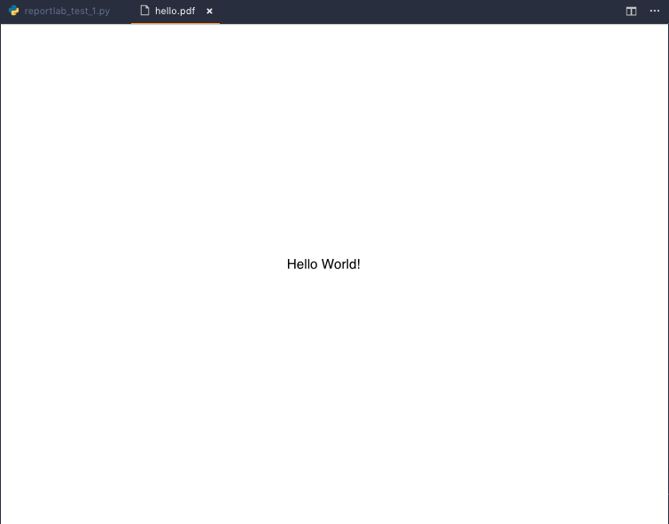
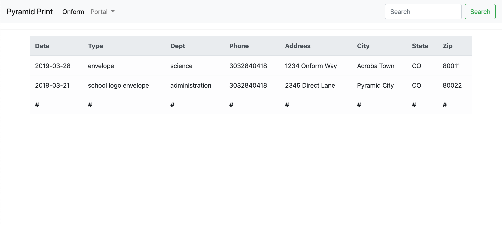

# 2019-03-27 | #020

\#100DaysofCode

- [2019-03-27 | #020](#2019-03-27--020)
  - [Today's Menu](#todays-menu)
    - [Main Course](#main-course)
    - [CUE_](#cue)
    - [Extras](#extras)
  - [Session Log](#session-log)
    - [9:45 -∫- Session Init](#945--%E2%88%AB--session-init)
    - [10:52 -+- Python](#1052----python)
    - [10:11 -+- What's In a Name?](#1011----whats-in-a-name)
    - [10:20 -+- Adult Steps](#1020----adult-steps)
    - [10:33 -+- Hell O' Whirled](#1033----hell-o-whirled)
    - [10:45 -+- Session Disengage](#1045----session-disengage)

---

## Today's Menu

### Main Course

    GOAL_ : Get a working prototype going for the online PDF form  

    TASK√01 : Python - just write something to a PDF - Hell o'Whireld!
    TASK_02 : Python - take input + place it in correct location on PDF
    TASK_03 : Write HTML forms (probably [Django forms](https://docs.djangoproject.com/en/2.1/topics/forms/)) to gather all input data
    TASK_04 : Python - save input data to database
    TASK_05 : Python - write input data to PDF (also using some CSS, JS and/or HTML)
    TASK_06 : Python - email finished PDF out to relevant parties
    TASK_07 : JavaScript - display the filled out PDF (not necessary for prototype)

--------∫--------

### CUE_  

CUE keyword denotes reminders or, in this case, secondary things that should be done or decided upon.

    TASK_ : Set up (sub)domain for PDF form  

    TASK_ : NAME.pyramidprint.graphics/ = {
       *onform
        pdform
        portal
        hardcopy
        softcopy
        subcopy
        oncopy
        subform
        coprint
        suprint
    }

--------∫--------

### Extras

---

## Session Log

### 9:45 -∫- Session Init

PDForm is...

- A feature I'm building / integrating into a client's website
- Allow users to view and interact with an online version of a PDF Work Order form
- The prototype will be able to:
  - Accept input of text, numbers, and checkboxes
  - Give an experience similar to that of filling out a PDF form in Adobe Acrobat
  - After form is submitted the input data is displayed as if it were a PDF
  - Email a copy of the edited PDF to us or to us and some number of other emails

I've looked around quite a bit and was very surprised by the lack of information I was able to find online about this sort of thing. It seems like it would be relatively simple with the use of a library that could abstract away the complexity of the PDF format.

I've gone back and forth on what language(s) to use for this. Obviously I'll have to use some HTML, CSS, and almost certainly JavaScript. However, as this will be one part of a larger "customer portal" section of the website, I wanted to continue testing out my Python chops by creating a simple Django app that deals with all the logic. 

With that running on the back end / dealing with storing the data / business logic, I don't imagine it will be all that difficult to add some JavaScript / HTML to do the front end work of displaying the forms such that they look like the "hardcopy" version as well as display the final form including all of the input data.

I've found some tools to hopefully help me along the way, such as jsPDF to create PDF from HTML using JavaScript and the Python package ReportLab.

I'm going to try to not use any JS frameworks (yet...). At some point, I would like to start learning one—probably Vue.

One step at a time though, as all I need right now is a prototype to show my boss that this will work very well. He'll be stoked as long as it's easier than their previous method—user downloads PDF, fills it out (probably by hand and scan), and emails it back to us, at which point we enter it into our estimation software.

Gotta get the prototype working by next Thursday (2019-03-28).

Let's do it!

### 10:52 -+- Python

As I enjoy writing Python the most / am the best at it / wasted some time today trying unsuccessfully to get jsPDF to work, I'm going to see how much of it I can do with only minimum JavaScript.

Already started building a simple Django app. Now I'm going to try out that package ReportLab:

    $ conda install -c anaconda reportlab
    > Downloading and Extracting Packages
        reportlab-3.5.13     | 2.4 MB
        libtiff-4.0.10       | 524 KB
        pillow-5.4.1         | 574 KB
        libpng-1.6.36        | 296 KB
        olefile-0.46         |  48 KB
        zstd-1.3.7           | 593 KB
        jpeg-9b              | 236 KB
        freetype-2.9.1       | 864 KB

        Preparing transaction: done
        Verifying transaction: done
        Executing transaction: done

### 10:11 -+- What's In a Name?

Just now came up with the new working title for the feature:

    IDEA_ : OnForm | onform.pyramidprint.graphics

Playing on the phrases / words "on form", online form, inform.

### 10:20 -+- Adult Steps

- HTML forms to gather input data
- JavaScript to serialize input data
- Python to organize data into PDF
- Python to email the finished PDF

----∫----

General steps toward ultimate goal:

    TASK√01 : Python - just write something to a PDF - Hell o'Whireld!
    TASK_02 : Python - take input + place it in correct location on PDF
    TASK_03 : Write HTML forms (probably [Django forms](https://docs.djangoproject.com/en/2.1/topics/forms/)) to gather all input data
    TASK_04 : Python - save input data to database
    TASK_05 : Python - write input data to PDF (also using some CSS, JS and/or HTML)
    TASK_06 : Python - email finished PDF out to relevant parties
    TASK_07 : JavaScript - display the filled out PDF (not necessary for prototype)

### 10:33 -+- Hell O' Whirled

Ayyye I got a Hello World PDF working!  
That was much easier than with jsPDF.

Crossed off numba one above:
TASK√01 : Write something to PDF with Python

Installed extension [LaTex Workshop](https://github.com/James-Yu/LaTeX-Workshop) to view PDFs in VSCode.

### 10:45 -+- Session Disengage

Got a basic Django app up and running to display a static HTML template.  
Made it look pretty with a table, though this is not the view that I need to produce for the prototype.

I don't want to copy over the entire Django project right now, but here's what the HTML table looks like:

And the code:

    

        <table class="table table-light">
            <thead class="thead-light">
                <tr>
                    <th>Date</th>
                    <th>Type</th>
                    <th>Dept</th>
                    <th>Phone</th>
                    <th>Address</th>
                    <th>City</th>
                    <th>State</th>
                    <th>Zip</th>
                </tr>
            </thead>
            <tbody>
                
                <tr>
                    <td>{{ input_data.date_requested }}</td>
                    <td>{{ input_data.type }}</td>
                    <td>{{ input_data.department }}</td>
                    <td>{{ input_data.phone }}</td>
                    <td>{{ input_data.address }}</td>
                    <td>{{ input_data.city }}</td>
                    <td>{{ input_data.state }}</td>
                    <td>{{ input_data.zip_code }}</td>
                </tr>
                
            </tbody>
            <tfoot>
                <tr>
                </tr>
            </tfoot>
        </table>
    

Still, feeling pretty good about the progress thus far.  
It helps so much to break things down into manageable baby/adult steps.

Hasta LuSENDo, Amigo!
