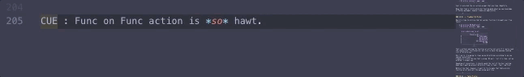
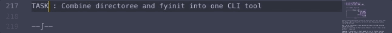

# 2019-03-28 | #025

\#100DaysofCode

- [2019-03-28 | #025](#2019-03-28--025)
  - [Today's Menu](#todays-menu)
    - [Main Course](#main-course)
    - [SELECT * FROM session](#select--from-session)
      - [Soundtrack](#soundtrack)
      - [Coolz](#coolz)
      - [Extras](#extras)
  - [Session Log](#session-log)
    - [17:20 -+- Sessionit](#1720----sessionit)
    - [17:21 -+- But What Is *Really* In A Rename](#1721----but-what-is-really-in-a-rename)
    - [18:01 -+- TreeRoot DirPicker](#1801----treeroot-dirpicker)
    - [18:24 -+- Table Printer](#1824----table-printer)
    - [18:35 -+- Sessioned](#1835----sessioned)

---

## Today's Menu

### Main Course

    GOAL_ : Create Directory Tree Via Python Click Cli Tool Directree

--------∫--------

### SELECT * FROM session

#### Soundtrack

- Back to the [Mechanarium OST](https://youtu.be/03l0ksPHYG4)
- Some more [instrumental jazzzzz](https://youtu.be/Evb31p5vFs4)

#### Coolz

[Giphy Capture](https://giphy.com/apps/giphycapture) is one of the best things ever.

#### Extras

Sitting down hurts my back. Now that I use a standing desk at home I really notice it when I've been sitting most of the day, such as when I'm at a client's office. If you haven't given it a go, I'd highly recommend trying it out.

However, don't only try for one or two days. The beginning is not fun as your body adjusts to doing what it's actually supposed to be doing—keeping you upright on your feet. I'd recommend trying it out for at least two weeks. Get a memory foam mat if you have to, but definitely give it a go. As long as you have good posture, your back / body will thank you later.

---

## Session Log

--------∫--------

### 17:20 -+- Sessionit

IDEA_ : directree = directoree

I just realized a mussed it on naming the tool directree when I could've named it directoree.

Soooo...let's learn how difficult it is to rename such things!

--------∫--------

### 17:21 -+- But What Is *Really* In A Rename

    $ pip uninstall directree
    > Uninstalling directree-0.1:
        Would remove:
          /anaconda3/envs/fyinit/bin/directree
          /anaconda3/envs/fyinit/lib/python3.7/site-packages/directree.egg-link
      Proceed (y/n)? y
        Successfully uninstalled directree-0.1

Now I believe I just have to change setup.py, the name of the directory (directoree, anyone?), and the .py file itself.

...Let's see how it breaks!

On a side note, I guess I forgot to re-comment-out the makedirs command because there is a directory called some_new_project.  
I guess it works?

**OK** time to pip install this bad boy back into my (virtual) world:

    $ pip install --editable .
    > Installing collected packages: directree
        Running setup.py develop for directree
      Successfully installed directree

It seems I missed something...

    $ pip uninstall directree
    > Can't uninstall 'directree'. No files were found to uninstall.

Hmmmm...

    $ pip uninstall directoree
    > Uninstalling directoree-0.1:
        Would remove:
          /anaconda3/envs/fyinit/bin/directoree
          /anaconda3/envs/fyinit/lib/python3.7/site-packages/directoree.egg-link
      Proceed (y/n)? y
        Successfully uninstalled directoree-0.1

Ok well nothing broke, which is good. But it also didn't fully take the new name.  
Now I'm going to try to delete the .egg-info directory for directree and run it again.  
Also just remembered about \_\_pycache\_\_—that also has directree.  
Deleting that and trying again:

...screw it, just gonna start the package from scratch, though not much scratching will (ideally) be involved:

    directoree
    .
    ├── directoree.py
    └── setup.py

    $ pip install --editable .
    > Obtaining file:///Users/Tobias/Documents/Projects/Challenges/100DaysofX/01_Code/Projects/directoree
      Requirement already satisfied: Click in /anaconda3/envs/fyinit/lib/python3.7/site-packages (from directoree==0.2) (7.0)
      Installing collected packages: directoree
        Running setup.py develop for directoree
      Successfully installed directoree

Ok looks like it worked—now time to test it out:

    $ directoree 00_NewProject
    > zsh: correct 'directoree' to '_directories' [nyae]? n
      Directory (project, app): project
      ----------------º----------------

      'ere's where you're at...
      /Users/Tobias/Documents/Projects
      ----------------º----------------

      So, you wanna create a root for 00_NewProject?
      ----------------º----------------

      This is where it shall be created...
      /Users/Tobias/Documents/Projects
      ----------------º----------------

Sweet, it works!  
One thing that is a little iffy is the fact that zsh asked to correct directoree...  
If that happens every time I might have another problem on my hands.  
However, now I know how to solve it easily!  

I know what is really in a rename.

    $ directoree 00_NewProject
    > Directory (project, app): app
      ----------------º----------------

Cool it only did the correction prompt that one time. Hopefully.

Whew that took a little while but feeling good about my new knowledge of Python packages, however simple an application.

--------∫--------

### 18:01 -+- TreeRoot DirPicker

Now it's time to utilize that dir_picker function I brought over from fyinit.  

    $ directoree 00_NewProject
    > Directory (project, app): app
      ----------------º----------------

      'ere's where you're at...
      ----------------º----------------
      -----------Choose-a-Dir----------
      0.......            02_Tobyreaper
      1.......               04_AjeoLab
      2.......               05_SassyJo
      3.......           20_todojournal
      4.......                   70_CRM
      ----------------º----------------
                    --º--

That's without editing the function at all—so not sure if I really need the choose-a-dir functionality, but nice to have the awesome-looking list of directories.

Don't worry, I'm going to clean up my directorees according to my new naming conventions.  
I guess it's only the one that's wrong. Oh well, "not it's time, not my problem" I always say.

Speaking of conventions, I should spend the rest of the hour nailing down how I want my project directory trees to look / feel / perform.

Before I do that, however, I want to try to make that table printer function print dots all the way along each line.

--------∫--------

### 18:24 -+- Table Printer

The reason I didn't do this before is it takes a little teensy bit of math and extra thinking to get it right, which I guess I didn't want to do when I first wrote it.

Basically, instead of passing in the left and right width as arguments to the function, I'll be using some über complex matématica to find the lengths of the string on the right side and use that to determine the width of the left.

I still want the table to always be the same width as everything else though, so I'm going to use the v_width variable as the total width of the table:

    def table_printer(array, title, table_width):
        """Formats an array - table of contents style."""

        print(f"{title}".center(table_width, "-"))

        for k, v in enumerate(array):
            right_width = len(v)
            left_width = table_width - right_width
            print(str(k).ljust(left_width, ".") + str(v).rjust(right_width))

That looks a lot better—but does it work?  
Find out **NOW** on tobias.fyi.rm.fm :

    Blah blah blah errors...
      table_printer(dir_list, "Projects", 10, 23)
    TypeError: table_printer() takes 3 positional arguments but 4 were given

Woops! Forgot to change where I actually *call* the func, which is in the dir_picker func.  

*Don't you think?*

Just had the idea that at some point I want to combine this tool with fyinit. Easy to do with click!

    TASK_ : Combine directoree and fyinit into one CLI tool  

In case you didn't get enough of that custom highlight action earlier...

--∫--

Ok now this should work:

    table_printer(dir_list, "Projects", v_width)

--∫--

It's almost there! Looks a lot...better?

    Directory (project, app): project
    ----------------º----------------

    'ere's where you're at...
    ----------------º----------------
    -------------Projects------------
    0...........................empty
    1...............00_Knowledge_Base
    2...................01_Tobias_FYI
    3.................30_Applications
    4......................40_Clients
    5...................60_Podcasting
    6............................CS50
    7......................Challenges
    ----------------º----------------
                  --º--

I almost liked it more the other way. But maybe this will grow on me.

Or maybe it would be better with underlines instead of full-stops:

    Directory (project, app): project
    ----------------º----------------

    'ere's where you're at...
    ----------------º----------------
    -------------Projects------------
    0__________________________.empty
    1_______________00_Knowledge_Base
    2___________________01_Tobias_FYI
    3_________________30_Applications
    4______________________40_Clients
    5___________________60_Podcasting
    6____________________________CS50
    7______________________Challenges
    ----------------º----------------
                  --º--
    ^C
    Aborted!

Oh no! Abort!

I'm not sure...I guess time will tell what character I like more, but I'm leaning toward dots.

--------∫--------

### 18:35 -+- Sessioned

Ok well that will about do it for tonight's session.

I would go out for a walk but it's currently cold and rainy, so we'll see.

Bueno Función, Amigo!