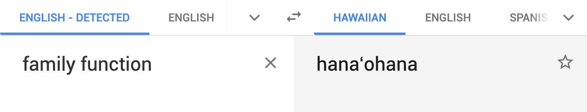

# 2019-03-29 | #026

\#100DaysofCode

- [2019-03-29 | #026](#2019-03-29--026)
  - [Today's Menu](#todays-menu)
    - [Main Course](#main-course)
    - [SELECT * FROM session](#select--from-session)
      - [Soundtrack](#soundtrack)
      - [Extras](#extras)
  - [Session Log](#session-log)
    - [20:58 -+- Sessionit](#2058----sessionit)
    - [21:00 -+- Hana'ohana](#2100----hanaohana)
    - [21:15 -+- This is Project Smartass](#2115----this-is-project-smartass)
    - [-+- smartass.life](#smartasslife)
    - [-+- Planning.init](#planninginit)
      - [init](#init)
    - [22:45 -+- Conda Create](#2245----conda-create)
    - [22:56 -+- To Cut Cookies Or Not](#2256----to-cut-cookies-or-not)
    - [23:12 -+- Django Startproject](#2312----django-startproject)
    - [23:28 -+- Git.init](#2328----gitinit)
    - [-+- Dat Back End Doe](#dat-back-end-doe)
    - [00:54 -+- Sessiond](#0054----sessiond)

---

## Today's Menu

### Main Course

    GOAL_ : Django Journal Entry + PDForm App  

--------∫--------

### SELECT * FROM session

#### Soundtrack

- pass

#### Extras

- Water is *good* so drink plenty of it

---

## Session Log

--------∫--------

### 20:58 -+- Sessionit

Just in case you didn't know, "hana'ohana" means family function in Hawaiian.

That was going to be more relevant because I was planning on working on the Click CLI tool I've been writing over the past few sessions.  
However, I decided to work on the Django PDForm tool instead.

--------∫--------

### 21:00 -+- Hana'ohana

Time for some family functions!

I made the decision to finally begin working earnestly on the app I've been wanting to create for years, though *really* *really* wanting to create especially bad since I started my deep dive into development several months ago.

Excited for this!

I'm going to first build the functionality that I want for my own uses:

    GOAL_ : Build a program to make my journaling process a breeze using Django + Postgres  

The fyinit-type of thing was my way of taking the first step toward this application, as it forced me to figure out the processes that work best for me when it comes to journaling—I think of it much like creating documentation for a program, but for everyday life and beyond.

This app will allow me to document my everyday life in a detailed way, with accurate data regarding timing of activities and such quantitative things, while not having to think too much about doing so or taking much time out of my day to get the nitty gritty details down on paper / screen / out into the world.

Beyond that, I want to use this app as part of a larger ecosystem of systems, as it were, that will make my life much, much better. One way I think about this ecosystem is how it's similar in a lot of respects to a CRM software platform—my own personal relationship management platorm, or PRM.

--∫--

I am very happy with the journey thus far, as it has led me to some of the tools I need in order to build it effectively. For example, markdown—which I intend to use extensively in this app—Postgres, click, and more.

I think I have enough of a toolbox and knowledge base to begin and **that gets me stoked!**

Are you ready?

...

Are you *really* ready?

...

Am *I* really ready?

    I'm ready, so let's do this!

--------∫--------

### 21:15 -+- This is Project Smartass

Smart (and Sassy) Assisted Mental (Micro/Macro) Management

A framework / system for self-discovery and growth—to make you more *you*.

Wouldn't it be nice if it were easier to be yourself—truly yourself?

Yes...

    I'm talking about YOU!

Ok enough of that. Time to get down to bid'ness.

--------∫--------

### -+- smartass.life

My addiction to buying awesome URLs aside, this is definitely one of my best URL purchases ever.

    Personal Management System
    --∫--
    AKA
    ...
    PMS

Ok now I'm seriously done.

Time to build.

--------∫--------

### -+- Planning.init

#### [init](https://en.wikipedia.org/wiki/Init)

In Unix-based computer operating systems, init (short for initialization) is the first process started during booting of the computer system. Init is a daemon process that continues running until the system is shut down. It is the direct or indirect ancestor of all other processes and automatically adopts all orphaned processes. Init is started by the kernel using a hard-coded filename; a kernel panic will occur if the kernel is unable to start it. Init is typically assigned process identifier 1.

- Named areas of the software and their functions
- Brand / Naming Styleguide

Initial (Simple) Project Structure:

- smartass (project)
  - sassyjo (simple journal app)
  - onpoint (resume / document builder)
  - onform (online pdf editing / saving / sending)

----∫----

    TASK√01 : Create directory for the system with README  

The main project tree will be separate from the Challenge because I want it to be its own thing. Specifically, I want this project to have its very own git repository.

    /Users/Tobias/Documents/Projects/Smartass

--------∫--------

### 22:45 -+- Conda Create

    TASK√02 : Set up new virtual environment + install dependencies

Much Import:

- python
- django
- pylint
- pep8

- psycopg2
- ipython
- black

Extras / For Later:

- reportlab
- markdown
- click

--∫--

    $ conda create -n smartass python=3.7 django pylint pep8
    > # To activate this environment, use
      #
      #     $ conda activate smartass
      #
      # To deactivate an active environment, use
      #
      #     $ conda deactivate

    $ conda activate smartass

    $ conda install -c anaconda psycopg2
    $ conda install -c anaconda reportlab
    $ conda install -c conda-forge black
    $ conda install -c conda-forge ipython
    $ conda install -c conda-forge click
    $ conda install -c conda-forge markdown

Donezo.  
*For now.*

--------∫--------

### 22:56 -+- To Cut Cookies Or Not

I kept going back and forth whether or not to use cookiecutter-django to kickstart the project.

I'm all about pushing my comfort zone but don't want to get caught up with learning the new layout and whatnot.

But I'm feeling like I should learn how a production Django app is built. I think it'll be worth the extra effort / potential frustration.

    $ conda install -c conda-forge cookiecutter

    cookiecutter https://github.com/pydanny/cookiecutter-django

...eh I might just wait on that. The documentation makes it seem a bit too complicated for what I want to do right now.

See what I mean? Flippy-floppity.

Going to start out without it and see how it goes.

--------∫--------

### 23:12 -+- Django Startproject

    TASK√03 : Start the django project

    $ django-admin startproject smartass
    > done

    TASK√04 : Start the app

    $ django-admin startapp sassyjo
    > done

    /Users/Tobias/Documents/Projects/Smartass
    .
    ├── db.sqlite3
    ├── manage.py
    ├── sassyjo
    │   ├── __init__.py
    │   ├── admin.py
    │   ├── apps.py
    │   ├── migrations
    │   │   └── __init__.py
    │   ├── models.py
    │   ├── tests.py
    │   └── views.py
    └── smartass
        ├── __init__.py
        ├── __pycache__
        │   ├── __init__.cpython-37.pyc
        │   ├── settings.cpython-37.pyc
        │   ├── urls.cpython-37.pyc
        │   └── wsgi.cpython-37.pyc
        ├── settings.py
        ├── urls.py
        └── wsgi.py

    4 directories, 17 files

--------∫--------

### 23:28 -+- Git.init

    TASK√05 : Initialize new Git Repo  

    $ git init
    > Initialized empty Git repository in /Users/Tobias/Documents/Projects/Smartass/.git/

    $ git add .
    $ touch .gitignore

    TASK√06 : add .gitignore  
    TASK√07 : add README.md  
    TASK√08 : Configure VSCode settings
    TASK√09 : Make initial commit  
    TASK√10 : Push to GitHub  

Here's the [GitHub Link](https://github.com/tobias-fyi/smartass).

That took waaaaaaay too long. I guess that means I'm spinning my wheels a bit. But hey, at least I figured it out. As it turns out, git / github doesn't like it when repositories aren't capitalized the same. That caused me to delete and re-init the repository a couple of times before realizing what was happening.

All good.

--------∫--------

### -+- Dat Back End Doe

    TASK_ : Create / Activate new Postgres server  

--------∫--------

### 00:54 -+- Sessiond

I guess dat back end will have to wait until next time.

Buenos Nachos, Amigos.