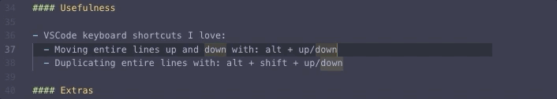
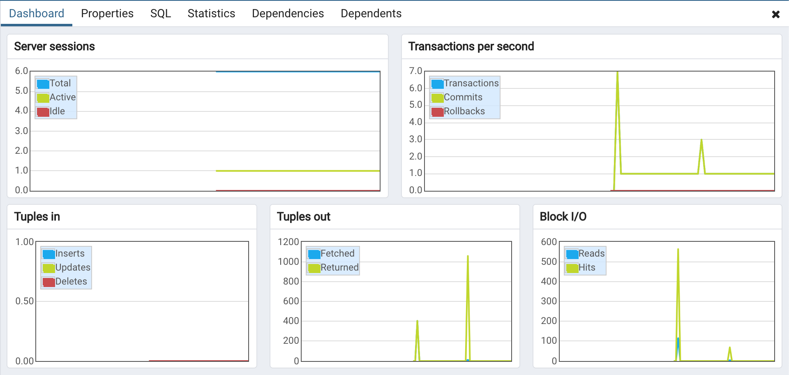

# 2019-03-30 | #027

\#100DaysofCode

- [2019-03-30 | #027](#2019-03-30--027)
  - [Today's Menu](#todays-menu)
    - [Main Course](#main-course)
    - [SELECT * FROM session](#select--from-session)
      - [Soundtrack](#soundtrack)
      - [Usefulness](#usefulness)
      - [Extras](#extras)
  - [Session Log](#session-log)
    - [13:31 -+- Sessionit](#1331----sessionit)
    - [13:32 -+- Postgres](#1332----postgres)
    - [15:43 -+- Docker](#1543----docker)
    - [18:02 -+- Sessioned](#1802----sessioned)

---

## Today's Menu

### Main Course

    GOAL_ : Set Up Postgres Database  
    GOAL_ : Connect to database using environment variable

Using a tool like [DJ-Database-URL](https://github.com/kennethreitz/dj-database-url).

--------∫--------

### SELECT * FROM session

#### Soundtrack

- [Kora at Burning Man 2018](https://www.youtube.com/watch?v=VLLsF0xCt3c)

#### Usefulness

- (VSCode) keyboard shortcuts I love:
  - Moving entire lines up and down with: alt + up/down
  - Duplicating entire lines with: alt + shift + up/down

#### Extras

- Portmanteau (found on the [z GitHub repo](https://github.com/rupa/z))
  - 1 : a large suitcase
  - 2 : a word or morpheme whose form and meaning are derived from a blending of two or more distinct forms (such as smog from smoke and fog)

---

## Session Log

--------∫--------

### 13:31 -+- Sessionit

Decided to make the names of the apps a little more accurate / boring.

However, I'm going to leave the sessionit app in the Smartass project because I think I want to use that as the session-tracking tool, which will be distinct from the journal tool.

--------∫--------

### 13:32 -+- Postgres

    TASK√01 : Set up new Postgres server

Name: Smartass_Server

    TASK√02 : Set up connection to new server on pgAdmin

I'm excited to see this dashboard once the app is cruising along:

I've never set up an environment variable (maybe ever?) to connect to a database, but seeing as this project will be public on GitHub, I thought it would be a good idea to learn.

Export environment:

    $ conda env export > smartass_environment.yaml
    $ cat $_

    name: smartass
    channels:
      - anaconda
      - conda-forge
      - defaults
    dependencies: ...
    ...

Navigate to virtual env dir:

    $ cd /anaconda3/envs/smartass
    >

--------∫--------

### 15:43 -+- Docker

Had to go eat and do some work around the house, but I'm back, *baby!*

I've been thinking a lot lately about the whole cookiecutter thing. The reason I keep leaning back to using it is because it seems that using it would teach me something of how things should be set up for a production application.

On that front, I thought it would be good to learn a bit about Docker.

So I'm going to take a little bit of time to do that and potentially start up a separate test project using cookiecutter.

    TASK√03 : register + download + install Docker Desktop

Installed.

    TASK√04 : spin postgres database + pgadmin into docker containers

    $ docker run --name smartassdb -e POSTGRES_USER="smadmin" -e POSTGRES_PASSWORD="smart4ss" -p 5432:5432 -d postgres
    > 2019-03-31 22:16:34.650 UTC [1] LOG:  database system is ready to accept connections

    $ docker run -p 80:80 --link smartassdb --name smartassadmin -e PGADMIN_DEFAULT_EMAIL="xxx" -e PGADMIN_DEFAULT_PASSWORD="xxx" -d dpage/pgadmin4

    TASK√05 : Log into docker pgadmin for smartassdb  

Had to run the docker command again to get it to work for some reason. Deleted the old docker container and created new one with above command for pgadmin. After that it worked.

Starting over yet again...like an hour later. This time going to do it right.

    $ docker rm smartassdb
    > smartassdb
    $ docker rm smartassadmin
    > smartassadmin

Starting from scratch

    $ docker container run -it -p 80:80 nginx
    > removed it after creating
    $ docker container run -d -p 8080:80 --name smginx nginx
    >  

    $ docker container run -it --name smartassdb -e POSTGRES_USER="smadmin" -e POSTGRES_PASSWORD="smart4ss" -p 5432:5432 -d postgres
    > 2019-03-31 22:16:34.650 UTC [1] LOG:  database system is ready to accept connections

    $ docker run -p 80:80 --link smartassdb --name smartassadmin -e PGADMIN_DEFAULT_EMAIL="admin@smartass.life" -e PGADMIN_DEFAULT_PASSWORD="smart4ss" -d dpage/pgadmin4

--------∫--------

### 18:02 -+- Sessioned

Didn't get a whole lot of useful stuff done today.  
It happens.  

Onto the next.

Beunos Nachos, Amigos!