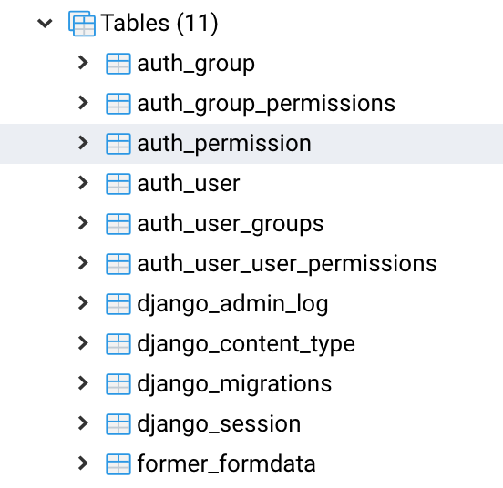

# 2019-03-31 | #028

\#100DaysofCode

- [2019-03-31 | #028](#2019-03-31--028)
  - [Today's Menu](#todays-menu)
    - [Main Course](#main-course)
    - [SELECT * FROM session](#select--from-session)
      - [Soundtrack](#soundtrack)
      - [Extras](#extras)
  - [Session Log](#session-log)
    - [19:28 -+- Sessionit](#1928----sessionit)
    - [19:30 -+- Fresh Django Project](#1930----fresh-django-project)
    - [20:06 -+- Dat Backend (Again)](#2006----dat-backend-again)
    - [20:24 -+- iPython DB Funtime](#2024----ipython-db-funtime)
    - [20:34 -+- SessionSend](#2034----sessionsend)

---

## Today's Menu

### Main Course

    GOAL_ : Write To Database Using Html Form  

--------∫--------

### SELECT * FROM session

#### Soundtrack

- Skyrim Exploration Suite

#### Extras

- pass

---

## Session Log

--------∫--------

### 19:28 -+- Sessionit

Starting over with a fresh Django project.  
Although there will be some time spent doing stuff I've done a few times now for this project, it's good to practice.  

This time, the django project will be located within this day's directory - 028_Django_PDformer.

Let's get this show on the road!

--------∫--------

### 19:30 -+- Fresh Django Project

    $ django-admin startproject pdformer .
    >  

    $ tree
    > .
      ├── manage.py
      └── pdformer
          ├── __init__.py
          ├── settings.py
          ├── urls.py
          └── wsgi.py

      1 directory, 5 files

I hadn't used the full-stop at the end prior to this but it's nice to know. It basically just means that the project isn't created in another directory with the project name, which is a bit redundant given I've already created the project folder.

    $ python manage.py runserver
    > woop woop!

Created Postgres server + database:

    $ CREATE DATABASE pdformer;
    > CREATE DATABASE

Create app 'former':

    $ python manage.py startapp former
    > tree
      ├── former
          ├── __init__.py
          ├── admin.py
          ├── apps.py
          ├── migrations
          │   └── __init__.py
          ├── models.py
          ├── tests.py
          └── views.py

Add app to project's settings.py installed apps:

former/apps.py:

    class FormerConfig(AppConfig):
        name = 'former'

settings.py:

    INSTALLED_APPS = [
        'django.contrib.admin',
        'django.contrib.auth',
        'django.contrib.contenttypes',
        'django.contrib.sessions',
        'django.contrib.messages',
        'django.contrib.staticfiles',
        'former.apps.FormerConfig',
    ]

models.py:

    from django.db import models
        from django.utils import timezone

        class input_data(models.Model):
            date_requested = models.DateTimeField(default=timezone.now)
            phone = models.PositiveIntegerField()
            email = models.EmailField()
            address = models.CharField(max_length=140)
            city = models.CharField(max_length=80)
            state = models.CharField(max_length=2)
            zip_code = models.PositiveIntegerField()

Created first view in views.py:

    from django.http import HttpResponse

    def formpage(request):
        return HttpResponse("Hello there, here are some form fields.")

Created the app's urls.py and wrote in url pattern for formpage view:

    from django.urls import path
    from . import views

    urlpatterns = [path("", views.formpage, name="formpage")]

Updated the project's urls.py with the url configuration:

    from django.contrib import admin
    from django.urls import path, include

    urlpatterns = [
        path("former/", include("former.urls"), name="former"),
        path("admin/", admin.site.urls),
    ]

And it works when the server is running! First try bb.

--------∫--------

### 20:06 -+- Dat Backend (Again)

Forgot to mention earlier that I created a new user in pgAdmin right after creating the database. Made sure to give that user all them nice privileges.

Changed settings.py a little to add a new timezone. Hopefully that doesn't break anything.

    TIME_ZONE = "America/Denver"

Make migrations:

    $ python manage.py makemigrations
    > Migrations for 'former':
      former/migrations/0001_initial.py
        - Create model input_data

Then I decided to change the name of the model to formdata:

    $ python manage.py makemigrations
    > Did you rename the former.input_data model to formdata? [y/N] y
      Migrations for 'former':
        former/migrations/0002_auto_20190401_2011.py
          - Rename model input_data to formdata

Tried to run the migration but received an error:

    $ python manage.py migrate
    > ImproperlyConfigured("settings.DATABASES is improperly configured. "
      django.core.exceptions.ImproperlyConfigured: settings.DATABASES is improperly configured.  
      Please supply the ENGINE value. Check settings documentation for more details.

I see now that I accidentally added an extra key value of "default". That's why it's bad to copy/paste, folks.

Ok let's try this again:

    $ python manage.py makemigrations
    > Operations to perform:
        Apply all migrations: admin, auth, contenttypes, former, sessions
      Running migrations:
        Applying contenttypes.0001_initial... OK
        Applying auth.0001_initial... OK
        Applying admin.0001_initial... OK
        Applying admin.0002_logentry_remove_auto_add... OK
        Applying admin.0003_logentry_add_action_flag_choices... OK
        Applying contenttypes.0002_remove_content_type_name... OK
        Applying auth.0002_alter_permission_name_max_length... OK
        Applying auth.0003_alter_user_email_max_length... OK
        Applying auth.0004_alter_user_username_opts... OK
        Applying auth.0005_alter_user_last_login_null... OK
        Applying auth.0006_require_contenttypes_0002... OK
        Applying auth.0007_alter_validators_add_error_messages... OK
        Applying auth.0008_alter_user_username_max_length... OK
        Applying auth.0009_alter_user_last_name_max_length... OK
        Applying former.0001_initial... OK
        Applying former.0002_auto_20190401_2011... OK
        Applying sessions.0001_initial... OK

AAAAAND BOOM! No more Chinese laundry.

Ah yes, those sweet, sweet TABLES!

Man, that was much easier than the Docker route. Of course I'm going to learn how to do it that way as well, and it really does interest me. I just don't have time for that this session. I need to give my boss a working prototype of this feature on Tuesday. That gives me one more session after this one to build it.

--------∫--------

### 20:24 -+- iPython DB Funtime

As I am somewhat following along with the documentation, I'm going to play around with the API as the docs do. Once again, this is where iPython is great.

    $ python manage.py shell
    >  

Import the model class from models.py:

    In [1]: from former.models import formdata

I just realized I did't follow convention by TitleCasing the class name. I'm going to change that then run the migrations again—and hope to goshdarn that nothing breaks.

Upon changing it to TitleCase, the makemigrations command didn't recognize the change.

    $ python manage.py makemigrations
    > No changes detected

Decided to change the model class to be a bit more descriptive with the title. Hopefully that allows the change to be detected as well:

    class OrderForm(models.Model):
        date_requested = models.DateTimeField(default=timezone.now)
        phone = models.PositiveIntegerField()
        email = models.EmailField()
        address = models.CharField(max_length=140)
        city = models.CharField(max_length=80)
        state = models.CharField(max_length=2)
        zip_code = models.PositiveIntegerField()

Now let's give the ol' migration a go:

    $ python manage.py makemigrations
    > Did you rename the former.formdata model to OrderForm? [y/N] y
      Migrations for 'former':
        former/migrations/0003_auto_20190401_2032.py
          - Rename model formdata to OrderForm

Sweetness.

--------∫--------

### 20:34 -+- SessionSend

Going to call it there for this session. This time getting things up and running was quite painless.

Practice makes less pain?

Not sure about that.

Either way...Buenos Djangos, Amigos!