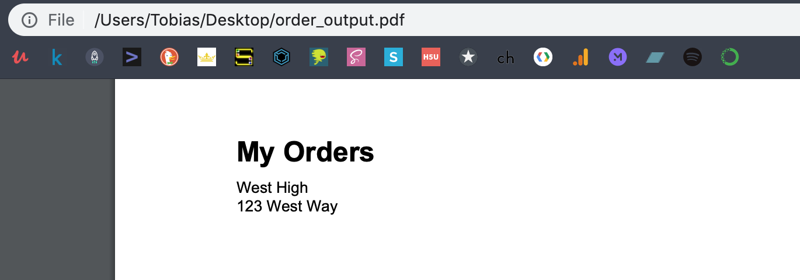

# 2019-04-02 | #030

\#100DaysofCode

- [2019-04-02 | #030](#2019-04-02--030)
  - [Today's Menu](#todays-menu)
    - [Main Course](#main-course)
    - [SELECT * FROM session](#select--from-session)
      - [Soundtrack](#soundtrack)
      - [Extras](#extras)
  - [Session Log](#session-log)
    - [08:53 -+- Sessionit](#0853----sessionit)
    - [09:24 -+- Anustart](#0924----anustart)
    - [09:46 -+- Django Startproject](#0946----django-startproject)
    - [09:50 -+- DataBASS](#0950----databass)
    - [10:20 -+- Startapp / Project (Again)](#1020----startapp--project-again)
    - [10:40 -+- Configuration](#1040----configuration)
    - [11:10 -+- Bass Migrations](#1110----bass-migrations)
    - [11:15 -+- First Records](#1115----first-records)
    - [11:24 -+- Administers](#1124----administers)
    - [11:28 -+- More Views and Such](#1128----more-views-and-such)
    - [14:59 -+- Down to the end](#1459----down-to-the-end)
    - [15:05 -+- PDFinally](#1505----pdfinally)
    - [17:11 -+- Python Classes](#1711----python-classes)
    - [17:18 -+- Making Pretty PDFs](#1718----making-pretty-pdfs)
    - [18:24 -+- Git Commits](#1824----git-commits)
    - [19:08 -+- Going SVGlib On It](#1908----going-svglib-on-it)
    - [23:34 -+- Documentation Station](#2334----documentation-station)
    - [00:36 -+- deSession](#0036----desession)

---

## Today's Menu

### Main Course

    GOAL_ : Deploy working prototype of PDForm app to Heroku

---

### SELECT * FROM session

    CUE_01 : Create cookiecutter template once I get my process nailed down

#### Soundtrack

- pass

#### Extras

- pass

---

## Session Log

---

### 08:53 -+- Sessionit

One thing to do before I get started is add the Postgres db_data directory to gitignore and remove it from github. It's going to cause all kinds of irritation because the temporary files change all the time.

Alrighty, now that I've created the form and written to the database, time to start from scratch yet again!

Practice practice practice...also because this time I'm going to deploy to the web and want to set things up slightly differently due to that intended result.

One of the reasons I documented the process in such detail the last couple of sessions is because I'd like to have my own documentation for how to get a prototype up and running. Creating a new repository for this type of thing [HERE](https://github.com/tobias-fyi/smartass_kb).

---

### 09:24 -+- Anustart

    TASK√01 : Create repository + clone to local directory  
    TASK√02 : Add .gitignore file  
    TASK√03 : Open directory in text editor + save workspace  
    TASK√04 : Make + push initial commit  

Cloned new project repository in my main Projects/Applications directory:

> Projects/30_Applications/PDForm

---

    TASK√05 : Create virtual environment  

Here are the dependencies I'll install first:

- python=3.7
- django
- pylint
- pytest
- pep8

--∫--

    $ conda create -n pdform python=3.7 django pylint pep8 pytest

    > Preparing transaction: done
      Verifying transaction: done
      Executing transaction: done
      #
      # To activate this environment, use
      #
      #     $ conda activate pdform
      #
      # To deactivate an active environment, use
      #
      #     $ conda deactivate

    $ conda activate pdform
---

    TASK√06 : Install additional dependencies  

    - psycopg2
    - ipython
    - black
    - reportlab

    $ conda install -c anaconda psycopg2
    $ conda install -c conda-forge ipython
    $ conda install -c conda-forge black
    $ conda install -c anaconda reportlab

---

---

### 09:46 -+- Django Startproject

    TASK√07 : Create new django project

    $ djang-admin startproject pdform  
    >
    $ tree
    > .
      ├── 00_Admin
      ├── LICENSE
      ├── README.md
      └── pdform
          ├── manage.py
          └── pdform
              ├── __init__.py
              ├── settings.py
              ├── urls.py
              └── wsgi.py

      3 directories, 7 files

I didn't use the full-stop at the end of the command this time because I have more in the root for the project.

---

### 09:50 -+- DataBASS

    TASK√08 : Create Postgres server + initialize  

    Server: PDForm on 5432 with data in /db_data/ directory

--∫--

    TASK√09 : Create new database in psql  

    CREATE DATABASE pdform;

    NOTE_ : Remember the semi-colon for psql commands.

--∫--

    TASK√10 : Create new superuser or edit postgres user to add password  

    $ CREATE ROLE pdf_admin WITH SUPERUSER PASSWORD 'pdf4dm1n';

Apparently the ROLE does not imply LOGIN permissions, so have to either recreate using USER or ALTER_ROLE:

    $ ALTER ROLE pdf_admin WITH LOGIN;
    > ALTER ROLE

--∫--

    TASK√11 : Connect to Postgres server + database with pgAdmin

---

### 10:20 -+- Startapp / Project (Again)

I decided that PDForm should be the name of the app, not the project, so going to delete the project and start again.

Created new GitHub repo + cloned to local:

> 

    $ django-admin startproject pdf_portal .
    $ tree
      .
      ├── 00_Admin
      │   └── pdf_portal.code-workspace
      ├── LICENSE
      ├── README.md
      ├── db_data (...)
      ├── manage.py
      └── pdf_portal
          ├── __init__.py
          ├── settings.py
          ├── urls.py
          └── wsgi.py

All the DataBASS stuff n things.

    postgres=# CREATE DATABASE pdf_portal;

    pdf_portal=# CREATE USER portal_admin WITH SUPERUSER PASSWORD 'p0rt4l4dm1n';

Connected to the server in pgAdmin.

---

    TASK√12 : Create new django app  

And NOW create the app orderform

    $ python manage.py startapp orderform
    >  

---

### 10:40 -+- Configuration

    TASK√13 : Add app to project's settings.py installed apps section

pdf_portal/settings.py:

    INSTALLED_APPS = [
        'django.contrib.admin',
        'django.contrib.auth',
        'django.contrib.contenttypes',
        'django.contrib.sessions',
        'django.contrib.messages',
        'django.contrib.staticfiles',
        'orderform.apps.OrderformConfig',
    ]

---

orderform/models.py:

    from django.db import models
    from django.utils import timezone

    class EnvelopeOrder(models.Model):
        school_name = models.CharField(max_length=140)
        street_address = models.CharField(max_length=140)
        city = models.CharField(max_length=80)
        state_code = models.CharField(max_length=2)
        zip_code = models.CharField(max_length=5)
        phone = models.CharField(max_length=10)
        email = models.EmailField()
        date_requested = models.DateTimeField(default=timezone.now)

---

- Copied over the /static/ and /templates/ directories.
- Changed the url for stylesheet to orderform/main.css

---

Created orderform/urls.py:  

    from django.urls import path
    from . import views

    urlpatterns = [path("", views.orderform, name="orderform")]

Edited pdf_portal/urls.py:

    from django.contrib import admin
    from django.urls import path, include

    urlpatterns = [
        path("", include("pdf_portal.urls"), name="pdf_portal"),
        path("admin/", admin.site.urls),
    ]

---

orderform/views.py:

    from django.http import HttpResponse

    def index(request):
        return HttpResponse("<h1>Work that backend!</h1>")

---

Ran into an error at first when starting up the server. It was because the project's urls.py was pointing back to itself. lol gotta love those looooops.

---

orderform/forms.py:

    from django.forms import ModelForm
    from .models import EnvelopeOrder

    class EnvelopeOrderForm(ModelForm):
        class Meta:
            model = EnvelopeOrder
            fields = "__all__"

---

### 11:10 -+- Bass Migrations

    $ python manage.py makemigrations
    > Migrations for 'orderform':
      orderform/migrations/0001_initial.py
        - Create model EnvelopeOrder

    $ python manage.py migrate
    > Operations to perform:
      Apply all migrations: admin, auth, contenttypes, orderform, sessions
    Running migrations: ...
      Applying orderform.0001_initial... OK
      Applying sessions.0001_initial... OK

That was nice and easy.

---

### 11:15 -+- First Records

Going to try to add the first record via iPython first before falling back to the SQL INSERT.

    $ python manage.py shell

    In [1]: from orderform.models import EnvelopeOrder

    In [2]: from django.utils import timezone

    In [3]: order = EnvelopeOrder(school_name="West High", street_address="123 West Way", city="Westminster", state_code="CO", zip_code="80021", phone="1112223333", email="admin@west.fyi")

    In [6]: order.save()

    In [7]: order.id
    Out[7]: 1

NOICE!

    In [8]: order_2 = EnvelopeOrder(school_name="West High", street_address="123 West Way", city="Westminster", state_code="CO", zip_code="80021", phone="1231231234", email="dev@west.fyi")

    In [9]: order_2.save()

    In [10]: order.id
    Out[10]: 1

    In [11]: order_2.id
    Out[11]: 2

Solid.

Now to add the str dunder method to orderform/models.py:

    class EnvelopeOrder(models.Model):
        school_name = models.CharField(max_length=140)
        street_address = models.CharField(max_length=140)
        city = models.CharField(max_length=80)
        state_code = models.CharField(max_length=2)
        zip_code = models.CharField(max_length=5)
        phone = models.CharField(max_length=10)
        email = models.EmailField()
        date_requested = models.DateTimeField(default=timezone.now)

        def __str__(self):
            return self.school_name

That is nice to see the list of orders in the admin page say the school name instead of just an arbitrary id.

---

### 11:24 -+- Administers

Creating superuser:

    $ python manage.py createsuperuser
    > Username (leave blank to use 'tobias'): order_admin
      Email address: admin@orderform.net
      Password: 0rd3r4dm1n
      Password (again):
      Superuser created successfully.

Added to orderform/admin.py:

    from django.contrib import admin
    from .models import EnvelopeOrder

    admin.site.register(EnvelopeOrder)

---

### 11:28 -+- More Views and Such

Added 3 more paths to orderform/urls.py for a total of 4:

    urlpatterns = [
        path("", views.index, name="index"),
        path("orderform/", views.orderform, name="orderform"),
        path("viewform/", views.viewform, name="viewform"),
        path(
            "viewform/<int:orderform_id>",
            views.viewformdetail,
            name="viewformdetail",
        ),
    ]

    INSERT INTO former_orderform (
        school_name,
        street_address,
        city,
        state_code,
        zip_code
        phone,
        email,
        date_requested
    )

    VALUES (
        'East Elementary',
        '2345 E Six Way',
        'Seven Town',
        'CO',
        '80221',
        '3033033033',
        'fyi@east.com',
        '2019-04-01'
    )

WOOOOOW I just realized I never added the Postgres DB to settings.py...  
I also added the field name to the database.

    Migrations for 'orderform':
    orderform/migrations/0002_envelopeorder_name.py
      - Add field name to envelopeorder

Added in those two records again.  

Plus another one:

    order_3 = EnvelopeOrder(school_name="East Elementary", street_address="2345 E Six Way", city="Seven Town", state_code="CO",zip_code="80221", phone="1234561234", email="fyi@east.com", name="Frank East")

Added namespaces to orderform/urls.py:

    app_name = "orderform"
    urlpatterns = [
        # Home
        path("", views.index, name="index"),
        # Form
        path("orderform/", views.orderform, name="orderform"),
        # View all subitted forms
        path("orders/", views.orders, name="orders"),
        # View individual submitted form + send it
        path("orders/<int:orderform_id>/", views.orderdetail, name="orderdetail"),
    ]

---

### 14:59 -+- Down to the end

Holy shit I finally figured it out...  

I've been trying to get the order detail page for the submitted data to be rendered after a form is submitted and written to the database. It took my faaaar too long but finally thought to look around on the QuerySets section of the docs and figured it out.

> orderform/views.py:

    from django.http import HttpResponse, Http404, HttpResponseRedirect
    from django.shortcuts import get_object_or_404, render, redirect
    from django.contrib import messages
    from django.urls import reverse
    from .models import EnvelopeOrder
    from .forms import EnvelopeOrderForm

    def orderform(request):
        if request.method == "POST":
            form = EnvelopeOrderForm(request.POST)

            if form.is_valid():
                form.save()
                date = form.cleaned_data.get("date_requested")
                order = EnvelopeOrder.objects.get(date_requested=date)
                messages.success(request, "Order submitted.")
                # return HttpResponseRedirect(reverse("orderform:orders"))
                return HttpResponseRedirect(
                    reverse("orderform:orderdetail", args=(order.id,))
                )

        else:
            form = EnvelopeOrderForm()

        return render(request, "orderform/env_orderform.html", {"form": form})

    def orders(request):
        context = {"orderform": EnvelopeOrder.objects.all()}
        return render(request, "orderform/orders.html", context)

    def orderdetail(request, envelopeorder_id):
        try:
            order = get_object_or_404(EnvelopeOrder, pk=envelopeorder_id)
        except EnvelopeOrder.DoesNotExist:
            return Http404("Order does not exist.")
        return render(request, "orderform/orderdetail.html", {"order": order})

>orderform/urls.py:

    from django.urls import path
    from . import views

    app_name = "orderform"
    urlpatterns = [
        # Home / Orderform
        path("", views.orderform, name="orderform"),
        # View all subitted forms
        path("orders/", views.orders, name="orders"),
        # View individual submitted form + send it
        path(
            "orders/<int:envelopeorder_id>/", views.orderdetail, name="orderdetail"
        ),
    ]

Committing to the repo now before moving on to formatting and saving the PDF.

---

### 15:05 -+- PDFinally

    TASK_ : Save a PDF from the site  

First, I'm going to bring over the files I need (envelopes)

Got a basic layout down. Nothing special but it's close enough for now.

> Reportlab

Now it's time to generate a PDF.

> orderform/views.py:

    from django.http import (
        FileResponse,
        HttpResponse,
        Http404,
        HttpResponseRedirect,
    )
    from django.shortcuts import get_object_or_404, render, redirect
    from django.contrib import messages
    from django.urls import reverse
    from io import BytesIO

    from .printing import PDFPrint
    from .models import EnvelopeOrder
    from .forms import EnvelopeOrderForm

    def orderform(request):
        if request.method == "POST":
            form = EnvelopeOrderForm(request.POST)

            if form.is_valid():
                form.save()
                date = form.cleaned_data.get("date_requested")
                order = EnvelopeOrder.objects.get(date_requested=date)
                # TODO: find a more robust way of getting the record?
                messages.success(request, "Order submitted.")
                return HttpResponseRedirect(
                    reverse("orderform:orderdetail", args=(order.id,))
                )

        else:
            form = EnvelopeOrderForm()

        return render(request, "orderform/env_orderform.html", {"form": form})

    def orders(request):
        context = {"orderform": EnvelopeOrder.objects.all()}
        return render(request, "orderform/orders.html", context)

    def orderdetail(request, envelopeorder_id):
        try:
            order = get_object_or_404(EnvelopeOrder, pk=envelopeorder_id)
        except EnvelopeOrder.DoesNotExist:
            return Http404("Order does not exist.")
        return render(request, "orderform/orderdetail.html", {"order": order})

    def print_pdf(request):
        response = HttpResponse(content_type="application/pdf")
        response["Content-Disposition"] = 'attachment; filename="order_output.pdf"'

        # create a file-like buffer to receive the PDF data
        buffer = BytesIO()

        report = PDFPrint(buffer, "Letter")
        pdf = report.print_order()

        response.write(pdf)

        return response

I wanted to use the FileResponse Object class but couldn't get it to work with how the PDFPrint class is implemented.

I'll figure that out later.

---

### 17:11 -+- Python Classes

The format of the article I was reading was not good so I didn't write in the double underscore for the PDFPrint class' init method.

Once I did that then I had much success.

> orderform/printing.py:

    from reportlab.lib.pagesizes import letter
    from reportlab.platypus import SimpleDocTemplate, Paragraph
    from reportlab.lib.styles import getSampleStyleSheet, ParagraphStyle
    from reportlab.lib.enums import TA_CENTER

    from .models import EnvelopeOrder

    class PDFPrint:
        def __init__(self, buffer, pagesize):
            self.buffer = buffer

            if pagesize == "Letter":
                self.pagesize = letter

            self.width, self.height = self.pagesize

        def print_order(self):
            buffer = self.buffer
            doc = SimpleDocTemplate(
                buffer,
                rightMargin=72,
                leftMargin=72,
                topMargin=72,
                bottomMargin=72,
                pagesize=self.pagesize,
            )

            # container for 'flowable' objects
            elements = []

            # stylesheets
            styles = getSampleStyleSheet()
            styles.add(ParagraphStyle(name="centered", alignment=TA_CENTER))

            # draw into / generate the pdf
            order = EnvelopeOrder.objects.get(pk=1)
            elements.append(Paragraph("My Orders", styles["Heading1"]))
            elements.append(Paragraph(order.school_name, styles["Normal"]))
            elements.append(Paragraph(order.street_address, styles["Normal"]))

            doc.build(elements)

            # get value of BytesIO buffer and write it to the response
            pdf = buffer.getvalue()
            buffer.close()
            return pdf

Doesn't look pretty but it works!

---

### 17:18 -+- Making Pretty PDFs

Ok over trying to get the image to work.

Going to skip that for now.

---

### 18:24 -+- Git Commits

Committing while it is still working.

The PDF is at least working, though still can't get the images to work.

I need a break...

Git COMMIT THAT SHIT.

---

### 19:08 -+- Going SVGlib On It

Decided to try out [this method](https://www.blog.pythonlibrary.org/2018/04/12/adding-svg-files-in-reportlab/) of using svg to create a drawing.

    $ conda install -c conda-forge svglib
    $ conda install -c anaconda lxml
    >  

    TASK√ : Export jeffco logos to svg

---

### 23:34 -+- Documentation Station

Going through the examples in the Reportlab documentation included in the source code. Probably something I should get to reading / doing earlier on in the process.

    CUE_ : When stuck with a certain something, if examples are provided in source / docs, that's a good place to look for help. Also there may be comments in the source itself that can lead to breakthroughs.  

In particular, the rlzope demo seems to be pretty interesting.

In fact, it goes into a bit more what I was thinking about earlier—dealing with converting images to/from io bytes. It seems that it really does depend a lot on the PIL library.

If I can get that to work or find an alternative, that would be stellar.

I thought as well about creating my own. I know that would be a crazy undertaking and maybe too deep for me right now, but something like this could give me the lower level learning I feel like I need to really get good at programming robust systems.

    We'll see...

Decided to see what [zope](https://en.wikipedia.org/wiki/Zope) is all about and it seems like a pretty important piece of the Python world. Will do some reading and get back to you.

---

### 00:36 -+- deSession

Well it seems that zope *was* important back in the late 90s and early 2Ks but is not really that big anymore beyond a few frameworks / systems like Pyramid and the open-source CMS Plone.

Linked over to the [Django wikipedia](https://en.wikipedia.org/wiki/Django_(web_framework)) because I was interested, and now I know that Django is named after the guitarist Django Reinhardt.

Also just coz...[CRUD](https://en.wikipedia.org/wiki/Create,_read,_update_and_delete).

Here's [another good place](https://www.fullstackpython.com/django.html) to go for Django resources.

Hasta mañana, amigo!