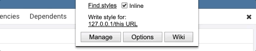
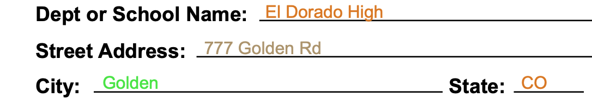

# 2019-04-15 | #043

\#100DaysofCode

---

## SELECT * FROM Project

### Project.abstract

    GOAL__ : Take data from user input + add it onto downloadable / sendable PDF

### Project.loxocache(2019-04)

    GOAL_042 : Deploy v0.2 to the web + add basic tests  

    CUE_042  : Save the output PDF into a django/postgres table  

--------◊--------

## SELECT * FROM Session

### Session.abstract

    GOAL_043 : Hook up models in Django to pdf-lib JS code  

#### Session.cache

- [Journal](https://en.wikipedia.org/wiki/Journal)
- [More Skyrim ambience](https://youtu.be/xWtfo9kuRTU)

---

## Session.journal(2019-04-15)

### Loxocache

    TASK_043.00 : Assign ModelField data to JS variable - look up best ways of doing this  
    TASK_043.00 :  
    TASK_043.00 :  
    TASK_043.00 :  
    TASK_043.00 :  

    CUE_043.00 : Set up script to automatically post parts of this coding journal to blog app  

--------◊--------

### 20:35 -+- Session.init

I love when I'm excited to get back to work on something. I'm a builder. I'm happy when I'm building things that are meaningful. For whatever reason, this build has been very meaningful to me. Probably because of how much learning has come out of it.

Excited to finally get a good-looking PDF overlayed with data fresh from the postgres database. The PDF that came out of the first prototype was not pretty at all, and was an absolutely enormous file. I used the html2canvas library to get it done, which basically just took a screenshot of the html page and inserted it as one giant image onto the PDF. Each time I saved one it was ~23mb. Not ideal. And that's not to mention the fact that, because it was one monolithic image, the text inside of it couldn't be selected / copied.

So happy to have ended up here with v0.2.

---

### 20:37 -+- Methods and Madness

I wonder if it would be possible to create a sort of JavaScript template that receives dynamic content from Django itself?

Or if that's not possible, maybe I can simply insert the JavaScript directly into the html file instead of separating it out. That way I could potentially access those ModelFields directly without having to assign an id to each html element where they will be once the page is rendered. I imagine that would make things quite a bit easier, though I'll do a little research before diving too deeply either way.

Read up a little bit about it and saw someone mention that Django automatically assigns an HTML element id to each field. I remember seeing this somewhere else as well. That would make this even easier!

Sometimes batteries-included is good.

Here is [the StackOverflow answer](https://stackoverflow.com/questions/44276329/accessing-django-form-variable-in-javascript-which-is-inside-html-page) where I saw that:

    Yes, its possible. Django gives an id in format id_fieldname to each field you define in your Django form.

    E.g. For name field, id in HTML will be id_name and For email_address field ,id in HTML will be id_email_address

    Now you can simply use getElementById() in your JS with these ID for validation.

---

### 20:40 -+- id.Render

I can just look at the rendered html itself and confirm that each field has an id and what the naming convention is for it.

    $ z pdf_portal
    >>

I thought this little animation on the Stylus menu was pretty slick. Simple and clean.

    CUE_043.00 : Set up script to automatically post parts of this coding journal to blog app  

I wanted to give pgAdmin a different color theme because the white is unpleasant in the evening. Thought I'd give the Stylus app a shot and see how dillicult it would be.

Found the pgAdmin stylesheet where the background-color attribute was being set  
(http://127.0.0.1:49651/static/js/generated/pgadmin.css?ver=40300), and the [pgAdmin styleguide](https://www.pgadmin.org/styleguide/colors), which I will utilize when I pick this back up. At least right now, it will take longer than the five minutes or so I'm willing to give it.

I want to get to goodies.

---

### 20:51 -+- PDF Goodies

Oh man I gotta do some fixing of the styles here soon. The interface is a little messy from all the experimentation. e.g. the envelope div on the home page isn't responsive.

> templates/orderform/env_orderform.html

    CUE_043 : Make homepage + form responsive
    CUE_043 : Style and lay the form out better
    CUE_043 : Placeholder for Name is default?

Miguel and Tulio

Oh god the order detail is even worse.

    CUE_043 : Fix all styling on order_detail.html

However, I'm not here to style atm. I'm here to get some identification. And I don't see any identification on those paragraph tags.

--◊--

I'm going to format all of the text on the PDF first, then dig into the actual data part after.

I feel like I'm building a JSON file right now, and basically am. I could try to break it out into it's own JSON file later. I might even be able to get JSON out of the database relatively easy. That would make connecting these up much easier / more modular.

Here's what I mean:

    let field_data = {
        order_info: {
            school: {
                data: "El Dorado High",
                pos: [184, 680],
            },
            address: {
                data: "777 Golden Rd",
                pos: [142, 655],
            },
            city: {
                data: "Golden",
                pos: [72, 631],
            },
            state_code: {
                data: "CO",
                pos: [360, 631],
            },
            zip_code: {
                data: "11111",
                pos: [485, 631],
            },
            phone: {
                data: "1112334444",
                pos: [84, 606],
            },
        },

That's the first field group. I really like how json looks and feels. For me it's a very readable data format.

---

### 21:37 -+- Succ Yess (kinda)

My method works well so far! All the json data is displaying correctly thus far, and I even added some colors. They aren't the colors I wanted, but that's alright. Still have colors...

It doesn't look half bad, ignoring the colors.

The only thing that came up after writing all of the fields into the .drawText function is that they fields stop showing up after billing_info.name. Strange. I guess I had to run into some issue, eh?

---

### 21:45 -+- A Django Thot

One way I could set the id's automatically is to put the ext into the id field of the template as well. Duh, I should've thought of that earlier.

I'm going to finish up laying out the fields then come back to this.

---

### 22:18 -+- Resolutions

First thing I want to try in an effort to find out what's causing those fields to not show is to remove some of the earlier fields. I'm wondering if it was something to do with the blob size or some sort of limit on the content stream.

Changing it didn't do anything. Restarting the server to see if it updates. Nope it still didn't update.

Oooooh maybe it's Chrome thinking that it's the same file because I've been writing over the same one every time; same name. Nope that didn't do it either.

It looks like it's something with the naming of the variables. I wonder if it doesn't like that I have the same names for some of the variables further down the tree. The reason I'm thinking this is the fields in billing_info that aren't showing are the ones that share a name with order_info. Time to try changing those.

Nope.

The weirdest part is that the document is not changing at all. e.g. the fields I removed from the code are still showing.

This time, I'm going to try revoking the objectURL after it is downloaded. I got a network error because I didn't tell the system to wait until the PDF is downloaded to close the objectURL.

Now I get to learn about setTimeout!

---

### 22:40 -+- More Asynchronicity

Found this block of code [on stackoverflow](https://stackoverflow.com/questions/37240551/how-can-i-revoke-an-object-url-only-after-its-downloaded), which I've seen before...I think while poking around the mozilla JS API site:

    setTimeout(function() {
        URL.revokeObjectURL(a.href);
    }, 0);

Trying it out as is to see if it does anything.

Nope I couldn't get that to work either...I don't think I want to dig into promises at this very moment.

Just in case...I'm going to shut down the server and chrome and give it another go.

Ok it's definitely something with how I set up the data structure. I'm going to separate out the three field groups into separate arrays.

...ok maybe not.

Now I'm wondering if it's something with the PDF template itself

---

### 00:05 -+- Mo'Resolutions

Back from a little break to clear my head.

Next thing to try is adding a separate contentstream for the different groups. That didn't work.

--◊--

...holy shit I can't believe what the problem is...At least I found it.

And it was an issue with those fields being the same, but not in the way I was thinking. I got really close to it but missed it a few times earlier.

When I copied over the data from order_info to billing_info...

    I forgot to update the coordinates.

So it was simply printing the information in the exact same spot twice. Because the data is the same I couldn't tell.

Man I just spent a whole evening on that...I guess it happens.

IT WORKS!

And that's what matters.

---

### 00:30 -+- Polishing

Instead of the dummy address that's on the PDF I'm going to fill it dynamically with the same data as is used in the order_info section.

I'll fix it up later. Just gotta get something working right now. That means fixing up the layout of the actual html with scss to make it look at least OK. Plus some other tasks:

    TASK_043 : Edit Django model(s) to add billing_info fields  
    TASK_043 : Add ids to the ModelFields (use jinja to generate the string)  
    TASK_043 : Preview the generated PDF on orderdetail.html  
    TASK_043 : Allow user to choose number of boxes once preview is generated  

For now, it's hasta bedtime, amigo.