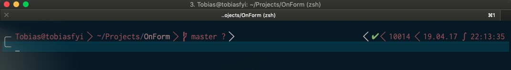
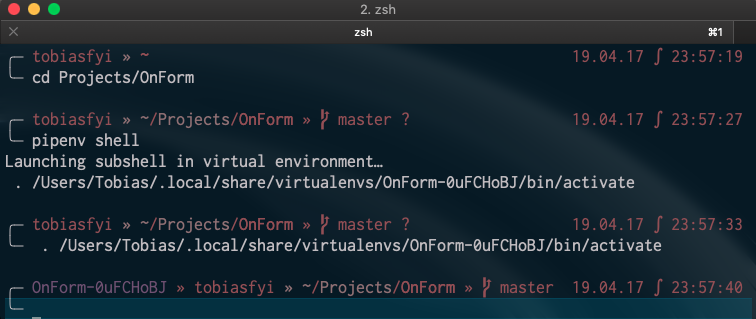

# 2019-04-17 | #045

\#100DaysofCode

- [2019-04-17 | #045](#2019-04-17--045)
  - [SELECT * FROM Project](#select--from-project)
    - [Project.abstract](#projectabstract)
    - [Project.loxocache(2019-04)](#projectloxocache2019-04)
  - [SELECT * FROM Session](#select--from-session)
    - [Session.abstract](#sessionabstract)
      - [Session.cache](#sessioncache)
  - [Session.journal(2019-04-17)](#sessionjournal2019-04-17)
    - [Loxocache](#loxocache)
    - [12:00 -+- Session.init](#1200----sessioninit)
    - [12:39 -+- Closures](#1239----closures)
    - [17:21 -+- Back to Pythonics](#1721----back-to-pythonics)
      - [Modified CLI](#modified-cli)
    - [22:15 -+- Back to Pipenvics](#2215----back-to-pipenvics)
    - [23:59 -+- Pyenv](#2359----pyenv)
    - [01:11 -+- Workshop Vega](#0111----workshop-vega)
    - [01:44 -+- de.session](#0144----desession)
    - [10:17 -+- DAY 046 - PRE-CONFIG](#1017----day-046---pre-config)
    - [10:53 -+- fyinit](#1053----fyinit)

---

## SELECT * FROM Project

### Project.abstract

    GOAL__ : Uninstall anaconda + rebuild my Python dev workflow

### Project.loxocache(2019-04)

    TASK__ : Collect tags from other documents 
    TASK_044 : Copy session from on_form build journal

--------ƒ--------

## SELECT * FROM Session

### Session.abstract

    GOAL_045 : Export environment files for all important projects + uninstall + reinstall + use pipenv  

#### Session.cache

- [The Lord of the Rings Soundtrack](https://youtu.be/_SBQvd6vY9s) is so good! 
  - [This track](https://youtu.be/_SBQvd6vY9s?t=3869) is so godamn emotional for me...honestly makes me feel all sorts of ways whenever I hear it.
  - That flute is unreal.

---

## Session.journal(2019-04-17)

### Loxocache

    TASK_ : Install and use a node version manager  

--------ƒ--------

### 12:00 -+- Session.init

Before I proceed with uninstalling anaconda, I'm exporting all of my important environment specs in case I want to recreate those environments in my new workflow.

- [x] fyinit
- [x] pdform
- [x] fineye
- [x] smartass
- [x] tobias_fyi
- [x] tobiasfyi

I'm using the following command to export the spec-file.txt for each:

    $ conda list --explicit > spec-file.txt

Here's a list of my current conda environments:

    $ conda info -e

    # conda environments:
    #
    base                     /anaconda3
    fineye                   /anaconda3/envs/fineye
    fyinit                   /anaconda3/envs/fyinit
    on_form                  /anaconda3/envs/on_form
    pdform                   /anaconda3/envs/pdform
    signal_graphics          /anaconda3/envs/signal_graphics
    smartass                 /anaconda3/envs/smartass
    tobias_fyi            *  /anaconda3/envs/tobias_fyi
    tobias_kb                /anaconda3/envs/tobias_kb
    tobiasfyi                /anaconda3/envs/tobiasfyi
    todojo                   /anaconda3/envs/todojo

---

### 12:39 -+- Closures

Time to proceed with the operation (I'm using [Option B](https://docs.anaconda.com/anaconda/install/uninstall/)):

    $ conda install anaconda-clean

    $ anaconda-clean --yes

    $ rm -rf ~/anaconda3

    >> still showing (anaconda3)

Removed lines from ~/.zshrc that had to do with anaconda. This means I need a new export PATH?

I saved it like so:

    # export PATH=""

And now my terminal starts up without a virtual environment active. The one inside of vscode, however, still does. So I changed the settings a little bit:

    $ "python.pythonPath": "/usr/local/bin/python3",

---

### 17:21 -+- Back to Pythonics

Of course Corey has an [awesome video on executables, etc.](https://www.youtube.com/watch?v=PUIE7CPANfo)

    $ type python3            17:33:39
    python3 is  /usr/local/bin/python3

    $ echo $PATH
    /Users/Tobias/.npm-global/bin:/usr/local/bin:/usr/bin:/bin:/usr/sbin:/sbin

I will probably end up installing anaconda again at some point, but will not add it to my $PATH.

Setting the alias for python3:

    $ alias python=python3
    >> this only stays until the session is terminated.

    $ code ~./zshrc
    alias python=python3
    alias pip=pip3

    $ python
    Python 3.7.3 (default, Mar 27 2019, 09:23:15)
    [Clang 10.0.1 (clang-1001.0.46.3)] on darwin
    Type "help", "copyright", "credits" or "license" for more information.
    >>> 

Boom! Been wanting to set that alias for a while now.

    $ type pip
    pip is an alias for pip3
    $ type pip3
    pip3 is /usr/local/bin/pip3

    $ python
    Python 3.7.3 (default, Mar 27 2019, 09:23:15)
    [Clang 10.0.1 (clang-1001.0.46.3)] on darwin
    Type "help", "copyright", "credits" or "license" for more information.
    >>> import sys
    >>> sys.executable
    '/usr/local/opt/python/bin/python3.7'
    >>>

    $ echo $PATH
    /Users/Tobias/.npm-global/bin:/usr/local/bin:/usr/bin:/bin:/usr/sbin:/sbin

I don't really like that I have that .npm-global path dirtying up my $PATH. I found on the npm [site where the instructions wer](https://docs.npmjs.com/resolving-eacces-permissions-errors-when-installing-packages-globally)e that led me to doing that, and found that they actually recommend using a node version manager.

I'm going to remove that export PATH= for node and reinstall [node using a version manager](https://github.com/creationix/nvm).

    TASK_ : Install and use a node version manager  

    $ echo $PATH
    /usr/local/bin:/usr/bin:/bin:/usr/sbin:/sbin

Much better. I also set up aliases in my .zshrc file for zsh / ohmyzsh config:

    alias zshconfig="code ~/.zshrc"
    alias ohmyzsh="code ~/.oh-my-zsh"

Also wanted to spend a little time [customizing my prompt a bit](https://github.com/bhilburn/powerlevel9k#customizing-prompt-segments).

I'm going to change up the date format on the right side of my prompt:

Default Value: %D{%d.%m.%y} | Uses [zsh time format](http://zsh.sourceforge.net/Doc/Release/Prompt-Expansion.html#Date-and-time).

Here's how I like it %D{%y.%m.%d} - I've been starting to use only the last 2 digits of the year in my naming and beem digging it. This works perfect for my prompt.

[Link to the Powerlevel9k Wiki](https://github.com/bhilburn/powerlevel9k/wiki).

Can use the `get_icon_names` command to get a list of all of the icon variables.

Installed [nerd-fonts](https://github.com/ryanoasis/nerd-fonts)

    $ brew tap caskroom/fonts
    $ brew cask install font-hack-nerd-font

    🍺  font-hack-nerd-font was successfully installed!

----ø----

#### Modified CLI

Putting it all together with some other modifications look a little something like this (not done yet but don't want to spend any more time on it right now):

---

### 22:15 -+- Back to Pipenvics

[The Lord of the Rings Soundtrack](https://youtu.be/_SBQvd6vY9s) is so good! [This track](https://youtu.be/_SBQvd6vY9s?t=3869) is so godamn emotional for me...honestly makes me feel all sorts of ways whenever I hear it. That flute is unreal.

This track is also unreal. I'm always blown away by this soundtrack, though I can't listen to it too much because it does hold so much emotion. Not only do I not want to experience those emotions all the time, I don't want the music to lose its importance in my life. The LotR soundtrack holds a sacred place in my heart.

Thank you, [Howard Shore](https://en.wikipedia.org/wiki/Music_of_The_Lord_of_the_Rings_film_series).

This paragraph is mind-blowing (from the wikipedia linked in the previous paragraph):

    Throughout the composition, Shore has woven over 100 identified leitmotifs (or over 160, when considering the music of the Hobbit films), which are interrelated and categorized into groups that correspond to the Middle-earth cultures to which they relate,[2] forming one of the greatest and most intricate collections of themes in the history of the cinema.

    [leitmotif](https://en.wikipedia.org/wiki/Leitmotif) or leitmotiv is a "short, constantly recurring musical phrase"[1] associated with a particular person, place, or idea.

I love that. Continued...

    The score was the subject of a short documentary film called Howard Shore: An Introspective, and has even earned a dedicated research-based book by musicologist Doug Adams. The scores go on being performed by choirs and orchestras around the world as symphony pieces, concert suites and live to-projection concerts.

I really want to watch that documentary. Of course [it's on YouTube](https://youtu.be/pGaczJHDnkw).

----ø----

    $ pipenv shell
    ╭─ djangitest-NxxUYHGn ~/Projects/djangitest        19.04.17 ∫ 22:47:54
    ╰─ python

I mean at least I got it to show the virtual environment right? I would prefer it to not show the hash as well.

Installing pyenv:

    $ brew update
    $ brew install pyenv

Then followed the installation guide to set it up.

    3. Add pyenv init to your shell to enable shims and autocompletion. Please make sure `eval "$(pyenv init -)"` is placed toward the end of the shell configuration file since it manipulates PATH during the initialization.

    Zsh note: Modify your ~/.zshenv file instead of ~/.bash_profile.

I might just use the automatic pyenv installer. Oh ya, I couldn't help myself and finished off editing the prompt. Quite happy with it now! I'm digging the whole brown / gold theme - planning on adding in more of a red color then maybe adjust the blue part of the theme to better match the earthiness of the text.

That's for later though...along with fixing that damn virtual environment name.

---

### 23:59 -+- Pyenv

I totally missed it that the pyenv installation mentions a ~/.zshenv file. I don't have one of those, so I created it. I read a little more:

    There are five startup files that zsh will read commands from:

    $ZDOTDIR/.zshenv
    $ZDOTDIR/.zprofile
    $ZDOTDIR/.zshrc
    $ZDOTDIR/.zlogin
    $ZDOTDIR/.zlogout
    If ZDOTDIR is not set, then the value of HOME is used; this is the usual case.

    `.zshenv` is sourced on all invocations of the shell, unless the -f option is set. It should contain commands to set the command search path, plus other important environment variables. `.zshenv` should not contain commands that produce output or assume the shell is attached to a tty.

    `.zshrc` is sourced in interactive shells. It should contain commands to set up aliases, functions, options, key bindings, etc.

That's probably why I was getting an error about zsh having an issue with the pyenv command I added.

    $ echo -e 'if command -v pyenv 1>/dev/null 2>&1; then\n  eval "$(pyenv init -)"\nfi' >> ~/.zshenv

    $ code ~/.zshenv

    if command -v pyenv 1>/dev/null 2>&1; then
        eval "$(pyenv init -)"
    fi

That looks better. I guess when I put that into my ~/.zshrc file the syntax was not recognized. This time it is.

    1. Restart your shell so the path changes take effect. You can now begin using pyenv.

----ø----  

Once again I couldn't help myself and changed the background color of my terminal to a more navy blue - #003366.

    5. Install Python build dependencies before attempting to install a new Python version. The pyenv wiki provides suggested installation packages and commands for various operating systems.

Going back to [this article](https://medium.com/@henriquebastos/the-definitive-guide-to-setup-my-python-workspace-628d68552e14) to continue the setup. Some notes from it:

    # pyenv to install Python interpreters
    $ brew install pyenv

    # pyenv-virtualenv to configure my "global environment"
    $ brew install pyenv-virtualenv

    # pyenv-virtualenvwrapper to work on projects
    $ brew install pyenv-virtualenvwrapper

With virtualenvwrapper all your virtualenvs are kept on a same directory and your projects’ code on another. I'll set up my folders in a similar manner to the author, and decided to start my new projects directory fresh. But justin case, I moved the ~/Projects directory into a newly minted project graveyard.

    mv Projects Documents/Projects/xx_Graveyard

---

### 01:11 -+- Workshop Vega

Created a new home for my projects going forward: `workshop`.

I thought / looked around for a bit to see if I could find a good name for the new virtual environments hub, came up with some ideas:

`vega` - noun: vega; plural noun: vegas

According to Google:  
(in Spain and Spanish America) a large plain or valley, typically a fertile and grassy one.

According to [Investopedia](https://www.investopedia.com/terms/v/vega.asp):  
Vega is the measurement of an option's price sensitivity to changes in the volatility of the underlying asset. Vega represents the amount that an option contract's price changes in reaction to a 1% change in the implied volatility of the underlying asset. Options that are long have positive Vega while options that are short have negative Vega.

And finally, according to [Wikipedia](https://en.wikipedia.org/wiki/Vega):  
Vega, also designated α Lyrae (Latinised to Alpha Lyrae, abbreviated Alpha Lyr or α Lyr), is the brightest star in the constellation of Lyra, the fifth-brightest star in the night sky, and the second-brightest star in the northern celestial hemisphere, after Arcturus. It is relatively close at only 25 light-years from the Sun, and, together with Arcturus and Sirius, one of the most luminous stars in the Sun's neighborhood.

I like that last one a lot (though the first one is good as well), so here's some more:  
The traditional name Vega (earlier Wega) comes from a loose transliteration of the Arabic word wāqi‘ meaning "falling" or "landing", via the phrase an-nasr al-wāqi‘, "the falling eagle".

----ø----

I also like `vela`.

Vela is a constellation in the southern sky. Its name is Latin for the sails of a ship, and it was originally part of a larger constellation, the ship Argo Navis, which was later divided into three parts, the others being Carina and Puppis.

This is fun. I love coming up with names.

[List of Proper Names of Stars](https://en.wikipedia.org/wiki/List_of_proper_names_of_stars)

I think I am going with vega.

----ø----

    # All virtualenvs will be in...
    mkdir ~/.vega
    # All projects will be in...
    mkdir ~/workshop

Configured the shell to initialize pyenv with each terminal session.

    export WORKON_HOME=~/.vega
    export PROJECT_HOME=~/.workshop
    eval "$(pyenv init -)"
    #pyenv virtualenvwrapper_lazy

The author makes a point of saying he did not include the `pyenv virtualenv init` as the documentation suggests.

---

### 01:44 -+- de.session

Leaving it off [here](https://medium.com/@henriquebastos/the-definitive-guide-to-setup-my-python-workspace-628d68552e14#a33b) for tonight. Picking it up again in ze morning.

Also found [this article](https://hackernoon.com/reaching-python-development-nirvana-bb5692adf30c) to peruse next time.

And here's a [link to the other one](https://liatas.com/posts/anaconda-vs-pyenv-pipenv/) from yesterday.

Hasta vega, amiga!

---

### 10:17 -+- DAY 046 - PRE-CONFIG

    GOAL_046 : My initial goal for this session is to get my fyinit click program up and running with the new environment setup

I copied over the Challenges repository / directory using one of my favorite bash tools `rsync`

    $ rsync -ah --info=progress2 --append-verify ~/Documents/Projects/Challenges ~/workshop

1. Installed pyenv-virtualenv
2. Installed pyenv-virtualenvwrapper

With virtualenvwrapper all your virtualenvs are kept on a same directory and your projects’ code on another. As I defined yesterday (and won't spend any more time on today, I promise...):

    # All virtualenvs will be in...
    mkdir ~/.vega
    # All projects will be in...
    mkdir ~/workshop

I created my .zshenv file and edited as follows:

    export WORKON_HOME=~/.vega
    export PROJECT_HOME=~/workshop
    if command -v pyenv 1>/dev/null 2>&1; then
        eval "$(pyenv init -)"
    fi

Restarted the shell. Now installing CPython 3.7.3. 

Here's a handy link to the [pyenv commands reference](https://github.com/pyenv/pyenv/blob/master/COMMANDS.md).

    $ pyenv install 3.7.3
    ... zlib not available

I got the notorious zlib not available error because I'm running Mojave. Went through some [GitHub issue discussion](https://github.com/pyenv/pyenv/issues/1219) and tried this (which worked):

    $ CFLAGS="-I$(xcrun --show-sdk-path)/usr/include" pyenv install -v 3.7.3
    Installed Python-3.7.3 to /Users/Tobias/.pyenv/versions/3.7.3

    $ pyenv global 3.7.3

---

### 10:53 -+- fyinit

Setting environment variables specific to each virtual environment. Once inside the project root:

    $ touch .env
    SECRET_KEY="SuperSecretQue"

Gettings fyinit up and running.

    $ cd ~/workshop/Challenges/100DaysofX/01_Code/Projects/fyinit
    $ pipenv install
    $ pipenv install click
    Installing click…
    Adding click to Pipfile's [packages]…
    ✔ Installation Succeeded
    Pipfile.lock (182788) out of date, updating to (a65489)…
    Locking [dev-packages] dependencies…
    Locking [packages] dependencies…
    ✔ Success!
    Updated Pipfile.lock (182788)!
    Installing dependencies from Pipfile.lock (182788)…
    🐍   ▉▉▉▉▉▉▉▉▉▉▉▉▉▉▉▉▉▉▉▉▉▉▉▉▉▉▉▉▉▉▉▉ 1/1 — 00:00:01
    To activate this project's virtualenv, run pipenv shell.
    Alternatively, run a command inside the virtualenv with pipenv run.

    $ pip install --editable .
    Obtaining file:///Users/Tobias/workshop/Challenges/100DaysofX/01_Code/Projects/fyinit
    Requirement already satisfied: Click in /Users/Tobias/.local/share/virtualenvs/fyinit-Ctn_MiSA/lib/python3.7/site-packages (from fyinit==0.1) (7.0)
    Installing collected packages: fyinit
    Running setup.py develop for fyinit
    Successfully installed fyinit

    $ pip install pylint

Decided I should probably use `git clone` instead of rsync to bring the repository over to the new workshop directory.