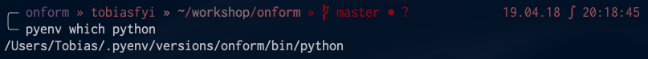

# 2019-04-18 | #046

\#100DaysofCode

- [2019-04-18 | #046](#2019-04-18--046)
  - [SELECT * FROM Project](#select--from-project)
    - [Project.abstract](#projectabstract)
    - [Project.loxocache(2019-04)](#projectloxocache2019-04)
  - [SELECT * FROM Session](#select--from-session)
    - [Session.abstract](#sessionabstract)
      - [Session.cache](#sessioncache)
  - [Session.journal(2019-04-18)](#sessionjournal2019-04-18)
    - [Loxocache](#loxocache)
    - [12:11 -+- Session.init](#1211----sessioninit)
    - [10:17 -+- DAY 046 - PRE-CONFIG](#1017----day-046---pre-config)
    - [10:53 -+- fyinit](#1053----fyinit)
    - [12:26 -+- Surroundings Assessment](#1226----surroundings-assessment)
    - [17:34 -+- BackHome](#1734----backhome)
    - [17:47 -+- Freshtallation](#1747----freshtallation)
    - [19:03 -+- Ice Cream for pyenv-virtualenv](#1903----ice-cream-for-pyenv-virtualenv)
    - [20:44 -+- Pipenv Again and Again](#2044----pipenv-again-and-again)
    - [21:50 -+- sketchbox](#2150----sketchbox)
    - [22:38 -+- Newdjangled Project](#2238----newdjangled-project)

---

## SELECT * FROM Project

### Project.abstract

    GOAL__ : Convenient CLI tool for initiating a session

### Project.loxocache(2019-04)

    TASK_044 : Copy session from on_form build journal  
    TASK_ : write cli tool for initializing a new project  

--------ƒ--------

## SELECT * FROM Session

### Session.abstract

    GOAL√046 : My initial goal for this session is to get my fyinit click program up and running with the new environment setup  
    GOAL_046 : Create better UX for fyinit  

#### Session.cache

- pass

---

## Session.journal(2019-04-18)

### Loxocache

    TASK_046 : move important dirs (fineyedesign + tobiasfyi) into ~/workshop  

--------ƒ--------

### 12:11 -+- Session.init

It worked! Woop Woop!

I wrote the first section of the journal in Day 045 until I got fyinit up and running in the new environment.

---

### 10:17 -+- DAY 046 - PRE-CONFIG

    GOAL√046 : My initial goal for this session is to get my fyinit click program up and running with the new environment setup  

I copied over the Challenges repository / directory using one of my favorite bash tools `rsync`

    $ rsync -ah --info=progress2 --append-verify ~/Documents/Projects/Challenges ~/workshop

1. Installed pyenv-virtualenv
2. Installed pyenv-virtualenvwrapper

With virtualenvwrapper all your virtualenvs are kept on a same directory and your projects’ code on another. As I defined yesterday (and won't spend any more time on today, I promise...):

    # All virtualenvs will be in...
    mkdir ~/.vega
    # All projects will be in...
    mkdir ~/workshop

I created my .zshenv file and edited as follows:

    export WORKON_HOME=~/.vega
    export PROJECT_HOME=~/workshop
    if command -v pyenv 1>/dev/null 2>&1; then
        eval "$(pyenv init -)"
    fi

Restarted the shell. Now installing CPython 3.7.3. 

Here's a handy link to the [pyenv commands reference](https://github.com/pyenv/pyenv/blob/master/COMMANDS.md).

    $ pyenv install 3.7.3
    ... zlib not available

I got the notorious zlib not available error because I'm running Mojave. Went through some [GitHub issue discussion](https://github.com/pyenv/pyenv/issues/1219) and tried this (which worked):

    $ CFLAGS="-I$(xcrun --show-sdk-path)/usr/include" pyenv install -v 3.7.3
    Installed Python-3.7.3 to /Users/Tobias/.pyenv/versions/3.7.3

    $ pyenv global 3.7.3

---

### 10:53 -+- fyinit

Setting environment variables specific to each virtual environment. Once inside the project root:

    $ touch .env
    SECRET_KEY="SuperSecretQue"

Gettings fyinit up and running.

    $ cd ~/workshop/Challenges/100DaysofX/01_Code/Projects/fyinit
    $ pipenv install
    $ pipenv install click
    Installing click…
    Adding click to Pipfile's [packages]…
    ✔ Installation Succeeded
    Pipfile.lock (182788) out of date, updating to (a65489)…
    Locking [dev-packages] dependencies…
    Locking [packages] dependencies…
    ✔ Success!
    Updated Pipfile.lock (182788)!
    Installing dependencies from Pipfile.lock (182788)…
    🐍   ▉▉▉▉▉▉▉▉▉▉▉▉▉▉▉▉▉▉▉▉▉▉▉▉▉▉▉▉▉▉▉▉ 1/1 — 00:00:01
    To activate this project's virtualenv, run pipenv shell.
    Alternatively, run a command inside the virtualenv with pipenv run.

    $ pip install --editable .
    Obtaining file:///Users/Tobias/workshop/Challenges/100DaysofX/01_Code/Projects/fyinit
    Requirement already satisfied: Click in /Users/Tobias/.local/share/virtualenvs/fyinit-Ctn_MiSA/lib/python3.7/site-packages (from fyinit==0.1) (7.0)
    Installing collected packages: fyinit
    Running setup.py develop for fyinit
    Successfully installed fyinit

    $ pip install pylint

Decided I should probably use `git clone` instead of rsync to bring the repository over to the new workshop directory.

    $ rm -rf Challenges
    $ git status
    $ git add 045-...
    $ git commit -m "Updated day 045 with 046 until new entry created"

Got that working nicely. Now some final notes on pipenv before switching gears to work on the fyinit cli tool.

[Pipenv Configuration with Environment Variables](https://pipenv.readthedocs.io/en/latest/advanced/#configuration-with-environment-variables)

    PIPENV_CACHE_DIR
        Location for Pipenv to store it’s package cache.
        Default is to use appdir’s user cache directory.

    PIPENV_EMULATOR
        If set, the terminal emulator’s name for pipenv shell to use.
        Default is to detect emulators automatically. This should be set if your emulator, e.g. Cmder, cannot be detected correctly.

    PIPENV_SHELL
        An absolute path to the preferred shell for pipenv shell.
        Default is to detect automatically what shell is currently in use.

    PIPENV_SHELL_FANCY
        If set, always use fancy mode when invoking pipenv shell.
        Default is to use the compatibility shell if possible.

    PIPENV_IGNORE_VIRTUALENVS
        If set, Pipenv will always assign a virtual environment for this project.
        By default, Pipenv tries to detect whether it is run inside a virtual environment, and reuses it if possible. This is usually the desired behavior, and enables the user to use any user-built environments with Pipenv.

    PIPENV_VENV_IN_PROJECT
        If set, creates .venv in your project directory.
        Default is to create new virtual environments in a global location.

    ☤ Custom Virtual Environment Location
        Pipenv automatically honors the WORKON_HOME environment variable, if you have it set — so you can tell pipenv to store your virtual environments wherever you want, e.g.:

            export WORKON_HOME=~/.venvs

    ☤ Shell Completion
        To enable completion in fish, add this to your config:

        eval (pipenv --completion)
        Alternatively, with bash or zsh, add this to your config:

        eval "$(pipenv --completion)"
        Magic shell completions are now enabled!

---

### 12:26 -+- Surroundings Assessment

Although it's felt like an absolute slog the last couple of days, I think I'm finally coming to understand pipenv.

I still feel very uninformed about pyenv so I will have to do more work with that later on.

For now, I'm going to try getting a django project up and running. I don't want to fall into any of the mistakes I made on Tuesday, so I'm going to create the repository from scratch.

    $ cd ~/workshop
    $ git clone git@github.com:tobias-fyi/onform.git

----ø----

I keep doing the same few things over and over again whenever starting a new project. What does that tell me? That I can make that process much easier and quicker with a little automation.

    TASK_ : write cli tool for initializing a new project  

    TASK_046 : move important dirs (fineyedesign + tobiasfyi) into ~/workshop  

----ø----

    $ touch .gitignore
    $ mkdir 00-Admin
    $ mkdir 01-Docs
    $ mkdir xx-db_data

I found a good [RealPython article on pyenv](https://realpython.com/intro-to-pyenv/).

----ø----

It looks like I'm [not the only one](https://github.com/pypa/pipenv/issues/1184) who doesn't like the idea of having [the hash on the end of the venv name](https://github.com/pypa/pipenv/issues/1049). That's only one thread out of what seems to be quite a few all about a similar thing.

One option is to utilize pyenv-virtualenvwrapper or something like it to define the names of the venvs, then utilize pipenv to manage them once they are created.

Will research more once I get back to the studio.

    TASK√046 : Commit / push from new local repo to GitHub
    TASK√046 : Remove legacy fineyedesign + Challenges repos from local  

Making the first commit / push from the new fineyedesign repo.

---

### 17:34 -+- BackHome

Found this bit in the RealPython article above that I guess gets inserted when the installer is run but the documentation doesn't mention (at least the one PATH line):

    # Load pyenv automatically by adding
    # the following to ~/.bashrc:

    export PATH="$HOME/.pyenv/bin:$PATH"
    eval "$(pyenv init -)"
    eval "$(pyenv virtualenv-init -)"

But I get this error when starting up my terminal:

    /Users/Tobias/.zshenv:4: command not found: pyenv
    /Users/Tobias/.zshenv:5: command not found: pyenv
    /Users/Tobias/.zshenv:6: command not found: pipenv

Trying those same lines in .zshrc instead of .zshenv:

    No errors that time...

But I'm still going to remove and reinstall it. Something still doesn't seem quite right...

---

### 17:47 -+- Freshtallation

Once again...I'm starting to realize that I do this a lot. Starting - stopping - starting - stopping. It's part of my process I think, whether I like it or not.

Uninstalling / Removing pyenv:

1. To disable pyenv managing your Python versions, simply remove the pyenv init line from your shell startup configuration. This will remove pyenv shims directory from PATH, and future invocations like python will execute the system Python version, as before pyenv.

2. To completely uninstall pyenv, perform step (1) and then remove its root directory. This will delete all Python versions that were installed under $(pyenv root)/versions/ directory:

    $ rm -rf $(pyenv root)

If you've installed pyenv using a package manager, as a final step perform the pyenv package removal. For instance, for Homebrew:

    $ brew uninstall pyenv
    Error: Refusing to uninstall /usr/local/Cellar/pyenv/1.2.11
    because it is required by pyenv-virtualenv and pyenv-virtualenvwrapper, which are currently installed.

    $ brew uninstall pyenv-virtualenv
    Uninstalling /usr/local/Cellar/pyenv-virtualenv/1.1.3... (20 files, 62.2KB)
    pyenv: no such command `sh-activate'

    $ brew uninstall pyenv-virtualenvwrapper
    Uninstalling /usr/local/Cellar/pyenv-virtualenvwrapper/20140609... (8 files, 14.8KB)
    pyenv: no such command `sh-activate'

    $ brew uninstall pyenv
    Uninstalling /usr/local/Cellar/pyenv/1.2.11... (643 files, 2.4MB)
    pyenv:11: command not found: pyenv

Not sure what that last line means - `sh-activate`. But the uninstallation seems to have worked.

Found a useful command to list out homebrew-installed packages: `brew list`. I guess that should've been pretty obvious but still good to know. I used it to be sure that pyenv and friends were removed.

--ø--

Ok no more pyenv for the moment. Time to use the installer.

    $ curl https://pyenv.run | bash
    ...
    Cloning into '/Users/Tobias/.pyenv'...
    Cloning into '/Users/Tobias/.pyenv/plugins/pyenv-doctor'...
    Cloning into '/Users/Tobias/.pyenv/plugins/pyenv-installer'...
    Cloning into '/Users/Tobias/.pyenv/plugins/pyenv-update'...
    Cloning into '/Users/Tobias/.pyenv/plugins/pyenv-virtualenv'...
    Cloning into '/Users/Tobias/.pyenv/plugins/pyenv-which-ext'...

And that, friends, is why we automate things with scripts. I could've saved at least an hour or two yesterday if I had started with that instead of the manual / homebrew installation.

Oh well, I still learned about my shell a bit more. For example, I know very well where to look for those lines in my shell initialization script. I knew some about it before but not as much as I do now!

Double checking ~/.zshrc... | ...nope those lines aren't in it.  
Looking in my ~/.bashrc... | ...nope—I don't even have a .bashrc file.

Hmmm...maybe I shouldn't have run it as bash. I'll just have to add those lines to my .zshrc file manually.

No errors when iTerm was restarted!  

    Last login: Thu Apr 18 18:19:00 on ttys000

    ╭─ tobiasfyi » ~       19.04.18 ∫ 18:20:56
    ╰─ echo $PATH
    /Users/Tobias/.pyenv/plugins/pyenv-virtualenv/shims:/Users/Tobias/.pyenv/shims:/Users/Tobias/.pyenv/bin:/usr/local/bin:/usr/bin:/bin:/usr/sbin:/sbin

I wish I knew a way to find out how many times I've restarted iTerm in the last 48 hours. Definitely in the hundreds.

Last thing for this part is to install pyenv-virtualenvwrapper. I'm going to wait on that for now. I don't think it's a requirement at this point.

--ø--

Time to install Python 3.7.3 using pyenv again.

    $ pyenv install -v 3.7.3

LOL I got the zlib error again. Trying something new this time:

    $ brew install zlib

Nope it still failed. A good attempt though. Good thing I keep a good journal so I can see what I did last time.

One thing I ran across earlier (was just reminded going through the journal) that I definitely want to come back to is using the command to put the .venv in the project folder. I just want to do some more research on if that's a good idea. I feel like it would take up much more space but maybe would be easier to manage.

    $ CFLAGS="-I$(xcrun --show-sdk-path)/usr/include" pyenv install -v 3.7.3
    Installed Python-3.7.3 to /Users/Tobias/.pyenv/versions/3.7.3

    $ pyenv versions

    ╭─ tobiasfyi » ~        19.04.18 ∫ 18:39:28
    ╰─ pyenv versions
    * system (set by /Users/Tobias/.pyenv/version)
      3.7.3

Woop Woop! Now to set the global Python to 3.7.3 (again).

    $ pyenv which python
    /usr/bin/python

    $ pyenv global 3.7.3
    $ pyenv which python
    /Users/Tobias/.pyenv/versions/3.7.3/bin/python

    $ pyenv versions
      system
    * 3.7.3 (set by /Users/Tobias/.pyenv/version)

The RealPython article says the installation can be verified by running the internal tests. The example does it with the 3.8-dev version. I'll run that install as well right now. First checking out the list to confirm the naeme:

    $ pyenv install --list | grep " 3\.[678]"
    $ CFLAGS="-I$(xcrun --show-sdk-path)/usr/include" pyenv install -v 3.8-dev
    Installed Python-3.8-dev to /Users/Tobias/.pyenv/versions/3.8-dev

I realized after running the command that I can just put that in my .zshrc.

The reason I want to use the same version is because it errored out within like 20 lines. Looked like something to do with homebrew. I just had the thought that it might also have something to do with my .zshrc aliases.

Yep, it definitely was a result of the alias. Here is the output from running `which python` before and after I commented out the alias.

    # before
    ╭─ tobiasfyi » ~                19.04.18 ∫ 18:55:24
    ╰─ which python
    python: aliased to python3

    # after
    ╭─ tobiasfyi » ~                19.04.18 ∫ 18:56:17
    ╰─ which python
    /Users/Tobias/.pyenv/shims/python

That looks and feels better. You know what they say, "If your output looks better, you'll feel better; if you feel better you write better code."

    $ pyenv global 3.8-dev
    $ python -m test
    ...
    ValueError: current limit exceeds maximum limit

Oh well. At least the test led to me taking out those aliases because I can see how that would majorly eff things up. Apparently it is a [known issue on python.org](https://bugs.python.org/issue36432)?

Here's a feature I must've overlooked before:

    The local command is often used to set an application-specific Python version. You could use it to set the version to 3.7.3:

    $ pyenv local 3.7.3

    This command creates a .python-version file in your current directory. If you have pyenv active in your environment, this file will automatically activate this version for you.

Better late than never?

---

### 19:03 -+- Ice Cream for pyenv-virtualenv

About to eat some ice cream that I've forgotten to eat the last couple of days. Let's get after it.

Here's a nice little breakdown:

1. pyenv manages multiple versions of Python itself.
2. virtualenv/venv manages virtual environments for a specific Python version.
3. pyenv-virtualenv manages virtual environments for across varying versions of Python.

Creating a virtual environment is a single command:

    $ pyenv virtualenv 3.7.3 onform
    Looking in links: /var/folders/51/jw_hn7_d1gx0q0thjrwtfh_00000gn/T/tmp_lynkqv_

    $ cd ~/workshop/onform
    $ pyenv local onform
    -rw-r--r--   1 Tobias  staff     7B Apr 18 20:11 .python-version

If you did not configure eval "$(pyenv virtualenv-init -)" to run in your shell, you can manually activate/deactivate your Python versions with the following commands—they are what pyenv-virtualenv is doing when it enters or exits a directory with a .python-version file in it.

    $ pyenv activate <environment_name>
    $ pyenv deactivate

HOLY SHIT IT FINALLY HAPPENED. Two days of struggle right here:

    $ pyenv which python
    /Users/Tobias/.pyenv/versions/onform/bin/python

It looks so good. I could cry. I'm figuring this thing out, one prompt segment at a time...

---

### 20:44 -+- Pipenv Again and Again

Ok now I feel like I know what it's going to look like when I install packages with pipenv. As I've read along the way the last few days, as I created the virtual environment for the project root already, when I run pipenv it will use that environment instead of creating a new one with that ugly hash.

I'm going to do it with this Challenges directory.

    $ cd ~/workshop/Challenges
    $ pyenv virtualenv 3.7.3 challenges

    $ pyenv virtualenvs
    3.7.3/envs/challenges (created from /Users/Tobias/.pyenv/versions/3.7.3)
    3.7.3/envs/onform (created from /Users/Tobias/.pyenv/versions/3.7.3)
    challenges (created from /Users/Tobias/.pyenv/versions/3.7.3)
    onform (created from /Users/Tobias/.pyenv/versions/3.7.3)

    $ pyenv local challenges

And Boooooom!

Cool.

### 21:50 -+- sketchbox

Starting out by creating a place to hold all my random little tests and ideas, where the initial directory will be to use during the learning.

    $ mkdir -p ~/workshop/sketchbox/badjango
    $ cd $_
    $ pyenv virtualenv 3.7.3 badjango
    $ pyenv local badjango

All fine and dandy so far...time for some hot pipenv action.

    $ pipenv install django~=2.2
    Installing django~=2.2…
    Adding django to Pipfile's [packages]…
    ✔ Installation Succeeded

Now...what happens when I say `pipenv shell`?

    $ pipenv shell
    Launching subshell in virtual environment…
    . /Users/Tobias/.vega/badjango-JosHkjwg/bin/activate

    $ . /Users/Tobias/.vega/badjango-JosHkjwg/bin/activate
    .: no such file or directory: /Users/Tobias/.vega/badjango-JosHkjwg/bin/activate

    pipenv install psycopg2
    Creating a virtualenv for this project…
    Pipfile: /Users/Tobias/workshop/sketchbox/badjango/Pipfile
    Using /Users/Tobias/.pyenv/versions/3.7.3/envs/badjango/bin/python3 (3.7.3) to create virtualenv…
    ⠼ Creating virtual environment...Using base prefix '/Users/Tobias/.pyenv/versions/3.7.3'

    New python executable in /Users/Tobias/.vega/badjango-JosHkjwg/bin/python3
    Also creating executable in /Users/Tobias/.vega/badjango-JosHkjwg/bin/python
    Installing setuptools, pip, wheel...done.
    Running virtualenv with interpreter /Users/Tobias/.pyenv/versions/3.7.3/envs/badjango/bin/python3

    ✔ Successfully created virtual environment!
    Virtualenv location: /Users/Tobias/.vega/badjango-JosHkjwg
    ...
    ERROR: ERROR: Package installation failed...

Yeesh that was ugly...I didn't want another venv.

Looks like I'm not going to be using pipenv. [As Chris says](https://chriswarrick.com/blog/2018/07/17/pipenv-promises-a-lot-delivers-very-little/), "Promises a lot; dellivers a little."

Well it wasn't ALL pipenv's fault—I have to either [meet the build requirements or build the binary](http://initd.org/psycopg/docs/install.html) version:

    $ pip install psycopg2-binary

---

### 22:38 -+- Newdjangled Project

    $ django-admin startproject newdjangled .
    $ python manage.py startapp tendraft
    $ python manage.py runserver

And we're live!

...finally back to actually doing something. Not like I wasn't doing something the last couple days, but I enjoy the actual coding part more than the setting things up. I guess it's good to realize that.