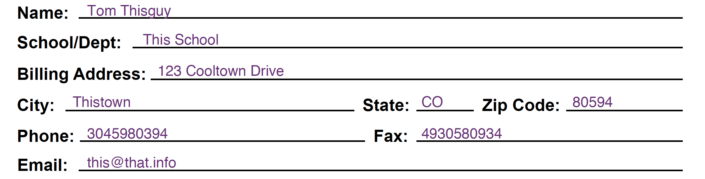

# 2019-04-22 | #100DaysofCode

## Day 050 / 100

- [2019-04-22 | #100DaysofCode](#2019-04-22--100daysofcode)
  - [Day 050 / 100](#day-050--100)
  - [SELECT * FROM Project](#select--from-project)
    - [Project.abstract](#projectabstract)
    - [Project.loxocache(2019-04)](#projectloxocache2019-04)
      - [Project-specific](#project-specific)
      - [Globaloxocal](#globaloxocal)
  - [SELECT * FROM Session](#select--from-session)
    - [Session.abstract](#sessionabstract)
  - [Session.journal(2019-04-22)](#sessionjournal2019-04-22)
    - [09:45 ~ Session.init](#0945--sessioninit)
    - [09:50 ~ Virtual Envelopes](#0950--virtual-envelopes)
      - [TASK_050 : Install pyenv-virtualenvwrapper](#task_050--install-pyenv-virtualenvwrapper)
      - [TASK_050 : Learn / start using pyenv-virtualenvwrapper](#task_050--learn--start-using-pyenv-virtualenvwrapper)
      - [TASK_050 : fyinit - use the template file instead of embedded string](#task_050--fyinit---use-the-template-file-instead-of-embedded-string)
    - [10:17 ~ VirtualRapper](#1017--virtualrapper)
    - [10:49 ~ Stealing Candy Wrappers From an Env](#1049--stealing-candy-wrappers-from-an-env)
    - [11:00 ~ Fresh Neurals](#1100--fresh-neurals)
    - [13:30 ~ Freshies](#1330--freshies)
      - [TASK_050 : Set up stylesheets for my markdown files](#task_050--set-up-stylesheets-for-my-markdown-files)
      - [IDEA_050 : Name of tag-management program = recallection](#idea_050--name-of-tag-management-program--recallection)
      - [CUE_050 : Figure out why new postgres server has those initial DBs](#cue_050--figure-out-why-new-postgres-server-has-those-initial-dbs)
      - [NOTE_050 : "markdown.extension.toc.githubCompatibility": true](#note_050--markdownextensiontocgithubcompatibility-true)
      - [IDEA_112 : Gnereate current day of year for journal template](#idea_112--gnereate-current-day-of-year-for-journal-template)
      - [IDEA_112 : Function to calculate hours spent on client session](#idea_112--function-to-calculate-hours-spent-on-client-session)
    - [15:15 ~ Try OneMore](#1515--try-onemore)
      - [TASK√048 : Write to the database via the form](#task048--write-to-the-database-via-the-form)
    - [15:33 ~ Display PDFs](#1533--display-pdfs)
      - [LVL3_050 : Fix labels on OrderFormView](#lvl3_050--fix-labels-on-orderformview)
    - [16:30 ~ Momentus Truthificus](#1630--momentus-truthificus)
      - [Lock and load them rifles, it's troubleshootin' time](#lock-and-load-them-rifles-its-troubleshootin-time)
    - [16:57 ~ IT WORKED](#1657--it-worked)
      - [TASK√050 : Pass model data into pdf_gen.js script](#task050--pass-model-data-into-pdf_genjs-script)
    - [17:10 ~ Loginto Me](#1710--loginto-me)
      - [LVL3_112 : render_pdf.js - loop through field_data for drawText](#lvl3_112--render_pdfjs---loop-through-field_data-for-drawtext)
    - [17:57 ~ You Auth](#1757--you-auth)
    - [22:11 ~ Log Back In Again](#2211--log-back-in-again)
    - [23:46 ~ Is U Auth?](#2346--is-u-auth)
      - [LVL2√050 : OrderDetail - PDF buttons in navbar](#lvl2050--orderdetail---pdf-buttons-in-navbar)
      - [LVL2√050 : Move Log Out nav-link to far right](#lvl2050--move-log-out-nav-link-to-far-right)
    - [00:52 ~ Homepage Stretch](#0052--homepage-stretch)
      - [LVL1_050 : Create user account for jeffco](#lvl1_050--create-user-account-for-jeffco)
      - [LVL0x050 : Make login page the home page](#lvl0x050--make-login-page-the-home-page)
      - [TASK√050 : Add user login functionality](#task050--add-user-login-functionality)
    - [01:47 ~ OnEmail](#0147--onemail)
    - [02:06 ~ Deploymintz](#0206--deploymintz)
      - [LVL2_050 : Randomish numbering scheme for orders](#lvl2_050--randomish-numbering-scheme-for-orders)
      - [TASK_050 : Install the Postgres.app CLI Tools / Configure $PATH](#task_050--install-the-postgresapp-cli-tools--configure-path)
      - [TASK_050 : $ pip install -r requirements.txt](#task_050---pip-install--r-requirementstxt)
    - [02:52 ~ Calling IT](#0252--calling-it)

---

## SELECT * FROM Project

### Project.abstract

    GOAL_OnForm : A simple form-based application for generatiing and filling out a PDF form online  

### Project.loxocache(2019-04)

#### Project-specific

    LVL0_050 : Deploy to production server  
        TASK_050 : Install the Postgres.app CLI Tools / Configure $PATH  
        TASK_050 : $ pip install -r requirements.txt  
        TASK_050 : Complete prerequisites for deployment  

    LVL1_050 : Implement email with SendGrid  
    LVL1_050 : Create user account for jeffco  
    LVL1_044 : Ask if billing address is the same, if so, fill in automatically  

    LVL2_050 : Add success message to orderdetail  
    LVL2_050 : Randomish numbering scheme for orders  
    LVL2_050 : Fix labels on OrderFormView  
    LVL2_050 : Serialize model data + display PDF  

    LVL3_050 : render_pdf.js - loop through field_data for drawText  

#### Globaloxocal

    TASK_050 : Set up stylesheets for my markdown files  
    TASK_050 : fyinit - use the template file instead of embedded string  

    CUE_050 : Figure out why new postgres server has those initial DBS  

    NOTE_050 : "markdown.extension.toc.githubCompatibility": true  

    IDEA_050 : Name of tag-management program = recallection, lococache  
    IDEA_112 : Genereate current day of year for journal template  
    IDEA_112 : Function to calculate hours spent on client session  

--------∫--------

## SELECT * FROM Session

### Session.abstract

    GOAL_050 : Complete the production version and start prepping for deployment  

---

## Session.journal(2019-04-22)

--------∫--------

### 09:45 ~ Session.init

Happy Halfway point to me!

I was thinking last night about what I'm going to do when I finish this challenge. My goal is to complete three of these 100-day challenges this year. If I did them b2b2b, the last day of the last challenge would be Dec 30, 2019. Crazy...

I had decided previously that I would practice storytelling for an hour every day for the next one. I hope I will be writing code every day anyways so I think it will be good for me to switch it up. I'm going to stick with that.

---

### 09:50 ~ Virtual Envelopes

Starting up a fresh virtualenv for this project. But first I want to install pyenv-virtualenvwrapper. If you've read my journals from a few days ago when I was revamping my workflow, you'll remember that I uninstalled my homebrewed version of pyenv. So I'm going with the method of installation as a pyenv plugin.

    $ git clone https://github.com/pyenv/pyenv-virtualenvwrapper.git $(pyenv root)/plugins/pyenv-virtualenvwrapper
    ...
    Resolving deltas: 100% (162/162), done.

And I will be using pyenv instead of virtualenv, so this is applicable:

To get virtualenvwrapper to create a virtual environment using pyvenv instead of virtualenv, set the PYENV_VIRTUALENVWRAPPER_PREFER_PYVENV environment variable. For example, set the following in your shell initialization config:

    export PYENV_VIRTUALENVWRAPPER_PREFER_PYVENV="true"

After you start a new shell with that variable set and initialize via pyenv virtualenvwrapper or pyenv virtualenvwrapper_lazy, any virtual environments created from that shell using mkvirtualenv will be created using pyvenv if it is available in the active Python version (pyvenv is in Python 3.3 or later).

----∫----

#### TASK_050 : Install pyenv-virtualenvwrapper  

#### TASK_050 : Learn / start using pyenv-virtualenvwrapper  

That means I should put it in my ~/.zshrc. Here are all the related lines in that file, for posterity:

    export PYENV_VIRTUALENVWRAPPER_PREFER_PYVENV="true"
    export WORKON_HOME=~/.vega
    export PROJECT_HOME=~/workshop
    export PATH="$HOME/.pyenv/bin:$PATH"
    eval "$(pyenv init -)"
    eval "$(pyenv virtualenv-init -)"

----∫----

Side-note: I decided to change up the format for the timestamps, so changed my vscode snippet and the fyinit template:

    "sub_stamp": {
        "prefix": "stamp-subject",
        "body": [
            "---",
            "",
            "### $CURRENT_HOUR:$CURRENT_MINUTE ~ ${1:Subject}",
            "",
        ],
        "description": "Markdown timestamp + subject entry."
    },

If you don't use your own custom snippets in vscode or wherever, you should definitely look into it. Makes my life that little titty bitty bit more efficient. 

This reminds me that I still need to spend some quality time improving my fyinit script. Specifically, I'm thinking I need to implement functionality that actually uses the template.md file instead of a super long string inside of the Click function.

At least it works, but it ain't pretty. The reason I did that is so I could easily use f-strings to insert variable data. This is obviously possible doing it the "*right*" way, but I haven't spent the time to figure it out yet.

#### TASK_050 : fyinit - use the template file instead of embedded string

---

### 10:17 ~ VirtualRapper

So I would like to use pipenv to manage my dependencies, though I'm tired of dealing with it as a virtualenvironment manager for now.

Actually, you know what?...I'm not going to get into that right now. I really don't want to go down that mole burrow today. Ain't nobody got time for that!

I'm going to spend 10 minutes MAX (setting a time) trying [this guy's setup](https://medium.com/@henriquebastos/the-definitive-guide-to-setup-my-python-workspace-628d68552e14) once again, using pyenv-virtualenvwrapper.

So I added this to my ~/.zshrc and restarted iTerm:

    pyenv virtualenvwrapper_lazy

    Collecting virtualenvwrapper
    ...
    Installing collected packages: virtualenv, virtualenv-clone, six, pbr, stevedore, virtualenvwrapper
        Running setup.py install for virtualenvwrapper ... done
    Successfully installed pbr-5.1.3 six-1.12.0 stevedore-1.30.1 virtualenv-16.4.3 virtualenv-clone-0.5.3 virtualenvwrapper-4.8.4

---

### 10:49 ~ Stealing Candy Wrappers From an Env

Hmmm...? I guess it just installed virtualenvwrappers' dependencies. Testing out the command to start a new project. It did quite a bit! Gotta break this down...

    $ mkproject sketchbook/neuraldraft
    virtualenvwrapper.user_scripts creating /Users/Tobias/.vega/premkproject
    virtualenvwrapper.user_scripts creating /Users/Tobias/.vega/postmkproject
    virtualenvwrapper.user_scripts creating /Users/Tobias/.vega/initialize
    virtualenvwrapper.user_scripts creating /Users/Tobias/.vega/premkvirtualenv
    virtualenvwrapper.user_scripts creating /Users/Tobias/.vega/postmkvirtualenv
    virtualenvwrapper.user_scripts creating /Users/Tobias/.vega/prermvirtualenv
    virtualenvwrapper.user_scripts creating /Users/Tobias/.vega/postrmvirtualenv
    virtualenvwrapper.user_scripts creating /Users/Tobias/.vega/predeactivate
    virtualenvwrapper.user_scripts creating /Users/Tobias/.vega/postdeactivate
    virtualenvwrapper.user_scripts creating /Users/Tobias/.vega/preactivate
    virtualenvwrapper.user_scripts creating /Users/Tobias/.vega/postactivate
    virtualenvwrapper.user_scripts creating /Users/Tobias/.vega/get_env_details
    WARNING: the pyenv script is deprecated in favour of `python3.7 -m venv`
    virtualenvwrapper.user_scripts creating /Users/Tobias/.vega/sketchbook/neuraldraft/bin/predeactivate
    virtualenvwrapper.user_scripts creating /Users/Tobias/.vega/sketchbook/neuraldraft/bin/postdeactivate
    virtualenvwrapper.user_scripts creating /Users/Tobias/.vega/sketchbook/neuraldraft/bin/preactivate
    virtualenvwrapper.user_scripts creating /Users/Tobias/.vega/sketchbook/neuraldraft/bin/postactivate
    virtualenvwrapper.user_scripts creating /Users/Tobias/.vega/sketchbook/neuraldraft/bin/get_env_details
    Creating /Users/Tobias/workshop/sketchbook/neuraldraft
    Setting project for neuraldraft to /Users/Tobias/workshop/sketchbook/neuraldraft

That's pretty neat! Let's see if I can figure out what happened.

Site-note: I created the .vega and workshop directories and set them as the WORKON_HOME and PROJECT_HOME in a previous session while hammering out my new workflow. You can see this in the code I copied from my ~/.zshrc which can be found [above](#task050--learn--start-using-pyenv-virtualenvwrapper).

It's obvious it created a new virtual environment and directories for both the environment and the project files. It also activated the environment, as is reflected in my prompt:

    ╭─ neuraldraft » tobiasfyi » ..p/sketchbook/neuraldraft        19.04.22 ∫ 10:57:16
    ╰─ which python
    /Users/Tobias/.vega/sketchbook/neuraldraft/bin/python

Ok this is really awesome and just what I've been wanting! I apparently got tired of working on my workflow and half-assed this part when I was setting everything up, as it was my original intent to have my virtual environments in the .vega directory (obviously...).

---

### 11:00 ~ Fresh Neurals

Ok I'm going to run really quick through building up a little journal app because last night's session was getting me a little worked up about the darn CreateView and how my implementation of it in the OnForm project was not working correctly. The Django Docs explicitly state that...

    Model form views provide a form_valid() implementation that saves the model automatically.
    ...
    You don’t even need to provide a success_url for CreateView or UpdateView - they will use get_absolute_url() on the model object if available.
    ...
    The fields attribute works the same way as the fields attribute on the inner Meta class on ModelForm.

The practice app will be called neuraldraft, as you can see from the command / output in the previous section.

----∫----

Ok two minutes then I'm over the pipenv thing...

It says in the pipenv documentation that `A virtualenv will automatically be created, when one doesn’t exist.`

I've been taking this to mean that if *any* venv exists for the current project, it will simply use that. However, in practice I've seen nothing that convinces me this is the case. Every time I install via pipenv, it creates a brand new venv even if there is one active.

Some things I could try are using the .env file or setting the pipenv venv location otherrwise, as stated in the docs...

- Automatically loads .env files, if they exist.
- Automatically creates a virtualenv in a standard location.

Ok my two minutes are up.

----∫----

---

### 13:30 ~ Freshies

I realized I set up the above project in the wrong directory. I had already created a directory for my "sketches" projects called `sketchbox`, but used `sketchbook` instead. I'm going to leave it for now, though it might be worth it to [learn how to use](https://virtualenvwrapper.readthedocs.io/en/latest/command_ref.html#rmvirtualenv) the `rmvirtualenv` command.

Spun up a new Postgres server, `sketchbook`, and a database for neuraldraft. Created the DB + logged into it + created admin user:

    postgres=# CREATE DATABASE neuraldraft;
    postgres=# \c neuraldraft;

----∫----

Random side-thought:

#### TASK_050 : Set up stylesheets for my markdown files  

I also decided to add the headings syntax to tags as with the TASK tag above. This way I can navigate directly to the tag in context.

You know what that means? ...new snippet!

    "recall-tag": {
        "prefix": "recall-tag",
        "body": [
            "#### ${2:Type} : ${1:Reminder}  ",
        ],
        "description": "Markdown subject header."
    },

And I have a good idea right now which will allow me to try it out in a real-world setting! Wow imagine that.

#### IDEA_050 : Name of tag-management program = recallection  

----∫----

Back to spinning up some Postgres...

    neuraldraft=# CREATE USER **** with SUPERUSER PASSWORD '******';

I also think it might be userful (get it?) to have some sql snippets. I looked it up in vscode extensions and there is only one sql snippets plugin. I might create a psql snippets extension. That would be chill.

#### CUE_050 : Figure out why new postgres server has those initial DBs  

I write the above CUE (reminder) because when I initially set up postgres, I must have set up some sort of template because every time I spin up a new server, it comes with a DB called 'Tobias' and 'template1'.

Not that big of a deal, hence using the CUE tag and not the TASK tag, but something I can do to drive some more postgres learning.

----∫----

#### NOTE_050 : "markdown.extension.toc.githubCompatibility": true  

Set the following setting in my vscode user settings, in order to use GitHub-flavored markdown.

> settings.json

    "markdown.extension.toc.githubCompatibility": true

----ƒ----

#### IDEA_112 : Gnereate current day of year for journal template  

#### IDEA_112 : Function to calculate hours spent on client session  

---

### 15:15 ~ Try OneMore

Before starting the fresh project, I have one more idea to try on the OnForm project to get it up and running.

Interesting...when I first loaded up the page on the local server, I got that one exception again, which does not stop the server from running, but which I'm wondering is a result of the problem that's causing all troubles I'm experiencing.

    ConnectionResetError: [Errno 54] Connection reset by peer

I did some quick googling but didn't find anything. Will maybe check in with that later on.

Back to the issue at hand. The idea I had that I think might be causing the OnForm CreateView to write to the database is to explicitly tell the view what fields to use instead of using "__all__". I had thought, from reading the documentation where it states that the view `fields` is the same as the form `fields`, that I could use the "all" syntax to bring in all of the fields. I had to write / copy all of the fields, which is a little unweildy given how many fields there are, however, thanks to multi-cursor functionality (one of my favorite things about a coding text-editor) it really didn't take long.

    class OrderFormView(CreateView):
        model = Order
        template_name = "orderform.html"
        fields = [
            "school",
            "address",
            ...
            "billing_email",
        ]

WOOOOOOOW that was the problem...holy shit. Of course I decided to be a little bit lazy and ended up spending hours last night spinning my wheels trying to figure it out.

#### TASK√048 : Write to the database via the form  

One big benefit from this ordeal is that I started setting up the tests for the app. Those make it much easier to test (obviously, that's what they're for) than filling out the fields every time. I'm going to give those tests a go again and see what happens.

Ok I'm still getting the 404 error for the detail view, even though when I used the browser UI I was successfully redirected to the detail view.

I want to finish the app enough to put in online before tomorrow, but once I have some free time (not sure even what that is anymore) I'll come back to the testing section. Or...

...if I run into more issues.

---

### 15:33 ~ Display PDFs

After the functionality below are working this version of the project should be about done!

    TASK√050 : Pass model data into pdf_gen.js script  
    TASK√050 : Add user login  
    TASK_050 : Display the generated PDF  

And some less important things:

#### LVL3_050 : Fix labels on OrderFormView  

----ƒ----

I had been able to bring over the serialized model data into the DetailView while I was using FBVs. I hope I can use a similar approach with the CBVs I've implemented.

As I mentioned in a prevous session entry, I could also assign an id to each of the `
` elements that contain the data. This way seems relatively simple, so I'm going to go with that first.

However, if I want to go straight to displaying the PDF on the detail page, this way might not work great.

---

### 16:30 ~ Momentus Truthificus

Alright I put all the fields inside of some DOM element and assigned each an id corresponding to the field name of the model from whence it originated.

*The moment of truth!*

...

Downloaded fine but when I tried to open the pdf it said it was corrupted or something.

I looked in the Firefox Dev Console and there was an error stating...

    Error: "PDF is missing a header"
        error http://localhost:8000/static/js/pdf-lib.js:8569
        parseDocument http://localhost:8000/static/js/pdf-lib.js:47233
        parse http://localhost:8000/static/js/pdf-lib.js:47273
        load http://localhost:8000/static/js/pdf-lib.js:47399
        processArray http://localhost:8000/static/js/render_pdf.js:184
        <anonymous> http://localhost:8000/static/js/render_pdf.js:353

#### Lock and load them rifles, it's troubleshootin' time

A bit unfortunate that it didn't work because I spent so long getting it to work. Oh well. More learning for me!

The first thing I checked was whether the textContent I was grabbing from the page was correct. I logged all the fields to the console and everything looked fine to me.

Ahhhh I wonder if it's because maybe I renamed and/or moved the template pdf file that's read into the script...that would definitely cause problems.

Or...it would cause one serious problem. Fixed the request URL and while I was at it I utilized {{ order.id }} as a part of the filename that is generated. No errors on reload. That is a very good sign!

Another truthus momenticus incoming!

Well...at least the naming worked! This time it was "onform_4.pdf". NEAT.

---

### 16:57 ~ IT WORKED

That's one shit-ton of steps for my kind (me), one giant leap in...PDF?

#### TASK√050 : Pass model data into pdf_gen.js script  

Wow that is so damn exciting! I've been working my little head off the past ~3 weeks to try to get this working and it finally happened. Obstacle after obstacle were presented to me, and I overcame them. I built a working piece of software that dynamically generates pdf and will be used by real people!

What an amazing feeling.

That, kids, is why life should be a struggle sometimes. You learn and grow; you get better.

----ƒ----

I just had to get that out of my system. Although to an experienced programmer this may seem relatively simple, to someone just starting out that was a whole lot of new concepts being thrown at me all the time. I was forced to take a whole two days to revamp my workflow just to get this done, which is something that a more experience programmer probably wouldn't have had to do.

I think for learning a lot of this on the fly, I did pretty well.

---

### 17:10 ~ Loginto Me

Fun fact: my very first email was something along the lines of loginto_me@hotmail.com.

lol

Side-note: made some minor adjustments to the font size and some of the coordinates to make the text fit better on the page.

----ƒ----

The last piece of functionality that I technically "need" is the user login.

    TASK√050 : Add user login functionality  

I don't know if I'll ever get to this, but it could be cool to refactor the javascript code such that instead of hardcoding the data into the drawText instances, use one nice-looking loop that loops through field_data to draw each element. I would definitely look a lot cleaner.

#### LVL3_112 : render_pdf.js - loop through field_data for drawText  

Additionally, the field_data object could be generated by django and read in as JSON, instead of doing the brute-force method I used. This is something I do want to get to at some point relatively soon.

---

### 17:57 ~ You Auth

Before going any further I'm going to make a solid git commit.

What I might do after that commit is create a new branch in order to implement the user login functionality, then once that's done I'll learn a bit about merging. I didn't get that far last time I branched a repo.

    $ git branch login
    $ git checkout login
    Switched to branch 'login'

    $ git log --oneline --decorate
    722f0a6 (HEAD -> login, origin/master, origin/HEAD, master) removed some remnants in a view
    5805dfb Basic functionality is all working correctly
    1d925c7 CBV working - form still not hitting DB
    515c8b7 Views working and looking very good but no writing to DB yet
    3511452 Structured but not tested
    8773756 Initial commit

----ƒ----

Side-note: the displayPDF functionality can be on a different view

    /orders/1/pdf

I also don't think we'll be publishing the orders page at all, as there is no real use for it. As admin we can use the admin area, and the users shouldn't have access to it anyways.

---

### 22:11 ~ Log Back In Again

Created a new template (and directory within templates) + url pattern + changed some settings.

> onform_pdf/urls.py

    urlpatterns = [
        path("admin/", admin.site.urls),
        path("accounts/", include("django.contrib.auth.urls")),
        path("", include("onform.urls")),
    ]

> onform_pdf/templates/registration/login.html

    
    
    
    <h2>Log In</h2>
    <form method="POST">
        
        {{ form|crispy }}
        <button type="submit">Log In</button>
    </form>
    

> onform_pdf/settings.py

    LOGIN_REDIRECT_URL = "orderform"

----ƒ----

It worked first try! That was easy.

Still have to add functionality to make it work as it should be I was able to log in and it redirected me to the orderform page.

---

### 23:46 ~ Is U Auth?

> templates/base.html

    # in the header
    
    <li class="nav-item">
        <a class="nav-link" href="">Log Out</a>
    </li>
    
    <li class="nav-item">
        <a class="nav-link" href="">Log Out</a>
    </li>
    

    # underneath the header
    

        

            
            <h5>Welcome!</h5>
            
Please fill out and submit the form below.

            
            <h5>Please log in to submit an order.</h5>
            <button class="btn">
                <a href="">Log In</a>
            </button>
            
        

    

> onform_pdf/settings.py

    LOGOUT_REDIRECT_URL = "login"

----ƒ----

Fixed up the navbar. Not quite done yet but it's looking pretty fresh. Very minimal yet effective. That subtle gradient works really well—and the cool part about that is the two colors I used for the gradient are pyramid and jeffco.

#### LVL2√050 : OrderDetail - PDF buttons in navbar  

#### LVL2√050 : Move Log Out nav-link to far right  

---

### 00:52 ~ Homepage Stretch

#### LVL1_050 : Create user account for jeffco  

I'm not going to create a custom user model for this project, as the user functionality really is not very important—it is only being implemented to allow access to certain people, not to hold their information.

I'll talk to my boss tomorrow to confirm.

The only reason I can think of atm would be if that's the *only* way to use a custom login URL. However, that's not a completely necessary feature—would just be a nice thing to have.

#### LVL0x050 : Make login page the home page  

----ƒ----

Before I make any more changes I'm making another commit.

----ƒ----

Forgot to update the time zone when I started the project:

> settings.py

    TIME_ZONE = "America/Denver"

----ƒ----

Login Required! That's what I've been looking for.

> onform/views.py

    ...
    from django.contrib.auth.mixins import LoginRequiredMixin
    ...
    class OrderFormView(LoginRequiredMixin, CreateView):
        model = Order
        template_name = "orderform.html"
        fields = [
            "school",
            ...
            "billing_email",
        ]

        login_url = "login"
    ...
    class OrderDetailView(LoginRequiredMixin, DetailView):
        model = Order
        template_name = "orderdetail.html"

        login_url = "login"

And there we have it! One working online PDF form with a simple user authentication system.

#### TASK√050 : Add user login functionality  

---

### 01:47 ~ OnEmail

    LVL1_050 : Implement email with SendGrid  

I'm going to see if I can integrate the auto-email, as there is a section in Django For Beginners that goes over it.

This isn't a complete necessity, as we can go in and generate the PDFs manually. But it is very high on the "cool features" list. So...I'm going to give it a go!

The book uses SendGrid so I guess I'll try that. Signed up for a free account.

Well...I actually don't need this to work at this current moment. But I *do* need to get the app live on a server somewhere so people can start using it tomorrow.

---

### 02:06 ~ Deploymintz

I'm going to start out using Heroku as it seems to be quick and easy.

Just bought a couple domains, one to use for this (maybe tomorrow), and the other is one I've been eyeing for a while (see Day 036).

    pyrportal.com
    djangit.com

Signed up for an account on Heroku. Installed CLI tool...

    $ heroku --version
    heroku/7.22.10 darwin-x64 node-v11.10.1

    $ heroku login
    Opening browser to https://cli-auth.heroku.com/****
    Logging in... done
    Logged in as ****

Before I create the new app I should probably merge the new branch with the master.

    $ git add -A
    $ git commit -m "User login and permissions"
    $ git log --oneline --decorate
    cad0467 (HEAD -> login, origin/login) User login and permissions
    8346f96 Initial auth functionality - no LoginRequired yet
    722f0a6 (origin/master, origin/HEAD, master) removed some remnants in a view
    5805dfb Basic functionality is all working correctly
    1d925c7 CBV working - form still not hitting DB
    515c8b7 Views working and looking very good but no writing to DB yet
    3511452 Structured but not tested
    8773756 Initial commit

    $ git checkout master
    $ git merge login
    Updating 722f0a6..cad0467

    Fast-forward
    01-Docs/vv-pdf_output/onform_2.pdf           | 197 ++++++++++++++++++++++++++++++++++++
    onform_pdf/onform/urls.py                    |   6 +-
    onform_pdf/onform/views.py                   |  48 ++-------
    onform_pdf/onform_pdf/settings.py            |  10 +-
    onform_pdf/onform_pdf/urls.py                |   1 +
    onform_pdf/static/css/main.css               |  13 ++-
    onform_pdf/static/css/main.css.map           |   2 +-
    onform_pdf/static/css/main.scss              |  18 +++-
    onform_pdf/static/js/render_pdf.js           |   2 +-
    onform_pdf/templates/base.html               |  43 +++++---
    onform_pdf/templates/onorder.html            |  42 --------
    onform_pdf/templates/onus.html               |  32 ------
    onform_pdf/templates/orderdetail.html        | 130 ++++++++++++++++--------
    onform_pdf/templates/orderform.html          |  17 ++++
    onform_pdf/templates/orders.html             |   6 ++
    onform_pdf/templates/registration/login.html |  20 ++++
    16 files changed, 404 insertions(+), 183 deletions(-)
    create mode 100644 01-Docs/vv-pdf_output/onform_2.pdf
    delete mode 100644 onform_pdf/templates/onorder.html
    delete mode 100644 onform_pdf/templates/onus.html
    create mode 100644 onform_pdf/templates/registration/login.html

Tested it out by running through the pages and it seems to be working just fine. My first merge ever!

Something reminded me that I want to add some random-ish numbering scheme to the orders so it doesn't start counting up from 1, but that's not critical right now.

#### LVL2_050 : Randomish numbering scheme for orders  

----ƒ----

[Started setting things up to deploy...](https://devcenter.heroku.com/articles/getting-started-with-python#declare-app-dependencies)

    $ touch Procfile
    > web: gunicorn onform_pdf.wsgi --log-file -

#### TASK_050 : Install the Postgres.app CLI Tools / Configure $PATH  

[Link to Postgres CLI tools site.](https://postgresapp.com/documentation/cli-tools.html)

#### TASK_050 : $ pip install -r requirements.txt  

    $ pip install -r requirements.txt

---

### 02:52 ~ Calling IT

Ok I think it's time for me to hit the hay. I was hoping to have it up by the time I went to sleep, but I guess I'll have to finish it up tomorrow.

Hasta bueno, amigo!