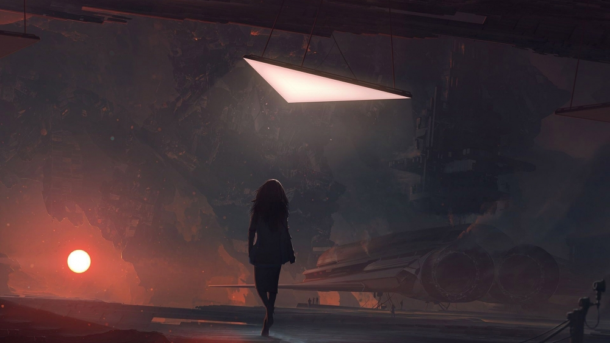

# #100DaysofStory: 005

    REP-005 ~ Lossless  

## 005/100 — 2019-06-18

---

- [#100DaysofStory: 005](#100DaysofStory-005)
  - [005/100 — 2019-06-18](#005100--2019-06-18)
    - [Bob Moses - The Only Thing We Know](#Bob-Moses---The-Only-Thing-We-Know)
  - [Lossless](#Lossless)

| Tuesday | Jun 18 | In    | Out   |
| ------- | ------ | ----- | ----- |
| Prep    | --:--  | 23:32 | 00:15 |
| Write   | --:--  | 00:15 | --:-- |
| Total   | -- hr  | hr    | hr    |

---

### Bob Moses - The Only Thing We Know

If you won't leave me
Then I won't go
If you can't see me
Guess I'm a shadow

If I say sorry
Would you let go?

It's the only thing we know.

---- ∫ ----

If you don't need me say it ain't so
If you won't lead me who will I follow?
If I say sorry would you come home?
It's the only thing we know

---

## Lossless

    CWS-169 | Device ~ Chiasmus
        The order of a pair of words or phrases in one clause (your country, you) is inverted in the next (you, your country); contrast by parallelism in reverse order.

    CWS-169 | Device ~ Dialogismus
        A speaker either imagines what someone or something else might be thinking, or paraphrases someone's earlier words; talks not as themselves just for rhetorical effect.

---

    CWS-169 ~ Initial Thoughts

    CWS-169 ~ Plot
        The entire story is spent looking for some trivial item, which ends up being right where it should've been / in the first place that was searched

    CWS-169 ~ Theme
        The balance / decision of searching vs complacency. 

    CWS-169 ~ Theme
        Making the decision to give up and let it go after a long and difficult struggle. Remembering what it feels like to let go.

---- ∫ ----

The feeling of defeat. Without it, we may never move on.

Wistful thinking.

---- ∫ ----

    CWS-169 ~ Liala is a member of a species called the Alagevana, or the "Vana", and is seemingly the only worker-class to realize that their queen is not only selling Vana as slaves, but also allowing them to be used as slaves to gather the rare (semiconductor?) material only found on their homeworld. Liala found out that the Vanas' religion is being coopted in order to ship the material off-world.

    CWS-169 ~ Syn Domari is the organization that controls the Vana homeworld, though the Vana do not know it even exists, much less the extent to which it plays a role in the past, present, and future of the species.

_When will you accept that this is hopeless?_ Liala intoned

The rhythm of her tongue was slow, the notes somber and wistful. The language of her people vividly portrayed the emotions Liala was experiencing. It was too vivid; too much for Ira to bear.

Ira's vision blurred as tears began to course down Ira's face, following the well-worn trails that had formed on her cheeks. 

Ira had fought for them. She had given them hope, hubris leading her to the belief that she could lead them out from under the tyranny of Domari.

Their ignorance of their own plight them ran deeper than Ira could have understood, even if she had centuries to try.

She had spent decades hiding out among them, exploring their subterrainian civilization and attempting to learn their language. The Vana were the most beautiful species Ira had ever seen. And to see all of this beauty exploited and poisoned was too much.

She had succeeded in dispelling their ignorance, only to see it replaced by grief.

