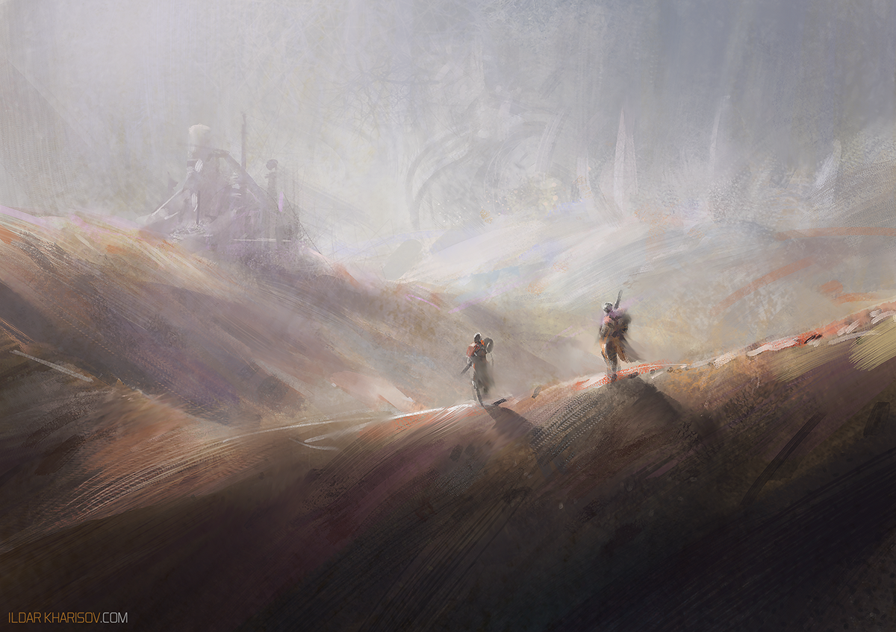

# #100DaysofStory: 006

    REP-006 ~ Makeshift  

- [#100DaysofStory: 006](#100DaysofStory-006)
  - [Wednesday, June 19, 2019](#Wednesday-June-19-2019)
    - [MnyKin - Intelligent Machines (Alon Mor Remix)](#MnyKin---Intelligent-Machines-Alon-Mor-Remix)
  - [Makeshift](#Makeshift)

---

## Wednesday, June 19, 2019

| Time  | Total | In    | Out   |
| ----- | ----- | ----- | ----- |
| Prep  | 00:40 | 21:45 | 22:25 |
| Write | 01:05 | 00:05 | 01:10 |

### MnyKin - Intelligent Machines (Alon Mor Remix)

## Makeshift

The wind whipped over the sparse hilltop, kicking up a steady stream of miscellaneous miniscularities that flowed into the leeward valley below. His primary focus was trained on the narrow path and the quickly desintegrating footsteps of his partner, who he kept between three and five meters in front of him.

Thus, he had his visor tilted down, which had the added benefit of keeping the sun out of his eyes—though the active nanomatter in the visor itself mirrored up whenever he looked up. He had not needed to raise his visor in some time, as a real-time, high-res representation of the landscape around and above him was displayed on the inside of his visor. That nanomatter was some seriously badass tech.

    CWS-006 ~ They're veterans of the Galamianic Wars that no longer fight on the front lines because they went into business together, testing out military equipment and weaponry.

The sensor arrays on the exterior of his helmet gathered far more data than he could ever ingest in real-time. He cycled through the different modes of gathering data, examining the distant ruins as if he were a hundred meters away seeing through the eyes of a shard-eyed Voeler. Then: a Galam soldier, vision tinged with ultraviolet reflections.

The two armoured figures walked, bringing the crumbling towers closer, step by step. Readouts of distances, temperatures, topographies—you name it.

"With all of the tech they managed to shove into these things, you'd think they would've included at least a basic flight system," his partner had said over the radio soon after setting out on foot across the rolling wasteland. "But man do they have a slim profile."

"Very light. Great action." He hopped around, throwing his limbs out this way and that—as if that was what happened in a real fight. They had sparred briefly to get a feel for the suits, before embarking on the real test. This was their secret sauce.

---- ∫ ----
