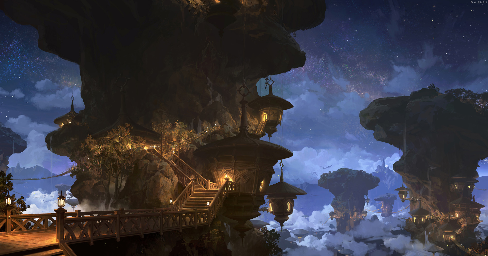

# #100DaysofStory: 008

    REP-008 ~ Ubique  

- [#100DaysofStory: 008](#100DaysofStory-008)
  - [Friday, June 21, 2019](#Friday-June-21-2019)
  - [Ubique](#Ubique)

---

## Friday, June 21, 2019

| Time  | Total | In    | Out   |
| ----- | ----- | ----- | ----- |
| Prep  | --:-- | --:-- | --:-- |
| Write | --:-- | --:-- | --:-- |

[Jacob Gurevitsch](https://jacobgurevitsch.bandcamp.com/) - [Motivo Loco](https://youtu.be/oCgbr6KelgY)

---

## Ubique

The trees had been his entire world once. More than that, really. The tree-like formations where he'd spent his young years had been the only thing he knew during that time. They'd been his entire universe.

He never considered what was beyond those rocks until he could no longer consider staying. Little did he realize the wealth of opportunity that lay beyond the Clynth Crags.

---- ∫ ----

The low clouds were starting to burn off, and glimpses of the turquoise sky beyond could be seen here and there. He sat on the edge of a large rock outcropping situated underneath the Crags but still high up on the mountainside. From here, he had a panoramic view of almost the entirety of the Cynth Flats and the trees that were scattered throughout the space like some giant's rock garden.
