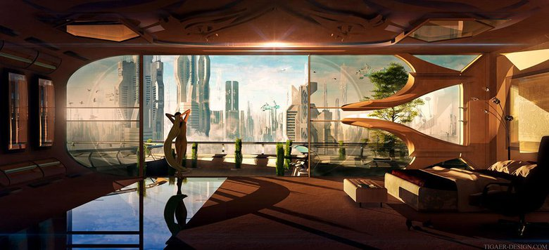

# Bewilder

## #100DaysofStory: 011

### Monday, June 24, 2019

---

Visual Inspiration by [Christian Hecker](http://www.tigaer-design.com/)

Musical Inspiration: Cheshire - [Dream Sipping](https://open.spotify.com/track/6SUYi9rGF3Tvf4BJEqNXVv)

---

## Bewilder

Bewilder: to be suitable to.

---- ∫ ----

As the guest—and because she had suggested that they alternate—the Queen asked Alia to mix the first round. Without waiting for the answer, the Queen touched the middle panel of the elliptical table between them, causing the panel to slide under one of the adjoining panels. The panel completed its motion with a barely audible click while something else began to ascend through the gap.

"Whoa...very impressive, I must say." Alia surveyed the multifaceted machine as it finished rising and clicked into place,base flush with the table's surface. She had yet to hear of a space-faring society that did not have some permutation of this device; Khaonos locals simply called it a dock.

Containers of various shapes, sizes, and colors lined the inside of the roughly box-shaped contraption, while the external surfaces sported arrays of dispensers of all types—faucets, drip tips, hoses, and even an inhaler mask or two. She was sure there were other features hidden within the dock.

---- ∫ ----

"I was curious about the...preferences, of one such as yourself." Alia said, allowing a subtle hint of slyness into her smile as her eyes met the Queen's. "So far, your reputation seems to be well-earned."

The Queen returned her gaze evenly. "I take it you have never been to Solamor." Alia inclined her head in acquiescence as the Queen continued, "That should make this rather interesting."

"Have not yet had the pleasure" Alia paused as she gave the dock a more thorough inspection. She touched a button on the dock and the table promptly responded by presenting a small metal cylinder. "Though it's the destination I'm most excited to visit on my next tour. I'm going to spend at least a few months in system...maybe more."

After popping the top off the cylinder, she reached over to the dock again and pushed a few more of the buttons. She picked up a small bottle filled with a dark blue liquid, and poured a small amount into the cylinder before replacing the bottle. The dock returned the bottle to its place, presenting her with a different container. She repeated the action a few more times, each time bringing the cylinder to her nose and giving it a short sniff before adding the next ingredient.

"And don't worry—I've been planning it for years," Alia said, her hands busy. She grabbed the tip of a hose that protruded from the side of the dock, slotting it into the top of the cylinder. A quiet hissing sound emanated from the dock, the hose moving slightly from the pressurized gas flowing through it.

"Originally, it was going to be my a vacation, with Solamor as a minor stop. But I decided to make it a tour after I began seeing a Solamian client on a...." Her voice trailed off. The hissing was being drowned out by a low rumbling as the Mechanine pack approached their viewing box.

---- ∫ ----

Alia paused her work to watch the spectacle. She caught her breath momentarily as the powerful, sleek machines faced them down, sprinting directly at them as if to trample the entire structure surrounding them—they were definitely big enough. Even with the certain knowledge that such a catastrophe would never happen, her heartbeat quickened.

"Double to top on Myradeon," the Queen said, apparently to no one. Alia noticed numbers and graphs on the overlay change in response to her command. "And keep a lookout for anyone asking five-two or more for Krano midrange."

Alia pulled the hose from the cylinder with a small pop, letting it snake back into the dock. She held it up to one of her ears and shook it gently. She nodded and gave the cylinder a forceful tap against the table. The cylinder gave a sharp crack as she raised it again, deftly catching the smaller cylinder that dropped from the original.

Two translucent vessels had appeared on the table. Alia considered them for a moment, then reached past them to grab another bottle from the dock, dropping the remains of the original cylinder into a newly-formed hole in the table as she did so. She looked up at the Queen, who was now watching her work with some interest.

She filled a third of each vessel with the contents of the bottle—a shimmering semi-translucent substance somewhere between a gas and a liquid. She then pressed each of them, in turn, into a depression on the dock. The top layer of the liquid hardened into a thin sheet of silver ice, over which she filled another third from one of the dock's many dispensers.

---- ∫ ----

Locking eyes with the Queen once again, Alia smiled broadly, showing off small crystal fangs. The Queen raised an eyebrow, the hint of a smile turning up one side of her lips.

Without warning or breaking eye contact, Alia slid one of the vessels toward the Queen. As it slid, she picked up the cylinder with her free hand, squeezing it before tossing it straight up.

To Alia's surprise—and great delight—the Queen didn't look away as she gracefully stopped the sliding vessel. The Queen lips parted as she began to say something, but was interrupted by a loud retort from above. Alia thought she saw split-second surprise cross the woman's face, though it was quickly replaced by a knowing smile.

They both raised their vessels.

Alie had time to think, _Damn she's good_, before two pressurized capsules each painted a bright turquoise line directly into their target vessel.

The two simultaneous impacts seemed to make a single sucking sound as they passed through the upper layer of liquid. After that, an unnatural silence.

"Let's explore the deep end," Alia said, her smooth voice piercing the taught air between them, causing the Queen to blink. 

The frozen silver began to crack, quickly followed by puffs of blue smoke. Alia sighted through blue smoke rings as she brought the vessel to her face, the Queen following suit.

"Shall we?"

---- ∫ ----

They watched as each other's face was bathed in an explosion of turquoise light and more smoke. They both inhaled deeply, the blueness immediately seeping into their bloodstreams.

After the initial chemical reaction had fizzled out, the two women began to laugh as fractal patterns danced in the turbulent blue air around them.

They both turned to watch the Mechanines complete another lap.

---- ∫ ----
