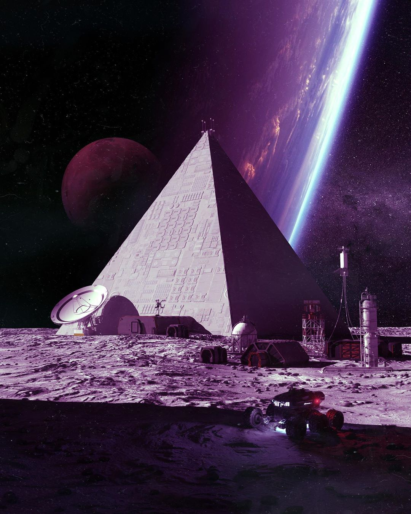

# Hedron

## #100DaysofStory: 012

### Tuesday, June 25, 2019

---

Visual Inspiration: Mike Winkelmann - Moonbase.7 | Musical Inspiration: Kotek - [Communication](https://youtu.be/wzN2gwuFQOw)

---

## Hedron

"Do you think we'll ever stop? We've already come this far...what is there out there that would—or could stop our momentum?" Ruis tapped his gloved thumb against the glass of the rover door on which he was leaning, pointing out into the speckled depths beyond the mottled grey-purple horizon.

Ruis let his arm drop back down to his side, the metal elbow section clacking against the rover's metal door. He stared at his shiftmate, Ando, who stood on the sunward side of the small space, alternating his attention between the foldout touchscreen attached to his arm and the rover's console. He didn't seem to be paying any attention to what Ruis was saying. He certainly didn't seem desparate to contribute to the conversation at this point.

Ruis crossed the room and stood behind the other man, looking out the window at their homeworld. "I mean...just imagine...I mean our history has been so short...yet here we are...what if we continued along our current trajectory unchecked for another thousand years? Another ten thousand years? A hundred thousand?"

Ruis felt the change in temperature as the spin of the moon and the sun brought their parked rover into the shade of another hedron. Obviously that particular conceptual road didn't lead anywhere. Not with Ando, anyways.

"Even through all of this." He focused his eyes on the diamond barrier separating inside from outside, his hand feeling the material drop in temperature. Once the heating elements caught up with the transition, the material returned to baseline; neutral. After Saleph & Co., MFG had brought diamond manufacturing to the masses, the rate of deaths due to atmospheric venting dropped quite significantly. It simply wouldn't do to live or travel in space without being able to look at it.

"We gotta have our windows—always looking out, waiting for our opportunity to explore the other side." Ruis threw a glance in Ando's direction, just in case the man ever decided to respond. He wasn't looking at his screen or the console. In fact, he was taking in the sweeping view of their homeworld.

"See, you're overlooking _our_ ability to adapt to our surroundings," Ando said. "Evolution brought us here—it's not as if we simply stopped evolving when we started writing things down. With the state of our culture and psychology and mental capacity as it is _right now_..." He bent to sit down in the seat in front of the console, punctuating the last couple of words by tapping his stylus on its composite edge. "...we would likely end up stopping ourselves one way or another."

---- ∫ ----
