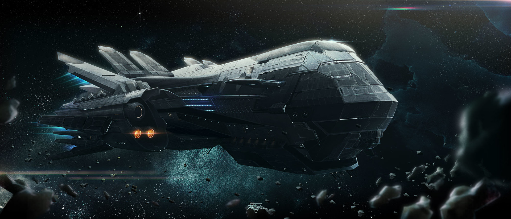

# Supercargo

## #100DaysofStory: 013

### Wednesday, June 26, 2019

---

Visual Inspiration: Kaithzer Morejón - Ayer Spaceship

Musical Inspiration: Parov Stelar - [The Lonely Trumpet](https://open.spotify.com/track/1QyAE58vhI63rsOO4ywD0T)

---

## Supercargo

### Supercargo Baselog - Oltar Besett :: Entry 874-43, 280/331/2488 :: Hypership Ayer Misáhre, Interstellar Hyperspace 

## ::

I wish I were better at this. Time is difficult to keep track of when I have so much of it. I don't even know where to begin. While so much has happened since the last entry, when I sit down to record one of these it all seems to melt together into one swirling puddle of memory.

Guess I can start with what I know. The only reason I know most of this is that I just checked the maincom's database before I started recording.

Currently, I'm the only organic being awake on the hypership Ayer Misáhre. I am always the first to wake up from cold fugue, which I actually enjoy most of the time. A ship always seems to look different without anyone else around. Maybe it's just me and my post-fugue brain. Most things are different right after waking from a deep fugue. For some people, things never return to the way they were before fugue. Luckily that has never happened to me...as far as I know.

Anyways, I thought it would be good to have an entry at least once every standard year, and today is my last chance for this one. According to maincom, it is two-four-eight-eight standard—about to be eight-nine, obviously—three-three-one ship year, and for me it's about to be the two-hundred-eighty-first consecutive year aboard my trusty Misá.

Time flies when you're having fun. Or when you're in fugue...combine the two, and here I am, quite a few standard years later.

She's a good home and a trusty traveling companion. She's taken me through almost every sector in the galaxy, though I can't say that I'd remember most of it. It's easy to pull up a starmap and trace the path we've taken, but to understand what it all means—my mind can't really comprehend the distances we've traveled. I can't even begin to imagine what it was like before hypergrid travel was invented.

But I can try: at subluminal speeds, three centuries would probably only bring me to a handful of different systems. Even the thought of that gives me a shiver of claustrophobia—or...maybe it's cosmophobia...or—I know there's a term for it...

...oh well, I'll think of it later, probably.

The primary purpose for this transit—our particular destination and cargo—is to offload whatever it is that the Converen loaded us up with during our last orbit around their primary planet—a cold, rocky, and altogether uninviting little world called Convek.

Beyond the assurance that whatever we're carrying won't blow up the ship—and as long as the price is right—we don't ask too many questions. Our onboard scanners are very good, as our livelihood—and lives—depends on it. This shipment seems to be mostly raw materials. How boring...

But the contents are not why we do this; a means to an end. Oh!...

That's what it was—the word I was looking for...

Thaasophobia.

...yeah...that was it.

Speaking of, there's fun to be had before the rest of the crew wake up.

Talk to you...next year probably.

---- ∫ ----
