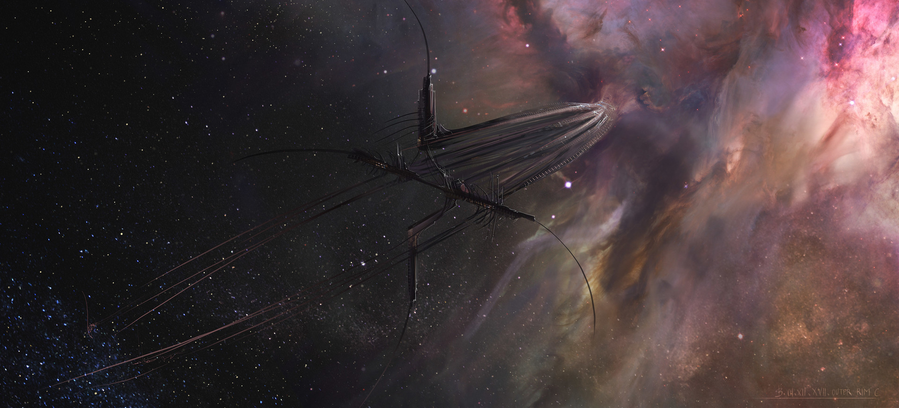

# Aft

## #100DaysofStory: 014

### Thursday, June 27, 2019

---

Visual Inspiration: Barthelemy Aupetit - Outer Rim

Musical Inspiration: Sebastien Leger - [Underwater](https://youtu.be/36t7NOrVmUo) | Township Rebellion - Dolores

---

## Aft

:: Supercargo Baselog - Oltar Besett :: Entry 1306-43, 282/333/2491  

:: Hypership Ayer Misáhre, Interstellar Realspace, Approaching Eno-class Sphere Helion

::

Well...

I'd hoped to write a journal entry at least once per standard. Seems like I failed at that once again.

Back in realspace now, all in one piece. Standard year two-four-nine-one; ship year three-threes; two-eight-two for me.

I haven't given much thought to how long that really is...to how lucky I am to be pushing three centuries on the same ship and to be able to sit here in good health recording this baselog.

::

Okay...I'm...I need to get it out—just going to say it...

I'm not one to be easily disturbed, at least I'd like to think so. I've seen plenty of starships in just about every state imaginable, from shiny scratchlessness to shattered scatteredness. I've watched thousands of bodies spray in all directions from a hypercruiser with a punctured hull and a propulsor gone haywire.

Those were the early days of hypertravel. I'd like to think that, in general, teknologue is at least marginally better now. Although I still consider Misáhre as "technically" the same ship, we've made improvements across the board, reaping the various teknologue advancements of the galaxy.

Upon our transition back to realspace a few light-hours from our next stop, EnoSphere Helion, everyone aboard Misá got a calvarous reminder of the risk we take—the ultimate risk—as hypertraders.

::

No—I know I'm not easily disturbed. No one can travel across the galaxy and back over the course of three centuries and not see some fucked up shit. That's not to mention the loneliness that sets in on a decade jump, light-years from the nearest...anything.

Light-years aren't the best way to look at it, as organic minds have trouble ascribing any meaningful distance to the term. I think saying it that way helps us to ignore the enormity of the space between systems. The space between any significant amount of matter, really.

Trillions of kilometers.

That gives it slightly more gravity—no pun intended.

There I go, doing what organics are good at. I've never heard of a machine making a joke—or trying to, anyways—in hopes that they won't have to face cold galactic truths. Not even a machrobian, though it's not as if I'm even close to up to date with things on a galactic scale. Even a millenia-long life of doing so during every waking second wouldn't be enough. 

::

Flying through realspace at barely subluminal speeds—no. That's also too abstract to portray anything reasonably close to reality.

A billion kilometers per hour—my trusty Misá can push a billion kilometers per hour...that's a little better.

Just stop to think about for a second.

::

I think the reason I'm so disturbed by what we encountered aft of transition is...I guess how almost beautiful it was, in a dystopian way. It was also a nice way for the galaxy to send a message that "Even with all of your fancy hypergrid tek, you understand only a insignificant fraction of me."

The hypership was eerily similar to images I've seen of Misá soon after her construction began. A perfect skeleton, floating—if that's even the right word for it—completely stationary a few million klicks out from the transition zone.

The ship had been methodically deconstructed by...something.

Strange things have been known to happen to hypertravelers.

::

::::∫::::

::

:: Supercargo Baselog - Oltar Besett :: Entry 1307-43, 282/333/2491  

:: Hypership Ayer Misáhre, Interstellar Realspace, Approaching Eno-class Sphere Helion

::

Before we lost sight of the skeleton, we gave it one more once over with our entire sensor array.

The image we got back hasn't helped me—any of us—process our thoughts and emotions aft transition.

While, as a whole, symmetrical arrays of concentric struts hadn't moved even a kilometer, the tip of the ship, which was pointing our direction as we fled from it, _was_ slightly farther away.

Well...there wasn't really a tip anymore. The ribs were stripped away—were actively _being_ stripping away as our sensors watched. 

Whatever started the disection was not finished yet. 

::::∫::::
