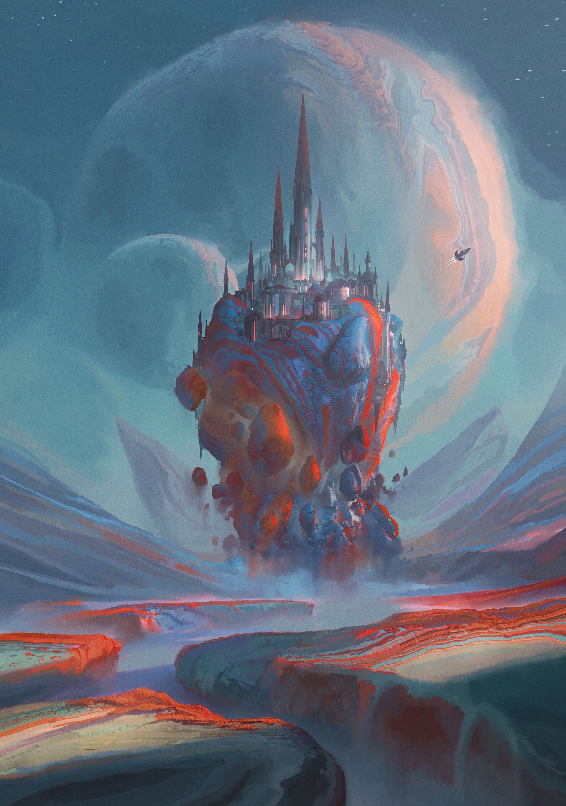

# Esoteris  

## #100DaysofStory: 015

### Friday, June 28, 2019

---

Visual Inspiration: Leon Tukker - Ephemeris

Musical Inspiration: Mahalo & Milkwish - [Social Experiment](https://youtu.be/y_ItE8J40ps)

---

## Esoteris

"I think the blue might be a bit strong," Staz said. He was hanging upside down, his bare knees hooked over the handle of a trapeze which connected to the underside of a archway. He swung slowly back and forth as he considered the blue and red stripes of the munclay, allowing the shifting colors in the distance to blur and blend together in his field of vision.

"You know where I stand on the matter. Contrast like that is..." The other man squinted and widened his eyes a few times as he swept his gaze over the swirling hills and canyons that stretched out below the edge of the terrace. "...nice. Though I prefer it in much smaller doses when it's this close."

He stepped to the edge of the tiles, dropped to his haunches, and ran a hand along the strangely organic surface of the munclay. Staz followed the hand with his eyes, letting his mind wander. As happened frequently around Loele, his mind reminisced on the satiny softness of the short, neat fur that covered the hand and the body it was attached to. It wasn't difficult to remember the feeling of bliss when the fur enveloped him, tickling his bare skin—it'd happened earlier that day.

He let a shiver work up his spine—or down, as it happened. He refocused his eyes as a dark shimmer moved in front of his view. Loele flicked a small ball of bight blue munclay, hitting Staz in the chest and rolling down to rest on the underside of his chin.

Staz laughed, flexing his body to make himself swing. On the upswing, he jerked his chin, the added  momentum make the dot of color float up past his face. Before he was done rising, his knees straightened and he flipped over the flying blue spot, keeping it in front of his face as if it were his acrobatics partner. He landed in a crouching position as he grabbed the munclay out of the air.

He turned around and saw Loele standing at the furthest point of the terrace, his toes curled over the edge of the tiles and his arm outstretched in front of him, a brilliant red circle between two of his fingers. 

"See, you start losing the pastels at around three kilometers. This one though?" He turned his head back to Staz. "I'd give at least ten."

---- ∫ ----
