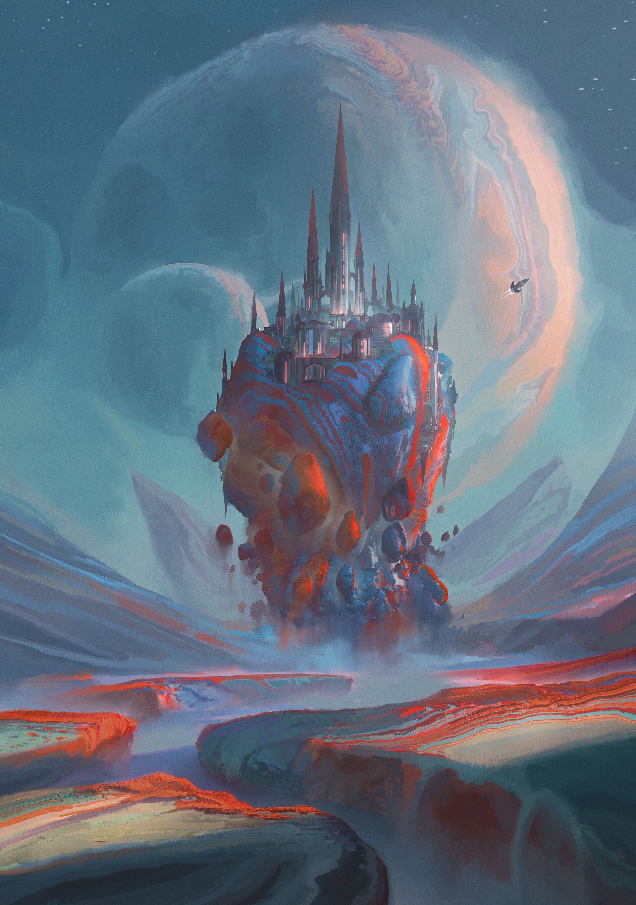

# Humunuclay

## #100DaysofStory: 016

### Saturday, June 29, 2019

---

Visual Inspiration: [Leon Tukker](https://www.artstation.com/leontukker) - [Ephemeris](https://www.artstation.com/artwork/JlZE3Z)

Musical Inspiration: Space Ranger - [Galactic Spice](https://open.spotify.com/track/6zR3r0pDnS2P3V8zIxRlAf)

---

## ::::Humunuclay::::

From far enough away, the strange arrangement of cosmic bodies looked vaguely like a collection of several moons of varying sizes. And if the observer was a skilled mental gymnast, the close proximity of the bodies to one another could almost be overlooked.

_Almost._

For nearly three thousand standard, the odd clump of relatively tiny planetary bodies had floated in a seemingly random orbit around the star Nymia, always staying far from other in-system habitats that held any sort of significant population.

They were the seminal work—and eventual home—of a particularly eccentric Opalian artist and engineer, Stelian Opaz. The years leading up to the project were during a time when money was an important societal construct, and material scarcity had not quite been overcome. In fact, the breakthroughs in novel technology and discoveries of exotic matériel made by Opaz and his original team during their initial work on the Munu project played a key role in the societal transition from scarcity to abundance.

Before the project, he was immensely wealthy; after it was mostly complete, the entire society would've been considered immensely wealthy by any other society that still saw the concept of money as significant.

It didn't take long for word of his unique creation spread far beyond the Opalian Proximate, bringing with it a wave of technological and societal advancement. Seen as the progenetor of the movement, Opaz became something of a legend throughout the local cluster, his home system the destination for many interplanetary travelers and pilgrims.

He did nothing to stop this reputation, even helping it in a number of ways. Near the end of the first phase of the project, his contemporaries had taken to calling the colorful worlds Kaleidoglobes. He embraced this sort of thing to the fullest, and ended up changing his name to Kaleido in honor of it.

Though he was eccentric, he was not solitary. On the contrary, he invited those who were interested to live with and be taught by him and the original team, with the stipulation that they had to contribute to the project and community as much as the original team. Many ended up building their own small worlds in the cluster.

The Phantasma Munu was also the venue for parties and festivals of an unprecendented scale. Some lasting months and encompassing the entirety of the cluster.

::::•::::

One of the aforementioned inventions was the material that made up the majority of the original Phantasma, humunuclay. It represented a completely new paradigm of organic and inorganic collaboration, greatly accelerating the evolution of both.

The material itself was mostly organic and in its early stages of life had a color and consistency not unlike clay. By themselves, these properties were not particularly interesting. The key breakthrough was the method of integrating advanced syntelligence throughout the substance.

Each atom of humunuclay was a tiny organic robot infused with its own syntelligent mind. No significant amount of itelligence could be expected from such a tiny syn, but when bonded together they made up slightly smarter, infinitely reconfigurable molecules.

By the the time the original team had created enough of these molecules to consitute a sphere with a one meter diameter, the collective syntelligence was considered sentient. Once a diameter of tem meters was achieved, the team considered it to be at least as intelligent as themselves.

When the original kaleidoglobe, which still sits at the edge of the cluster (Opaz—now Kaleido—made sure he still had a clear view of the stars), was passed on to the next Stelian Opaz, popularly known as Staz, its diameter was pushing thirty kilometers.

::::{•}::::
