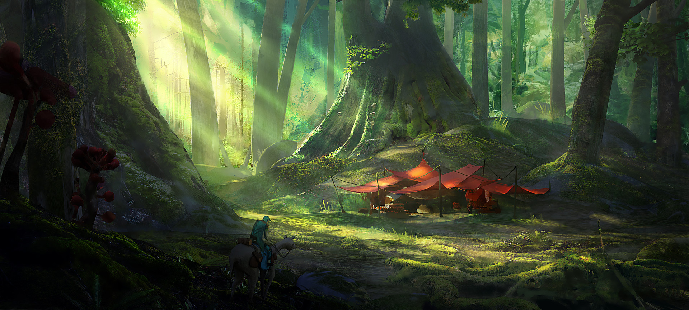

# Advocate

## #100DaysofStory: 017

### Sunday, June 30, 2019

---

Visual Inspiration: Martin Faragasso - Camping in the Woods

Musical Inspiration: CloZee - [Koto (Lazy Syrup Orchestra & Waspy Remix)](https://open.spotify.com/track/71GsJ9KKmLZNAEoSzOVzuk)

---

## Advocate

A legend among the Opalian Ancileas spoke of a mass-migration or, as some of the Ancilea interpreted it, a planetary pilgrimage that took place far back in the depths of time. According to the legend, the Opalians did not originate on their namesake, Opalia. The story tells of how their evolution began on Laene, the sister planet to Opalia.

While neither of their orbits are perfectly even, Laene's orbit is tighter than that of Opalia, bringing it closer to the star Nymia on a normal cycle. Once the orbits of the two planets could be precisely calculated, it was discovered that once every eighty-nine-centuric cycles, the orbits of the two sister planets bring them into relative close proximity to one another.

General interest in the ancient myth was reinvigorated once this discovery was made widespread. While the method of the migration was rarely agreed upon, neither among the ancient Ancilea nor the modern scientists, all of the various interpretations of the myth gave the same reasoning for why might have happened.

The legend describes a great and terrible extinction event on Laene soon after the entire population of ancient Opalians migrated to Opalia. The majority of modern scientists agreed that it was likely a solar flare during the planet's closest transit, which, as it was also discovered, was supposed to take place within one-centuric cycle of the two planets' proximate orbit.

---- ∫ ----

One of the common interpretations say that the ancient Opalian civilization was brought to Opalia from Laene by an alien starship. However, the only evidence the believers of this theory could point to is a spattering of ancient crystalline artwork which include a drawing which they say must be such a machine. Other interpretations tended to include some permutation of the idea that the entire continent on which the ancients displaced from one planet onto the other by gravitational forces—or as the pre-scientifics believed, by a watchful godsprite.

Another point that was generally agreed upon was the myth's explanation of how Opalian evolution was forever changed by this event. Supposedly, the Opalian's knew—or were told—to shelter underground for a number of centuric cycles while the fire burned the surface of all the planets in the system. Following the proximate encounter, Opalia's orbit takes it further away from the sun than usual, which allowed the subterranian communities to survive.

It is said that the event caused much of the organic surface of Opalia to burn up, revealing the vast crystalline tectonic layers beneath. The light energy from the event still penetrated through the crystals, hitting the shelters beneath where the Opalians lay in hiding. Before the concept of evolution became widespread, Opalians believed this to be the reason their eyes resemble the crystalline tectonic plates of their namesake.

---- ∫ ----

Although modern Opalians believe the story to be only a myth, Laene remains a sacred place. As such, the now-forested planet was never developed into anything more than a sparsely interconnected network of primitive villages. Ever since Opalians achieved space travel, it has been a tradition to spend time amongst the giant, majestic trees of Laene.

Far from the advanced technologies of mainstream Opalian, individuals or small groups explore the vast forests and plains on foot, building their own primitive shelters with tools made by hand from materials local to the area.

It was during one such pilgrimage, in an isolated part of the great forest, that a particular Opali infant was born.

Her name was Arsena.

---- ∫ ----
