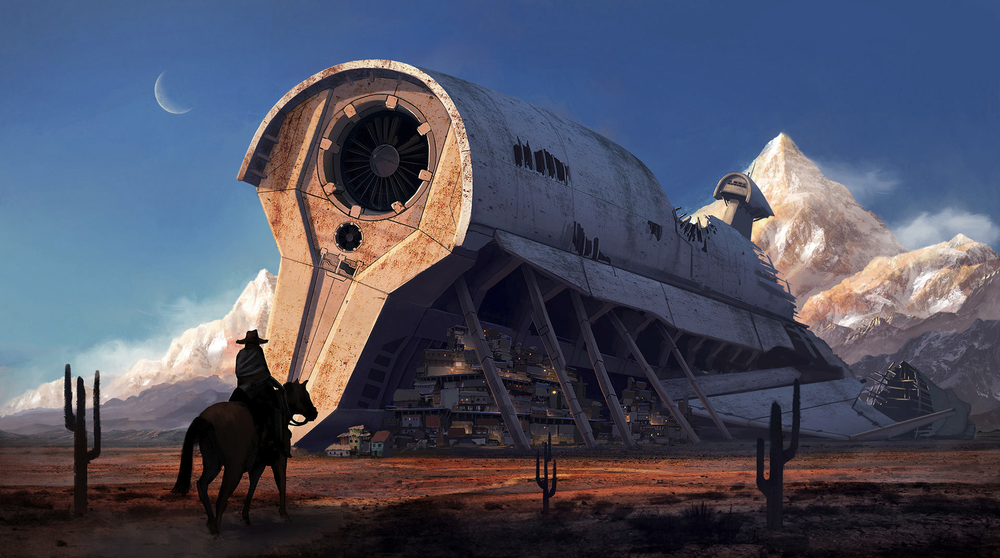

# Lazaret

## #100DaysofStory: 019

### Tuesday, July 02, 2019

---

Visual Inspiration: [Maksym Harahulin - Village](https://www.artstation.com/artwork/kQNPA)

Musical Inspiration: [Sound Nomaden - Savanna](https://open.spotify.com/track/1lg75QqjuIhvT3rqD4Ml2r)

---

## Lazaret

Lazaret: space in ship between decks used for storage.

---- ∫ ----

He was getting closer.

The red-orange sun had begun the downward marathon toward the sharp peaks. Compared to the Rider's old homeworld, this planet took longer to spin on its axis, and so the sun seemed hardly to move at all. Days and nights dragged on

While his exploration undoubtedly took far longer than it would if the various landcraft aboard the ship functioned, the slow pace of his trusty Mahlljin gave him the time to fully appreciate the natural beauty of his new home.

The pace of life was slower here and the Rider had grown accustomed to it; even enjoyed it. 

---- ∫ ----

He was glad that some of the genebanks aboard Olonor had survived transit and, more importantly, landfall. Without the genetic material of the animal on which he now rode, he'd be doing all of his exploring on foot.

The genebanks were been one of the many small miracles that made—quite literally, the Rider mused—all the difference. After years of floating in complete sensor blackout, the Olonor unexpectedly made a sudden transit back to real space from whatever extra-hyperspatial dimensions the Well contained, only to be sent directly into a highly ionized cloud of cosmic debris. Any of the ship's sensors that may have survived years of bombardment by the mysteriously powerful forces swirling inside the Well were lost in those first days back, along with every other electronic circuit on or in the ship.

They'd only estimated at the amount of time spent in the Well, as even time sensors acted erratically and could not be trusted. The experience of being one of roughly ten thousand humanoids packed into any available space in the raw-hauler for years with now sense of space, direction, or time was not one that the Rider wished to repeat.

However, the majority of them had made it through the Well and onto a habitable planet in mostly one piece. Whenever the Rider tried to imagine the probability of that happening, he would inwardly smile and give up trying to count that high. It was all thanks to that series of miracles, one of which he was currently riding.

---- ∫ ----

The Rider kept on riding. The Rider kept on thinking; imagining. The hulking mass of Rexville now took up a significant portion of his view, framed on one side by one of the planet's moons and, of course, by snow-capped mountains on the other.

The Rider's stare was caught by the crescent that hung just above the top of the hull. Two of the moons always seemed to catch him by surprise, his subconscious mind ascribing the lazy pace of the sun to all other planetary bodies in the system. Compared to it, the planet's eight moons seemed to traverse the sky unnaturally fast, these two in particular. He would look up and one of them would be there, minutes later he would look up again and it would be gone, soon replaced by its pursuer hot on its heels.

While he was glad to have a break from the technology that had taken over all of their lives prior to the Well, it was at times like this he did see how useful it was—if even just to sate his scientific curiousity. Every stellar system was unique, obviously, but now that he called this one home, he wanted to know more about it.

The time would come when the engineers of the township made such endeavors possible once again. Until then, he would live in blissful, semi-ignorant slowness.

---- ∫ ----

They had been working hard ever since their little civilization stabilized. While progress had been slow at first due to lack of certain raw material, he had no doubts they could find what they needed among the rocky peaks. In fact, he had found some of it on this exploration, and was excited to tell them the good news.

The Rider stopped whistling for a few moments as he chuckled to himself. He passed underneath the first of the metallite braces that marked the entrance to Rexville.

The Deep Space Well...they had made it.

---- ∫ ----
