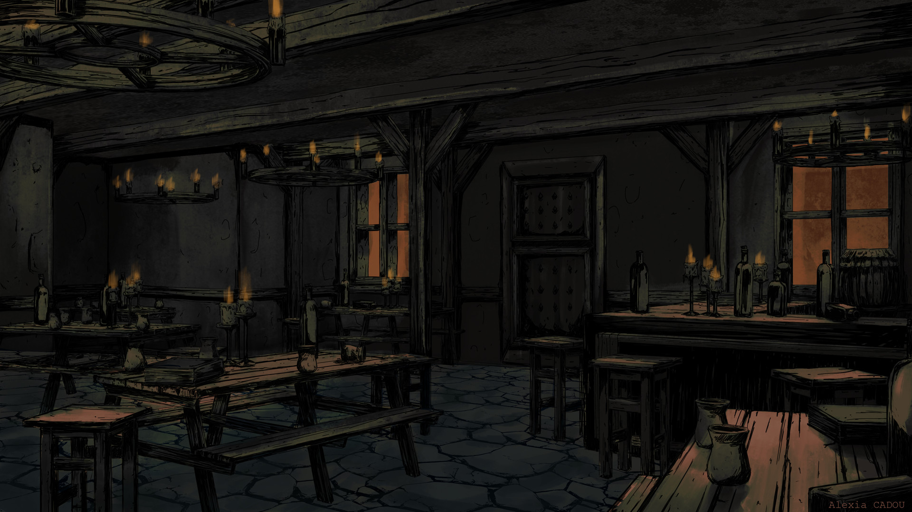

# Ad-hoc

## #100DaysofStory: 020

### Wednesday, July 03, 2019

---

Visual Inspiration: [Alexia Cadou](https://www.artstation.com/afcvisual) - [Tavern](https://www.artstation.com/artwork/NO6Pd)

Musical Inspiration: Serge Devant - [It's Like That (Sebastien Leger Remix)](https://open.spotify.com/track/6Qo6cxBZ6ovjZuobscYtUg)

---

## Ad-hoc

### :::: 1 ::::

The Rider moved along the packed dirt of the Rexville's shaded streets. He wanted to stop at Tavenor for a cold drink or three, but he knew the council would be expecting his report. And this report was more exciting and important than any he'd come back with previously.

What had seen on the explore was another one of those little miracles.

In fact, the report he was about to relay to the steering council may contain the most important bits of information he'd ever carried by himself. If he was suddenly crushed by a falling metallite strut, which was not beyond the bounds of reason, given the state of the mongrel structure under which he now rode.

He looked up at the mess of metallite that was once a majestic raw-hauler. Light from the local star shone through the outer hull in places, illuminating broken and bent pipes and trusses. The Rider had watched as they all bent in the same direction as the ship rammed through the dozen or so mountain peaks on its way to the valley floor, each successful impact slowing the ship marginally; offsetting different sections of the ship more and more.

It was a miracle he had been strapped to the wall in the precise location that he was. Out of the two hundred or so that had been occupying the same lazaret as him upon landfall, only a handful had survived. He watched as they were crushed and mutilated by shifting metallite and falling debris. Or by not having strong enough straps and being flung against the aft bulkhead in an apparent burst of intense gravitation.

The Rider shook his head, returning his gaze to the buildings in front of him. _This was no little miracle._

This was something big. This could be everything. _This will change everything._

He needed a few minutes of unrelated conversation to loosen his tongue.

_This calls for a drink._

### :::: 2 ::::

"The explorer returns!" The large man behind the counter grinned broadly, waving one of his overly large hands to the newcomer. The Rider pushed the door shut behind him, cutting off the slice of outside light that he had brought with him into the ground-level building. He took in the familiar interior as he removed his mask, barely able to make out the bar as his eyes adjusted to the gloom. He welcomed the cool darkness.

"Good to see you, Rall," the Rider said as he made for the bar and the line of seats in front. The other man who sat on a high-backed stool did not turn around as he approached. "Evar, you as well."

Evar looked over as he sat down, a look of barely unbridled glee on his face. "Nyle! Hi...umm...good to see you," the man coughed, seeming to stifle a laugh. He cleared his throat, composing himself. "Looks like you just came in. How was the explore?"

"I'll tell all about it later," Nyle said, taking off his hat. He sat down on another high-backed stool next to Evar, placing the sweat-rimmed hat on the counter next to him. "Right now I am in dire need of refreshment."

Rall grinned even more broadly, which Nyle had doubted was even possible. The man's thick teeth seemed to shine, even in the relative darkness. Rall reached under the counter, giving Evar a knowing look.

"Am I missing something here?" Nyle said, looking back and forth between the two mischevious faces. "Or are you really that happy to see me?"

Evar said nothing, laughter simmering just under the surface.

Rall casually jerked the two arms that had reached under the counter and two shining glasses shot up in front of him. The two hands attached to his primary set of arms caught them easily, spinning each expertly a few times on the broad palms.

Nyle's eyes widened, following one of the glasses as it was brought to a tap and filled with a frothing blue-green liquid. "I see..." He looked back at Evar, a stupid smile spreading across his dirty face.

"Just finished the first ones yesterday. Knew you were coming back so we waited to bring 'em out," Evar said, his eyes sparkling. He raised 

Rall placed a glass in front of each of the seated men, laughing as he watched Nyle cycle through a several emotions in quick succession. Rall passed a third glass to a primary hand, filling that one and holding it up in front of him.

"Glad you made it back to the wreck without turning yourself into one in the process."

They clinked glasses for the first time since before the war began, and drank deep.

### :::: • ::::
