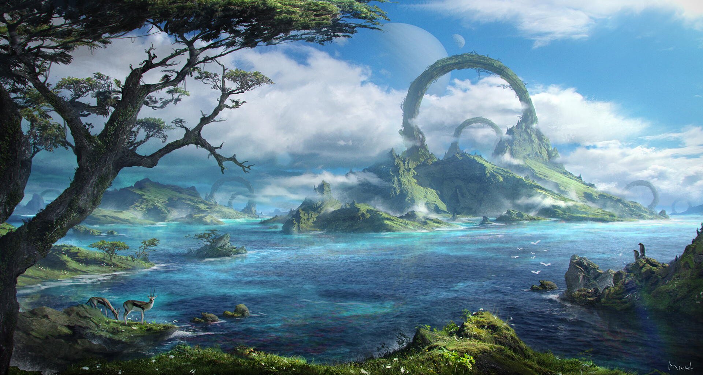

# Pareto

## #100DaysofStory: 021

### Thursday, July 04, 2019

---

Visual Inspiration: Luka Mivsek - [Fantasy Landscape](https://www.artstation.com/artwork/Ka41VW)

Musical Inspiration: Moontricks - [Home](https://open.spotify.com/track/2eII7kQp92E20ijKxRVcDK)

---

## Pareto

### :::: The Missing Link ::::

A hush suddenly fell over the room. Ten faces were facing his direction rapt with attention. He hadn't taken a break from drinking Ralsbier out of glass—_real_ glass—to be ignored by a room of bickers.

"Now, it doesn't matter much what any one of you thinks. They are what they are." Nyle scanned the room with dark eyes partially hidden behind lowered eyebrows. His eyes searched for the one who dared interrupt him this time. "All I can say is that I do not believe they are naturally-occuring structures. I say we refrain from making too many assumptions without a more thorough investigation."

"One assumption serious enough to be worth discussing—_after_ I'm through with my report—" He narrowed his eyes even further. Someone coughed. He drew the silence out, to be sure he had their complete attention. "...is that we are likely not alone on this planet. The relics look to have been sitting in their current configuration for some time—millennia, maybe tens of millennia."

He once again let it sink in. He'd been thinking through all of it over the last ten day-night cycles. Plenty of time to imagine what the massive ancient architecture was and how it got to be where it was.

"If the civilization that built the rings is still around...well I won't get ahead of myself. But believe me when I say that the things are big; enormous. I'd hazard they are a quarter-klick top to bottom..." Nyle traced the outline of a circle, starting with the tips of the first finger on each hand touching, sweeping them out and down, making them meet again at the bottom.

"Camping at the base of one was...surreal. And there were seven more of the rings scattered around the landscape. Those were the ones I could see from my camp. I'm telling you all, there is something about the place. Plenty of fresh water, game...I was tempted to stay a few more weeks."

### :::: One of Five ::::

"We can't just up and leave," Oloni said. His voice had no particular passion, as if the argument was already over and he was being forced to explain it to a child. The man _seemed_ old, though by most counts, he should still have many years of full life ahead. His hair was short, curly, and had not yet turned completely grey. A few curls that had not yet resigned to drooping stuck out at odd angles and wiggled as he moved his head, which didn't happen as much as it used to. Mostly, he looked at whatever was below and in front of him, whether a table or the ground. When he did look up at another's face, he would slowly move his entire head up as if the effort offended him.

"We also can't stay here and stagnate, wallowing in the broken dreams we brought with us." Carre had given up trying to make eye contact with the man. Carre looked around at those who remained at the conference table. His right eyebrow seemed to always be raised slightly, as if he was using it to drive his focus around the room, his head following where that eyebrow turned.

"There's just nothing left for us here," Carre said, the palm of his left hand automatically rubbing his temple. "Except maybe some scrap metal. But we can always come back for that."

### :::: • ::::
