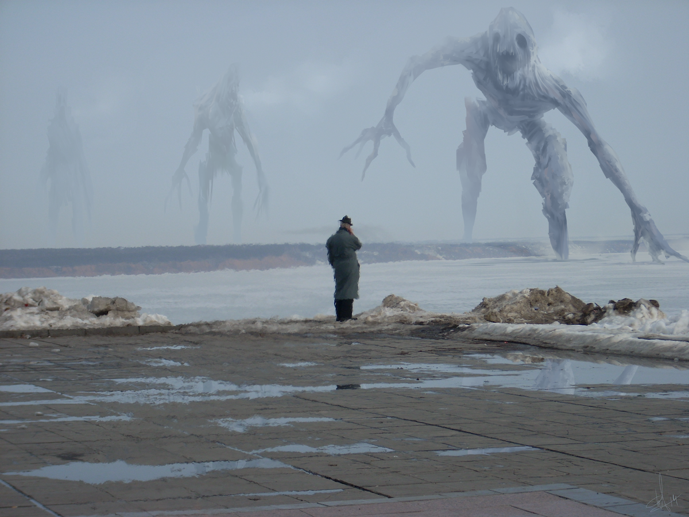

# Phenomena

## #100DaysofStory: 022

### Friday, July 05, 2019

---

Visual Inspiration: AndyFil - [Monsters](https://www.deviantart.com/andyfil/art/monsters-432250860)

Musical Inspiration: deadmau5 - [Whelk Then](https://open.spotify.com/track/3C2EoVLfPVajaocjUBlooV)

---

## Phenomena

He stood at the edge of the tiles, smoking another cigarette, watching them as they came. Every time they pulled a limb from the swamp, it made a sucking sound like a thick knife being pulled, slowly and begrudgingly, from flesh.

It was not an altogether pleasant sound, though it was one that Simof could almost pretend was coming from something natural. His eyes told him a different story; they were by no means natural. Supernatural, maybe—though that wasn't quite the right term either.

Super creepy, that's what they were.

He wouldn't want to hear that noise in the dark of night while camping behind enemy lines. Actually, he wouldn't want to hear that noise at all. But he had to be here to observe and bring information on the project back to his Dommo. He would much rather be able to see the things coming in broad daylight.

They made him sick to his stomach.

His cigarette was helping. He was not sure he would still be able to stand here with the things advancing on him, sucking step by sucking, god-awful step, if he didn't have his favorite brand of dispack to continuously feed him the tight little rolls. They could've been the only thing anchoring him to reality.

To say they calmed him down is the understatement of the year standard.

:::: • ::::

They were slow and loud, not suitable for most battlefields or even most types of warfare. These were more a psychological weapon than anything else. He would be having nightmares about the things—these..._monsters_—for weeks if he didn't take anything to prevent them.

Plus, without ample marshes such as the Fens, which took up close to ten percent of the entire world of Domari Septum, the monsters didn't last long. They began breaking down immediately upon leaving the wetland.

No...they will have only a very narrow use-case.

Transportatation would also be an interesting problem. While ships with the capacity to carry one, or even several, of the ugly beasts were common enough, the liquid would pose something of a more difficult problem. He guessed that if the tanks used to transport them were pressurized, the things may not come out the other side in one piece.

That was another thing about them—they were relatively fragile.

Simof slid the hatch of the dispack and put the fresh cigarette to his lips, dragging hard as the pack lit the tip for him. He slid the dispack back in the inside pocket of his coat, and continued to stand, watching the things slowly approach.

:::: • :::: «•» :::: • ::::
