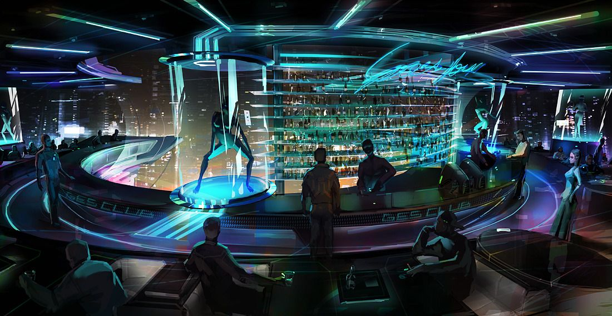

# #100DaysofStory: 023

    DRAFT-023 ~ Namantine  

---

## Saturday, July 06, 2019

| Time  | Total | In    | Out   |
| ----- | ----- | ----- | ----- |
| Prep  | 00:29 | 13:11 | 13:40 |
| Write | 02:10 | 13:50 | 16:00 |

Visual Inspiration: Michael Lisowski - [Spacebar](https://www.artstation.com/artwork/AL6X)

Musical Inspiration: Gab Rhome & Mark Alow - [Microbioma](https://open.spotify.com/track/2aZ04TmnRhKfqUmlSGHkx3)

---

## Notes

Namantine Blue is the drink that Alia made for herself and the Queen. She had not idea that this was among the Queen's favorite drinks as well as her own. This story is an attempt to give some backstory to how it became Alia's favorite drink. In the process, I hope I can provide a breathe a bit more life into her character. Maybe the next story in the series can be about the Queen's side of it.

    CWS-023 | Idea ~ Stream the race in virtual reality
    CWS-023 | Concept ~ DADA: Data-Analysis-Decision-Action = a spy's thought process

I'm thinking that in order to make Alia's history with Namantine Blue legitimate and interesting, the drink itself should have some backstory as well. Where / when / why did it originate? What substances does it contain and what effect do they usually have on people?

### Setting

:: System ~ Khaonos :: Planet ~ Ophon :: City ~ Cthapaz ::

Begins in the same room where the story left off in 011 ~ Bewilder, a private viewing box overlooking the Cthapaz racetrack.

### Characters

Alia - female Symian living and working in Khaonos.

The Queen - female of an as-yet-unnamed species.

---

## Namantine

Alia brought the shimmering vessel up to her face, allowing tendrils of the offgas to wind into her nostrils. "Unique individuals always have unique tastes."

"You flatter yourself."

"Maybe so..." Alia smiled with a feigned ruefulness. "What I mean is that there is always a story behind someone coming to enjoying a stiff Namantine Blue. It's not exactly an easy experience the first few times, especially if it isn't made to suit you."

"Maybe I'm just one who likes a good challenge." The Queen let her gaze linger for a few moments before turning back to the race. "Still...I'm impressed how well this one sits with me. As you said—unique..." She took a long drag of the offgas, even dipping the tip of her tongue in the shifting froth at the top of the vessel while she inhaled. "Yet, there is a hint of familiarity in this."

"Which could tell me a few things about you," The Queen said. She placed her vessel on the table, keeping her eyes forward as the giant machines once again turned the corner on to the straightaway. Alia could see the almost invisible shiver run through the Queen as the substance made its way through her system. "Any one of which would be intriguing."

Alia had already been planning on telling the story, but she wanted to let the Queen's curiousity grow. Nothing like a little intrique to make the telling of a story that much more enjoyable. The coincidence was too important to ignore. She had taken a huge risk by mixing up a Namantine Blue as the first drink of the night with a new client—the Queen, no less.

At the time, Alia had not even weighed the options. She simply made the first concoction that came to mind. Her centuries of professional experience had given her the intuition of not planning the encounter with the Queen. She was incredibly shrewd—the only way to have a genuine interaction with her was to make it legitimately genuine. Anything less, Alia knew, would bore the both of them.

However, as much as she had prepared herself to be surprised, the payoff from that risk had surprised even her. She had to keep that going; take more risks. She was about to take a leap, but she could not imagine this going any other way. It made sense.

Still, she wanted to play it cool no matter how much she was currently itching to expose some deep secrets. "You flatter me."

---- ∫ ----

Alia was always looking for a reaction from the Queen as she spoke. She was good at using her peripherals, just as she imagined the Queen would be. Alia hoped the Queen had noticed the subtle tinge of blue she'd given her hair, which had been completely black when she first sat down.

She caught herself as she was about to subconsciously release a dose of Intero into her bloodstream. Now was not the time to use her drug glands to supplement. She had to stay on a level with the Queen, though she knew the Queen could be glanding her own supplemental substances.

She doubted it. Blue gave a strong enough experience to not need anything else, at least for a little while. She would let that assumption ride for the time being.

"I'm not one to give secrets away for free," Alia said, turning her head back to the Queen. "Much less my own."

The satiny fur on Alia's chest rose slightly as the Queen turned to meet her gaze, eyes seeming to bring a certain focus. The Queen's attention was almost a tangible force; gravitational.

    CWS-023 ~ The fur on a Symian's body will move slightly in response to certain emotions. While this response wasn't always conscious, Alia was very good at controlling it. Those subtle cues made the difference.

_Gravitas...Damn she is gorgeous_. 

She suppressed a brief flash of disbelief and doubt that threatened to make her question her situation, and continued before the Queen could interrupt, "One hears many rumors, but as of now they remain just that."

Alia brought her other hand up to hold the vessel while fingers on the hand that had been holding it traced the underside of it, condensation wetting the tips' fur. She looked down at it, pretending she had not noticed the Queen's eyes shift slightly up and down. Alia wondered briefly if she knew anything about Symian body language.

She knew what she wanted. Now she had a way of getting it.

_Keep it cool; mysterious...mischevious...?_ She let a little of it into her expression. She raised one eyebrow slightly, using it to bring her eyes back to the Queen's striking features.

When the Queen did not speak for another few moments, Alia went on. "What do you say to dispelling some of the rumors?"

Alia's eyes sparkled with success as the Queen gave a subtle nod.

_Time for more risk-taking._

Alia tapped a panel on the table, and typed a command into the array of buttons that were revealed. A pair of sleek mechanical arms emerged from the wall behind her and the Queen. Alia pulled the visor of their mindscape device down over their face, and saw the Queen do the same through semi-translucent material.

"Before I came to Khaonos, I was, to put it mildly, a very different Symian..."

    CWS-023 ~ To be continued... | I decided to use separate entries to tell each of their stories

---- ∫ ----
