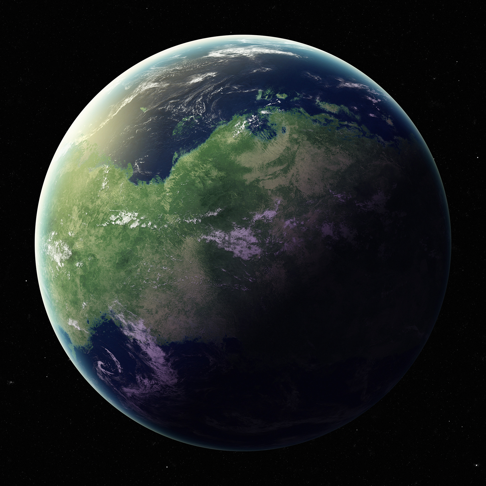

# Substance

## #100DaysofStory: 024

### Sunday, July 07, 2019

---

Visual Inspiration: Jose Mikhail - [Shah'Tula](https://www.artstation.com/artwork/aKOn9)

Musical Inspiration: Sebastien Leger - [Forbidden Garden](https://open.spotify.com/track/4VwM1QAqDLdR2RVzeuG0A4)

---

## Substance

Namantine Blue has its origins on the backwater planet Ferenni, which was the exclusive home of the species Ghryllota. The concoction gets its name from one of the 

A jungle planet, Ferenni was full of noise of all kinds. Transient drips, drops, yelps, and yowls overlayed on the constant background hum of the Ferenni analog of what most of pan-humanity would call insects. The only break from the sounds of the insects came when a strong breeze stirred the leaves or a squall brought enough rain to drown them out.

The vast majority of life on Ferenni lived in or around the vast jungle that covered much of the planet's landmass. In fact, given that most of Ferenni's land mass was concentrated in a single equatorial ring, there weren't many other opportunities for life to find a hold elsewhere.

The layout of land on Ferenni meant that the planet's oceans were both roughly the same size and virtually cut off from one another. This made for some interesting research.

::::•::::

Although the initial report sent back to the Proximate by the Outside agents who discovered it noted that the equatorial ring was indeed 3 separate continents, it was completely possible to traverse the entirety of the planet's equator on foot. The agents had considered doing so upon arrival, but had elected to forego the roughly thirty-thousand kilometer bushwhack. Instead, they did what any good Outside ship would do: they stayed hidden in orbit above the planet for a period of time while evaluating the local fauna. 

The ship stayed hidden by not emitting any electromagnetic energy in the wavelengths that primitive scanners tended to be looking for. They purposefully did not go completely dark, as a species advanced enough to find the energy signature of their ship would be advanced enough for contact anyways.

::::•::::

The Ghryllota would only be considered humanoid if viewed under certain conditions where lighting and sound were both hindered. This was a situation that one would decidedly not want to be around a member of the species, particularly if that specimen was not a friendly one.

The Outside agents sent down to the surface of Ferenni found this out the hard way. Unfortunately for the Ghryllota who happened to be the one that saw them first and therefore the one that attacked, primitive ferocity does not match up against tens of thousands of years of technological advancement.

Normally, Outside agents would refrain from killing a member of the local sentient species. But seeing as the agents on the surface had killed one out of self-defense, they figured they could bring it with them when they went back up the gravity well. The situation provided a rare research opportunity for the crew, and they took full advantage.

::::•::::

No...I know what you're thinking. Outside agents aren't savages, even when it comes to psychoactive substances—surprising, yet true. The concoction the agents invented—or discovered, depending on who tells the story—called Namantine Blue does not contain bits of dead Ghryllota.

At least as far as they knew.

One of the interesting areas of study—which helped keep the Outside ship in orbit for many decades standard—was the absolute motherload of local psychoactive substances. While every planet has their own unique set of substances, Ferenni and its unique geography—and therefore unique fauna—had a spectacularly large array.

Some of these substances had effects that were entirely novel to the agents, and therefore to the entire Proximate. One such substance, which was particularly interesting, is the primary ingredient of Namantine Blue.

What is that substance, if not the liquified exoskeleton of a Ghryllota?

As it happens, this substance was found in a small gourd that was strapped to the individual that was "accidentally" killed by the landfall agents.

::::•::::

