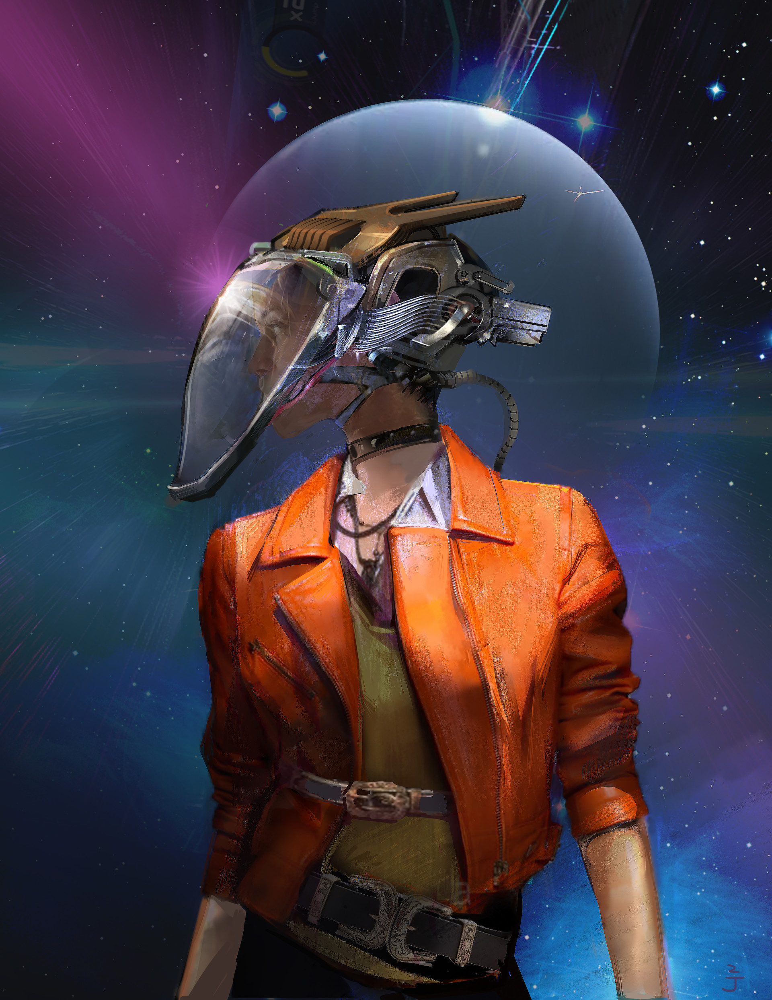

# Mindscape

## #100DaysofStory: 025

### Monday, July 08, 2019

---

Visual Inspiration: Jingjing Cao - [Space Welder](https://www.artstation.com/artwork/k3mOy)

Musical Inspiration: Gab Rhome - [Do Not Grill Inside](https://open.spotify.com/track/0kbUD0WNZDKeObJrlgvzXr)

---

## Mindscape

As the mindscape device began the interface process with her neurolattice, Alia began resculpting the images and other sensory information into a cohesive narrative. Alia wanted to give the story of her relationship with Namantine Blue the depth she knew it deserved. And she wanted to entertain the Queen.

She hadn't revisited this phase of her life in quite some time, though the fond memories were still easily accessed in perfect clarity. The Intero she'd dosed helped with that.

"I imagine I wouldn't have to say this, but just in case—I'd highly recommend an imagenic," Alia said. She spoke very delicately, allowing the mindscape to carry her voice through the lattices of anyone scaped into the session. Right now, it was only herself and the Queen. "Intero is my go-to."

Intero was one of the favorite imagenics in the Khaonos system. It was fairly easy to come by—and fairly inexpensive. She always had a reserve of it in one or more of her glands, in case she was expected to tell a story or to record a memory for safekeeping. The drug heightened the senses and imagination in ways that made the resculpt process much smoother. It generally made her narratives more interesting and entertaining; her imagery more realistic.

The Queen's silky voice appeared the aural pathways of her lattice, though it carried a note of amusement this time. "Who do you think I am, exactly?"

"I think after it's your turn to sculpt I'll know I wouldn't have to ask. But, you never know—like I said, I've never been to Solamor." She had enough of the story sculpted now to begin. "...anyways, ready to dive in whenever you are."

---- ∫ ----

She saw the Queen's hand holding the vessel of Namantine Blue disappear inside the mindscape. The vessel and the hand came back out trailing smoke. She thought she saw smoke rolling out from under the device.

_Of course...wouldn't expect anything less from this one._ Her desire for the Queen only grew.

"Primed." Alia heard a faint cough from realspace. She smiled, imagining the Queen's face inside the scape, swimming in Blue smoke. She could see smoke curling off the smooth curves of her cheekbones, imagined it was the steam rising from sweaty skin, her lip being softly—...

_Shit..._

The Queen laughed, this time allowing the sound to traverse their connected lattices.

That was the thing about strong imagenics—sometimes it was difficult to _not_ create vivid images of one's stream of consciousness. When combined with an active mindscape device, one had to be careful with the content of those thoughts.

Alia felt the fur on her chest raise as she realized the Queen had experienced what she had been imagining. She had not meant to express that level of emotion just yet. Honest mistake. At least she'd caught it before it went any further.

An exogenous image formed on her lattice then, similar to what she had been imagining. The Queen seemed to look into her eyes, a hint of a mischevious smile on her lips.

Alia caught her breath and allowed her hair to take on a deep magenta tint. She streaming the entire response back, adding in the feeling of her fur raising.

As she loaded up the fully-sculpted scape she had prepared, she thought she saw the Queen shudder slightly, her eyelids flicking down for an instant.

---- ∫ ----

Alia wiped the slate clean, clearing out the emotions that had been wafting around her mind like the Blue around the Queen's face.

"I traveled quite a lot my first and second century, sometimes spending decades on worlds or habitats that I enjoyed."

Alia imagined the enormous columns of a rough rocky material coming out of the bioluminescent waters of AyrenPond. The columns continued off into the indeterminate haze ahead of her as she stood on a balcony cut into one of them. Everything seemed to give off a subtle glow, as if the cavern itself were alive.

"This particular phase of my trip had been a complete bust until I found my way to the Insk-Eremme system..."

---- ∫ ----
