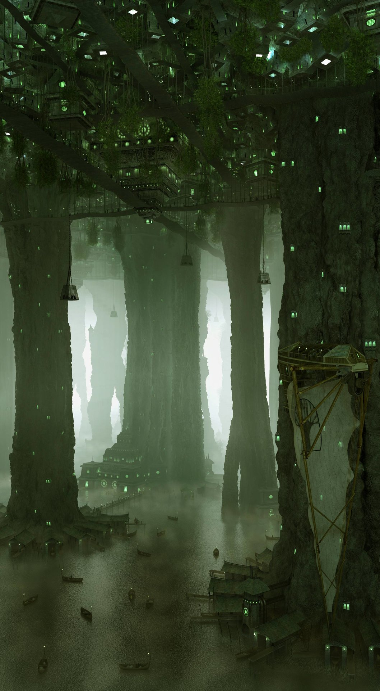

# #100DaysofStory: 026

    DRAFT-026 ~ Deliria  

- [#100DaysofStory: 026](#100DaysofStory-026)
    - [Tuesday, July 09, 2019](#Tuesday-July-09-2019)
    - [Ideabox](#Ideabox)
        - [Notes](#Notes)
        - [Setting](#Setting)
        - [Characters](#Characters)
            - [Kouki Designate](#Kouki-Designate)
            - [Delir(avae)](#Deliravae)
    - [Deliria](#Deliria)
        - [---- ∫ ----](#----------)
        - [---- ∫ ----](#-----------1)

---

## Tuesday, July 09, 2019

| Time  | Total | In    | Out   |
| ----- | ----- | ----- | ----- |
| Prep  | 00:12 | 23:20 | 23:32 |
| Write | 01:16 | 23:32 | 00:48 |

Visual Inspiration: Alexandr Melentiev - [Cave City](https://www.artstation.com/artwork/NyomN)

Musical Inspiration: 

---

## Ideabox

### Notes

Complex numbers | [Quaternions](https://en.wikipedia.org/wiki/Quaternion)

### Setting

:: System ~ Insk-Erimme :: Planet ~ Esqe :: Location ~ AyrenPond Chase | Tashold Archol | Kouki Designate ::

Ayrenpond Chase = Superstructure cavern
Tashold Archol = Column
Kouki Designate = Group

Designates are spaces occupied by groups organized around some sort of theme, idea, skill, or purpose. The groups that organize the designates are themselves designates who specialize in architecture, structural engineering, civil engineering, and other such related fields.

### Characters

#### Kouki Designate

- Alia: female Symian
- Chaka: male Delirevae; one of a set of twins
- Chouko: male Delirevae; the other twin
- Kaida
- Echo
- Bode

#### Delir(avae)

The society that's considered the "main" group in the Insk-Erimme system is a seemingly loose anarchist utopia. However, it only seems loosely organized because the structure has been subtly evolved over the course of millions of years of sentient lineage.

The true-locals to the system / planet are a highly intelligent humanoid species somewhat reminiscent of Earth's monkeys. They are considered by most to be an elder species, because they achieved spaceflight some millions of years prior. After meeting their energy needs by gathering energy from their binary stars, Insk and Erimme, their civilization did not physically expand beyond their home stellar system. 

    CWS-025 | Concept ~ The Now What Dilemma: the Delirevae are on the end of the spectrum rarely inhabited by organic species / civilizations. Upon achieving energy and matter abundance, they confronted the great question of "now what?" and decided to forego physical expansion for internal and social advancement.

However, that is not to say that the species did not continue to advance. Being around for millions of years, they've had ample time to develop supremely advanced technology. The exact extent of their technological prowess is not common knowledge, even among their own members. There are plenty of rumors, most of which exist for good reason, that every single power that has tried to invade or otherwise interrupt their peaceful existence did not so much as land a single missile or laser bolt before being completely and utterly wiped out.

Thus, the Delirevae are usually well respected by their interstellar contemporaries.

---

## Deliria

It took Alia a few years to even start thinking about how she might contribute to the group. Looking back on it, she somehow knew she would eventually find her niche. Her _real_ niche, beyond being a favorite among the Chase party-goers.

That was how this place worked. Some may call it slow, relaxed, leisurely; others...well, they wouldn't understand. While life on Esqe had a certain leisure, it was anything but slow.

Some were simply slow to catch on.

Like most visitors, she didn't understand it at first. Luckily, she had the realization before deciding to leave the world that this place took time. Allowing for that, she could tell there was something to the place. There was _definitely_ something to those that made up the Delir. Maybe that's what she had stayed for.

She came for the sex parties; stayed for the intellectual curiousities.

...and the sex parties.

### ---- ∫ ----

Streams of colorful symbols swirled around the room. Following one in particular, it would detaching itself from the surface on which it had been resting, sweep purposefully through the air—sometimes taking more of a relaxed, circuitous path—to join with others, making what Alia assumed were either sentences or equations, or some strange combination of both.

Alia frequently sat and watched the twins while they worked. She didn't understand the details of what they were doing during these sessions. Simply watching the lightshow was enough for her—at first. Her mind would automatically pick up on apparent patterns, large and small; simple and complex.

    CWS-026 ~ Brainstorm Sessions; Storming; tumult
    CWS-026 ~ Storm: a disturbance (of the atmosphere marked by  ...)
    CWS-026 ~ Storm: a disturbed or agitated state.

Part of what made the brainstorms so fascinating was how the resonant frequencies of certain ideas would bring up in Alia's mind the aspects of the ideas she already knew while simultaneously exposing the depths and interconnectedness that she never knew existed.

After weathering those storms, it was sometimes a harsh transition going back to more common—primitive, she began to realize—forms of communication like speaking or electro-interfacing.

    CWS-026 ~ Paroxysm: a sudden violent emotion or action.

### ---- ∫ ----

Her first big series of breakthroughs came when she was joining the twins on a Namantine Blue-fueled storm that lasted the better part of ten days standard—a little over a week in local days. This was the first time she'd even heard of the concoction, and had been told by the twins to take it slowly at first.

I thought I _had_ taken it slowly. But as they say: your mind, your body, your experience.

The initial phases of the storm were rough and she almost tapped out. Encouraged by the twins to weather on, she eventually broke through, the patterns of the quaternia, octonia which had flowed around her unsuspecting brain suddenly being brought into a focus so sharp and intense she completely forgot where—and who; what—she was.

New dimensions of time and space and...other avenues, too complex to communicate with mere words, had opened—or been revealed—to her.

That was the day her neurolattice began to take shape.

    CWS-026 ~ I want to develop this story further, but it's late (00:45) and been a long day. Hopefully I'll get to it in a later story.

    CWS-026 ~ Just so I don't forget—the idea with the lattice is that it is an advanced method of neural reorganization / optimization that can only be undertaken once a certain level of understanding of the fundamental laws of the universe are understood.

    CWS-026 ~ Definitely more to come on the neurolattice later!

---- ∫ ----
