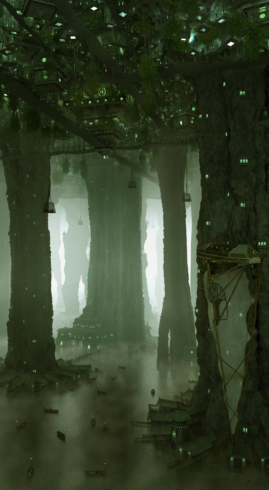

# Deliria

## #100DaysofStory: 026

### Tuesday, July 09, 2019

---

Visual Inspiration: Alexandr Melentiev - [Cave City](https://www.artstation.com/artwork/NyomN)

Musical Inspiration: 

---

## Deliria

This part of Alia's travels had been a bust until she found her way to Insk-Erimme system, the Delir and their unheard-of neural technology.

The society that's considered the "main" group in the Insk-Erimme system is a seemingly loose anarchist utopia. It only _seems_ loosely organized because the societal structure and culture evolved over of millions of years of advanced sentience. The result of such a deliberate evolutionary timeline was a civilization that was at once perfectly streamlined and perfectly disarrayed.

The true-locals of the Insk-Erimme system evolved on the planet Esqe. A highly intelligent humanoid species somewhat reminiscent of a medium-sized primate, though only on the surface and only in approximate body structure, the Delirevae are considered by most to be an elder species. They achieved spaceflight some millions of years before the Symian or Proximate were even sentient. After meeting their energy needs by gathering energy from the binary stars, Insk and Erimme, their civilization did not physically expand beyond their home stellar system.

However, that is not to say that the species did not continue to advance. Being around for millions of years without significant conflict gave them ample time to develop into supremely advanced beings. The exact extent of their technological prowess is not common knowledge, particularly among non-locals. There are plenty of rumors, most of which exist for good reason, that every civilization that has ever tried to invade or otherwise interrupt their peaceful existence did not so much as land a single missile or laser bolt before being completely and utterly wiped out.

Thus, the Delirevae are usually well respected by their interstellar contemporaries.

### ---- ∫ ----

It took Alia a few years to even start thinking about how she might contribute to the group. Looking back on it, she somehow knew she would eventually find her niche within the Delir. Her _real_ niche, beyond being a favorite among the Chase party-goers.

That was how this place worked. Some may call it slow, relaxed, leisurely; others...well, they wouldn't understand. While life on Esqe had a certain leisure, it was anything but slow.

Some were simply slow to catch on.

Like most visitors, she didn't understand it at first. Luckily, she had the realization before deciding to leave the world that this place took time. Allowing for that, she could tell there was something to the place. There was _definitely_ something to those that made up the Delir—those that made up the Kouki Designate.

She came for the sex parties; stayed for the intellectual curiousities.

...and the sex parties.

The Kouki were the best at both.

### ---- ∫ ----

Streams of colorful symbols swirled around the room. Following one in particular, it would detaching itself from the surface on which it had been resting, sweep purposefully through the air—sometimes taking more of a relaxed, circuitous path—to join with others, making what Alia assumed were either sentences or equations, or some strange combination of both.

Alia frequently sat and watched the twins while they worked. She didn't understand the details of what they were doing during these sessions. Simply watching the lightshow was enough for her—at first. Her mind would automatically pick up on apparent patterns, large and small; simple and complex.

Part of what made the brainstorms so fascinating was how the resonant frequencies of certain ideas would bring up in Alia's mind the aspects of the ideas she already knew while simultaneously exposing the depths and interconnectedness that she never knew existed.

After weathering those storms, it was sometimes a harsh transition going back to more common—primitive, she began to realize—forms of communication like speaking or electro-interfacing.

### ---- ∫ ----

Her first big series of breakthroughs came when she was joining the twins on a Namantine-fueled storm that lasted the better part of ten days standard—a little over a week in local days. This was the first time she'd even heard of the concoction, and had been told by the twins to take it slowly at first.

I thought I _had_ taken it slowly. But as they say: your mind, your body, your experience.

The initial phases of the storm were rough and she almost tapped out. Encouraged by the twins to weather on, she eventually broke through, the patterns of the quaternia, octonia which had flowed around her unsuspecting brain suddenly being brought into a focus so sharp and intense she completely forgot where—and who; what—she was.

New dimensions of time and space and...other avenues, too complex to communicate with mere words, had opened—or been revealed—to her.

That was the day her neurolattice began to take shape within her newly-stimulated brain.

---- ∫ ----
