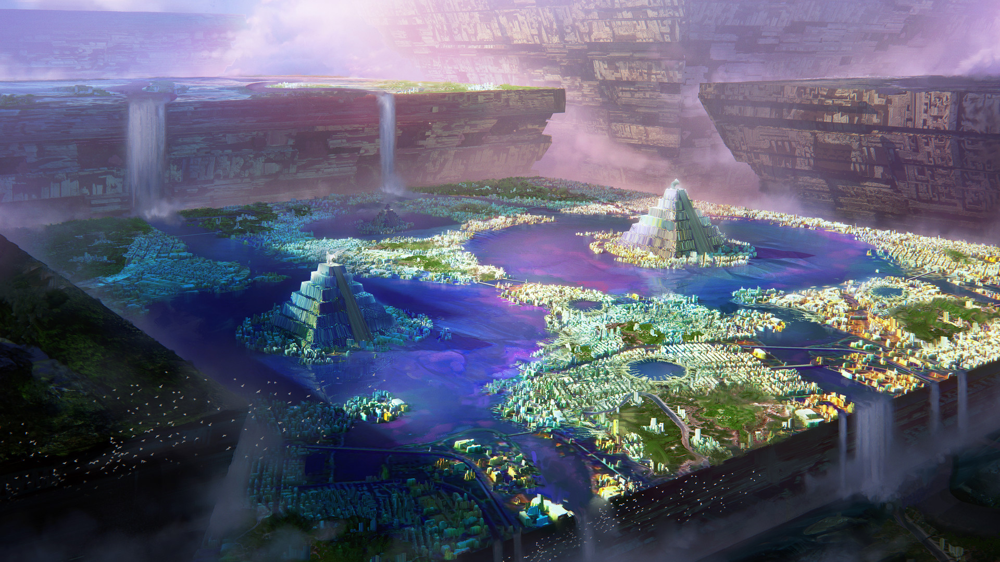

# Mindset

## #100DaysofStory: 027

### Wednesday, July 10, 2019

---

Visual Inspiration: Leon Tukker - [Pyramids](https://www.artstation.com/artwork/gK3ke)

Musical Inspiration: Sanoi - [Conquistador](https://open.spotify.com/track/6VRPYoUZdL35sMrCDMD3PT)

---

## Mindset

Alia was spending time on the surface with two of her friends and desimates. The three of them stood outside enjoying the primal warmth of the twin stars' radiation after months spent in the relative gloom of the Chase. 

The surface of the Aren edifice, a roughly square block of land, several kilometers to a side, that held a couple of picturesque cyaenta lakes and tasteful architecture on the surrounding land. The water flowed out from the lakes, eventually drifting off the edge of the Aren's crust to fall into the AyrenPond below.

The underside of the Aren, the AyrenPond Chase, had been Alia's home for the past few decades standard. Her designate occupied a sizable section of one of the supporting columns that connected the Aren edifice to the floor of the pond far below. The true-locals somewhat jokingly named the body of water a pond, as it could easily be called a freshwater ocean. The water stretched out for thousands of miles under the planet's superstructures, and was commonly referred to as the "real" surface of Esqe. Alia frequently wondered if that surface was yet another false bottom.

---- ∫ ----

The three of them stood on one of the uppermost terraces of a large pyramidal structure situated on an island near the middle of the Aren's Dale. Alia assumed it was constructed from the same rock-like material as most of the Delir's planet-spanning superstructures. Although the material looked ordinary, she knew it was an exotic substance far beyond her scope of understanding.

The building looked like a four-sided pyramid when viewed from the Dale. In fact, the structure was an octohedron; the floor of the Dale bisected the building into two perfect halves, leaving only one of the two visible from the top.

The building's other quadrahedron extended down into the Chase: the cavernous space between the Aren and the pond. The size of the Chase depended on where in its cycle the Aren was at any given time—largest when the Aren was at the top of its cycle, almost a kilometer above the water. At the bottom of the cycle, the Aren's underside was only a hundred meters or so above the surface, just low enough for ten meters of the octahedron's bottom tip to be submersed.

---- ∫ ----

Alia had been told this was how the structure replenished its water supplies, which would steadily flow along and off the Aren to be eventually reunited with the main body. She imagined that it was more of a gimmick than anything else, as the columns connecting the Aren to the surface could surely transport water as well.

However, this process made for more dynamic sub-seasons—a short wet season corresponding to the top of the cycle, and vice versa—completely separate from that of the planet or of the neighboring superstructures.

The Aren had just reached the bottom of its cycle and was resting for a few days while slurping up its seasonal drink. Thus, even from their vantage point on top of the upper pyramid, Alia and her two companions could not see above the edges of the neighboring edifices.

The denizens of the Aren used the occasion to host one of the edifice's biggest parties of the year. Although all of the neighboring edifices also celebrated the bottom of their own cycles, the Aren was famous for its event.

The three friends were taking a short break from the party to soak in the binary sunlight.

---- ∫ ----

Echo leaned on Alia's shoulder as they both took in the dramatic view.

"I'm curious—what is it that keeps you here?...aside from the amazing company, of course." Echo's smooth tail curled up Alia's leg, tickling her inner thigh. She chuckled, the sound coming out more huskily than she intended. She brought herself out of the mild trance. She cleared her throat softly and chuckled again, smoother this time.

"You mentioned that you stayed for a year standard, at the most, in the last several systems you visited," Echo said. "It's been...what?—thirty years standard? And as far as I've seen or heard, you haven't even entertained the thought of continuing your travels."

"The short answer is just as you said—the amazing company." Alia said, reaching down to hold the tail that threatened to derail her thought process.

"The long answer...?" Echo had an idea of the answer, but wanted another excuse to listen to Alia's voice. Alia was regarded as silver tongue of the group, not only because of smoothness her voice.

---- ∫ ----

She was also a singer—and one of Echo's favorite lovers. In fact, Alia was scheduled to perform that night on top of the pyramid on which they now stood.

"Maybe it was unmet expectations...all of the previous ones had been the place to be at some point in their history. By the time I got there, they were in various states of decline. Living there, even for a year, was in some ways a...a valuable experience." She gently grabbed onto Echo's tail and brought the malleable, soft tip up in front of her. 

"Honestly I found the way of life I was leading rather depressing." Alia paused, shaking her head. "Many of the locals had lived that way for their entire lives—as if they...I don't know...were forcing themselves to stay; to suffer."

Alia raised the tip some more to brush it against her cheek, squeezing her legs together, gently trapping the constantly moving tail.

"Everything seemed so backward there. I understand that some civs haven't yet reached a point in their evolution beyond which the ideals that govern a place like this would be possible." Alia hadn't realized her face was stretched into a frown or that her frow was furrowed. She unclenched, relaxing the muscles in her face; her shoulders, her legs. She released the tail, letting it slide back out from between her legs. She sat down on the warm surface, her legs dangling over the edge of the terrace.

"But it seemed like they never truly rid themselves of the residual intrinsic conflict left over from an evolutionary track driven by natural selection."

---- ∫ ----

Alia took a breath. The grey memories were threatening to darken her mood a few shades. She appreciated that Echo had asked, however. In her view, every experience had to be experienced at least twice: once when it actually happens, and once when it is recalled and analyzed. Without the second part of that process, she would be no better than those she had left behind on those worlds.

"Of course suffering can be a good thing. Unnecessary suffering gets to me—is what got to me, in those systems. These people—entire worlds full of them—did not realize the pain they felt _every day_ could be alleviated—it's not like they didn't have the technology, they did—plenty of amazing ships, habs, buildings; you name it."

Echo brought her tail up to rest on Alia's shoulder as the smooth voice continued. "They'd grown so accustomed to suffering I couldn't even bring one of them to notice."

Echo looked down at Alia as she raised her hands and shrugged, the motion enclosing Echo's tail in the nook of her neck. Alia's fur felt like velvet; felt like how her voice sounded. Alia was still looking out over the Dale, though her eyes were focused on something much more distant.

"After a while I knew there was nothing I could do. And...this may sound ignorant—I guess I didn't want to run the risk of somehow being infected by their mindset. You..." She smiled and turned her face up to Echo, her soft hands stroking the sensitive skin on the underside of her tail. "...are much more my style."

---- ∫ ----

A thought came to Alia just then, as she watched and felt Echo's tail curl deftly around her hand. She was surprised it had taken this long for the question to arise.

She turned to Echo, her face inquisitive. "Have you ever left Esqe's gravity well? Or traveled beyond the light of Insk-Erimme?"
