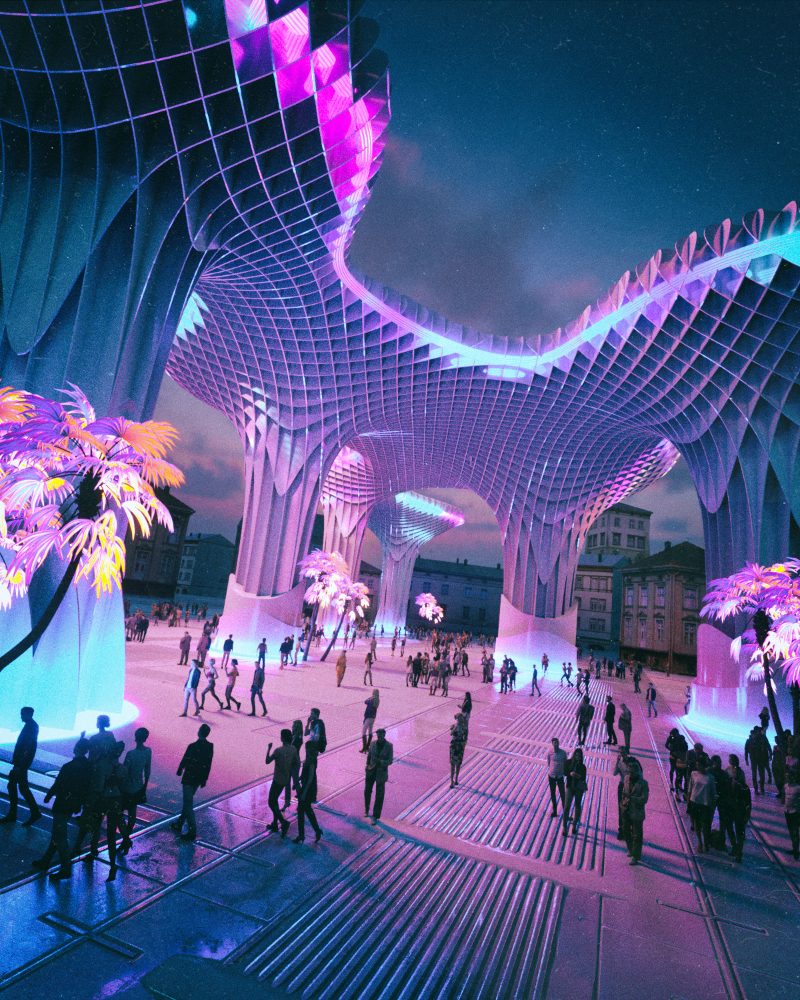

# #100DaysofStory: 028

    DRAFT-028 ~ Artifice  

- [#100DaysofStory: 028](#100DaysofStory-028)
    - [Thursday, July 11, 2019](#Thursday-July-11-2019)
    - [Ideabox](#Ideabox)
        - [Notes](#Notes)
            - [Local-ish Culture](#Local-ish-Culture)
        - [Setting](#Setting)
        - [Characters](#Characters)
    - [Artifice](#Artifice)

---

## Thursday, July 11, 2019

| Time  | Total | In    | Out   |
| ----- | ----- | ----- | ----- |
| Prep  | 00:32 | 13:38 | 14:10 |
| Write | 02:34 | 14:25 | 16:59 |

---

Visual Inspiration: Beeple - [Metropol Parasol](https://beeple.tumblr.com/)

Musical Inspiration: Marley Carroll - [Shiver](https://open.spotify.com/track/7byvvFWcBJ1MHdMyG9694r)

---

## Ideabox

### Notes

#### Local-ish Culture

I'd like to generate deeper details about the Delirevae, the Insk-Erimme system, Esqe, and whatever else is related to the civilization. More detailed descriptions of topics like the languages and culture would do a lot to give the story more depth.

The most commonly spoken language on Esqe, Inskei, can be roughly translated to "between ideas" from the ancient dialect where it gets its name (though the language was built from the ground up in early modern times). The current name of the binary stars, Insk-Erimme, also comes from the same dialect, and has been translated to "between sky", though the word for sky could also be translated to mean "space", "distance", "expanse" or other similar meanings.

In Inskei, the "ae" (aye; or the pronunciation of the vowel in play) phoneme, as in Delirevae, always means something to do with life, living, species, animals, etc. The "ei" (uh-ee) phoneme denotes conceptualization, abstraction, metacognition. Thus the name of the language could also mean something along the lines of "between cognition" or "between sentient minds".

### Setting

:: System ~ Insk-Erimme :: Planet ~ Esqe :: Location ~ Aren Plate :: City ~ Aren Dale ::

### Characters

Today's writing will focus mainly on characterization.

- Alia
- Echo
- Kaida

---

## Artifice

Although Alia had intimate relationships with each and every member of the Kouki crew on a level beyond anything she'd previously experienced in her life, she'd been spending the most time with Echo and Kaida, the two who had sat with her at the top of the tower for the last several hours.

The twin suns had said their grand goodbyes, gracing the superstructure plates with a sunset lightshow. The sunset was another piece of the Esqe experience that Alia did not think about much when living in the Chase, but appreciated all the more because of it.

She sat between her two desigmates, both of which had been consistent lovers over recent years. On the one side was Echo, who was, according to Alia, the most exquisite specimen of a Delir female-equivalent. Curving layers of muscles stretched elegantly over her petite frame, the lines seeming to flow from front to back, from her four primary limbs to the strong yet slender tail that extended from her flawless backside. The tail was almost as long as the rest of her body, and she used it just as easily and deftly as she her forward limbs.

She had been one of Alia's first lovers upon arriving to Esqe, and the primary reason Alia had eventually joined the Kouki designate. Alia liked to joke that prior to her first sexual encounter with Echo, she had been skeptical of the usefulness of a tail in such matters. She said Echo had changed her mind within minutes.

---- ∫ ----

On the other side was Kaida, who was what most would consider human-standard except for a few extra organs and certain structural features that were very unusual for the form. Most notable was the gem-like spots on either side of his head which he claimed allowed his to view a much wider range of the electromagnetic spectrum than eyes alone. A strip of long, flowing hair started at a point between the large eyes on the front of his head and ran the length of what passed as a spine, though was more like a series of interlocking plates and nodes made of a tough, flexible material. Some of the nodes had a small sort of spike on the outward-facing side, which extended out from the skin at regular intervals down his back to intermingle with the voluptuous stripe of hair.

When attending parties of a more comfortable nature, it is common for his species, called the y'Nram or "yin", to expose these appendages by braiding or otherwise tying the hair around them. a relatively new addition to Kouki.  

The spikes were not usually as hard as his back plates, but tended to become just as stiff at times of emotional stress—or, as Alia had found out, during heightened sexual arousal. The stipe spikes were the primary reason Alia referred to Kaida as male, though she knew the yin had nine distinct genders, none of which were quite analogous to the human-standard male. He didn't seem to mind the pronoun.

---- ∫ ----

"One of the atmos engineering groups came up with the idea—oh, I don't know...a few hundred beta cycles ago?" Echo had said as they watched the intense, vibrant colors and intricate patterns in the sky above the setting suns. He waved his hand in the general direction of the dazzling expanse of sky. "So, a relatively new addition. The same designate that invented it has made it happen every day since."

Alia had seen the sunset show many times since her arrival to Esqe, but had been so overwhelmed by the sheer number of unimaginable inventions and attractions that she had never asked about it. At least not in any depth. The one thing she could deduce was that the dazzling colors and elaborate patterns were not a natural Esqe phenomena. There wasn't much left on Esqe that _was_ a natural phenomena. Yet somehow the Delir's ubiquitous technology seemed to have its own natural quality.

"Another addition to my earlier point about why I'm still here," Alia chuckled, shaking her head as if in disbelief, the colorful patterns in the sky dancing back and forth across her field of vision. "Even if I stayed here for a thousand more years I don't think I would even come close to experiencing all that Esqe has to offer. While I guess I thought it was over the top for the first few years, the possibilities—the _myriad_ new experiences provide as much nuance as you would—or could—ever want. It's kept me fascinated for decades, and likely will continue to do so for decades—centuries, probably."

Alia brought her feet up from where they'd been hanging over the edge of the terrace. "Or not...who knows?" she said as she got to her feet. She entended her legs and feet, going up on the tips of her toes to stretch her legs out. "I am also—" her voice stopped suddenly as her attention was drawn across the top of the pyramid by a new source of intense light and color that appeared above the lip of the tower. Standing as tall as she could, Alia could just make out the top of the structure which was giving off the light. It extended far above the short lakeside buildings on the far shore.

Her mouth continued moving even though her mind had abandoned the idea. "...full of surprises." 

Apparently, she hadn't noticed it before because it had not been lit up. Now a significant amount of light was emanating from within the ambiguous shape, washing everything around it in shifting shades of cyan and magenta. The colors precisely matched those of the lake, and the light reflected from the water between Alia and the structure played tricks on her eyes. She stood, wide-eyed, transfixed by the nebulous reflected patterns.

---- ∫ ----

Alia continued to stare into the water below as Echo stood beside her. Alia looked back at Kaida, who was still sitting. "Hey, you two want to—" Alia began, but Kaida had already begun to say something.

"A civilization directing all of its excess productivity inwards," Kaida paused, completely still for a few moments before he brought a webbed hand up and through the short hair of his head stripe. After a few more moments, his expression changed as he said something in his native tongue.

"Just imagine," he said. "If the majority of cosmic civilizations had this...mindset..."

He sat still again, his features a mask of what Alia assumed was concentration. Sometimes his facial expressions and body language flew completely over Alia. This time, however, she knew he was concentrated inwards, scouring his mind for exactly the right words.

As a relatively new arrival to Esqe, he hadn't quite mastered the Delir's language yet. The y'Nram—or "yin", as Kaida called his own species—had a language for which the Kouki crew had coined the term "eccentreloquent". While he had easily picked up the basics of Inskei, the Delir's primary tongue, his mind was always one step ahead of his fluency. Words often failed him altogether as he searched for the perfect way to say what he was thinking.

"Maybe," Echo said, filling the gap in conversation left by Kaida's intellectual wanderings. "No one would be conditioned by suffering."

---- ∫ ----

Kaida had apparently given up trying to express his current thoughts with adequately descriptive Inskei words. He also stood up, his eyes following the gaze of his two companions.

Alia laughed at the thought of an entire cluster full of Insk-Erimmes; of Delir-like civilizations. "Instead, we'd be conditioned by pure overstimulation."

She began walking along the terrace toward the side of the pyramid facing the installation, Echo and Kaida on either side.

"Maybe it wouldn't be as magical."

---- ∫ ----
