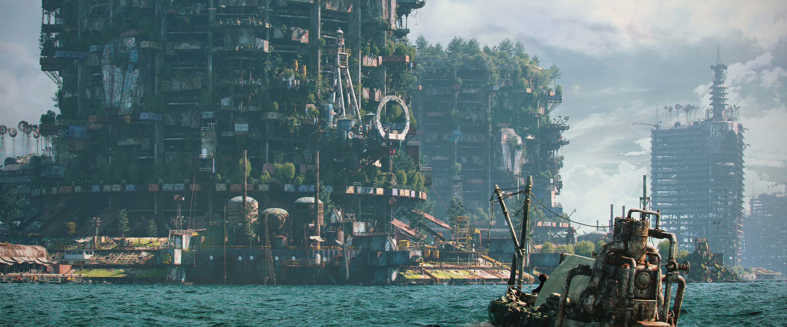

# #100DaysofStory: 029

    DRAFT-029 ~ Isometric  

---

## Friday, July 12, 2019

| Time  | Total | In    | Out   |
| ----- | ----- | ----- | ----- |
| Prep  | 00:40 | 23:00 | 23:40 |
| Write | 01:31 | 23:43 | 01:14 |

Visual Inspiration: Alexandr Melentiev - [City On The Water](https://www.artstation.com/artwork/ywbgJ)

Musical Inspiration: Tim Green - [Her Future Ghost](https://open.spotify.com/track/3ERaLMAXCu1vnUdqntMAoh)

---

## Ideabox

    isometric | ˌīsəˈmetrik |
    adjective
      1 - of or having equal dimensions.
      2 - (Physiology) relating to or denoting muscular action in which tension is developed without contraction of the muscle.

### Notes

Looking through my concept art cache (the Vibrary), I was struck by this artwork for some reason. I'm going to roll with it!

### Setting

:: System ~ Urunque :: Planet ~ Omurin :: City ~ Bellague :: Location ~ Subsur ::

---- ∫ ----

The first thing that comes to mind when thinking about a story for this is for it to be one of the worlds that Alia visited that was less than exciting — depressing, even. However, I'm not sure I want to write more about Alia at this particular moment. So, I am not going to write about one of the worlds that Alia visited, but one that is somewhat similar; has a somewhat similar society, technology, etc.

This world has been exploited to the extreme by the native civ. All of the planetary ice melted, flooding over 90% of the world in salt water.

The chaos and noise of the oversurf setting and the silence of a deepwater dive (though that may not be realistic unless it was really deep or far away) would make for an interesting contrast.

That's it right there.

### Characters

Protagonist - Mon Umet
Antagonist - the constant hum of the salt

I want to portray a character that is going through what Alia brought up when discussing the matter: one who is suffering without realizing it. One way I've descibed a situation like this in the past, particularly as it relates to me trying new things, is to think of a time when I noticed I was being subjected to something only by the absence of that thing. 

There are many analogies for this idea. A good one is some sort of barely audible humming noise that is quiet enough to be mostly tuned out of conscious experience, but which leaves a welcome silence when it stops.

An interesting idea for this story is to use that particular thing that causes the unnoticed discomfort as the antagonist instead of another character. Seeing as the primary setting is a series of artificial oceanic archipelagos, it would make sense that they would constantly have to run their desalinators.

---

## Isometric

    CWS-029 ~ I want to portray the constant noise and chaos of the broken and breaking machinery as a sort of antagonist without explicitly anthropomorphizing.

    CWS-029 ~ To start, the protagonist will be above the surface (abovesurf | parasurf | supersurf | hypersurf | extra)

Everything moved; all the time. 

    CWS-029 ~ Too explicit, yet true. I don't want it to be so noticeable. Yes, everything moves, but how does that translate into the protagonists everyday experience?

Still half-asleep, he made a half-assed grab for the object as it slid off the tilting shelf by the head of his bed.

He missed.

His reaction to a rolling, sliding sound that usually preceeded such a falling object was habitual by now. When things like that happen enough they simply become a part of life.

He knew by the sound that some part of the...whatever the thing was, broke when it hit the floor. Blood pounded in his temples, pain spreading with each heartbeat. It might as well have been his head down there on the floor.

_Shit...shit. Shit, shit....unnnhh—ahhhh._

His back against the wall, he rested, attempting now to focus his eyes on his surroundings.

One thing at a time.

---- ∫ ----

Further deductions were slowly, painfully made by his still drug-addled brain. Some moments later he had the revelation that the object must have been, and still was, somewhat round. He heard it—and maybe even felt it through the wall, as he had sat up and was leaning against it.

Plus, it had somehow gotten loose. He had learned to never leave anything out that could get loose, especially on elevated surfaces. It'd been a very long time since he'd done that.

That means it had been a long time since he'd gotten that drugged up.

_That means I'm starting to slip..._, Mon Paar chuckled, the noise crackling in his dry throat.

_Uuuggghh..._

He pulled the water hose to his mouth and took a drink. Luke-warm tubwater had never tasted so good. His mind reveled in the simple concept of fresh water.

The room he currently occupied was near the meniscus level where the desalination systems continuously chugged up the now-ubiquitous saltwater and provided him with the lovely liquid he swished around in his mouth

---- ∫ ----

A few indeterminate moments into his salt-less daydreams, the building started back down the pendulous cycle, bringing along with it his room with the shelf, the wall it was attached to, the perpindicular surface of the floor, the bed attached to it, the perpindicular wall, and the figure slumped against it.

He slurped another mouthfull of the fresh water before forcing his brain to consider the situation.

_Shit,_ he predicted. His brain managed to understand some of the basic facts about how deep ocean swells work.

_Quite the interval._

He could feel the deep, guttural vibrations of the building as it made its way back down the face of another swell. The enormous metal skeleton of the ancient, restless beast creaked. Saltwater encrusted joints bent and rusted ball bearing sockets rotated.

---- ∫ ----

    CWS-029 ~ Hyparchy and the pararach.

The recovery drugs he dripped into the water hose were working. Now his brain wasn't pounding with every movement of his body.

Now he know what the swells meant—they meant hyparchy; pararach.

Today, he would be going subsurf, maybe even all the way down to the floor.

---- ∫ ----
