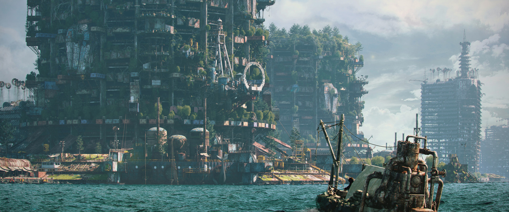

# Isometric

## #100DaysofStory: 029

## Friday, July 12, 2019

---

Visual Inspiration: Alexandr Melentiev - [City On The Water](https://www.artstation.com/artwork/ywbgJ)

Musical Inspiration: Tim Green - [Her Future Ghost](https://open.spotify.com/track/3ERaLMAXCu1vnUdqntMAoh)

---

## Isometric

isometric | ˌīsəˈmetrik |  adjective

1. of or having equal dimensions.  
2. (Physiology) relating to or denoting muscular action in which tension is developed without contraction of the muscle.  

---- ∫ ----

Still half-asleep, he made a half-assed grab for the object as it slid off the tilting shelf by the head of his bed.

He missed.

His reaction to a rolling, sliding sound that usually preceeded such a falling object was habitual by now. When things like that happen enough they simply become a part of life.

He knew by the sound that some part of the...whatever the thing was, broke when it hit the floor. Blood pounded in his temples, pain spreading with each heartbeat. It might as well have been his head down there on the floor.

_Shit...shit. Shit, shit....unnnhh—ahhhh._

His back against the wall, he rested, attempting now to focus his eyes on his surroundings.

One thing at a time.

---- ∫ ----

Further deductions were slowly, painfully made by his still drug-addled brain. Some moments later he had the revelation that the object must have been, and still was, somewhat round. He heard it—and maybe even felt it through the wall, as he had sat up and was leaning against it.

Plus, it had somehow gotten loose. He had learned to never leave anything out that could get loose, especially on elevated surfaces. It'd been a very long time since he'd done that.

That means it had been a long time since he'd gotten that drugged up.

_That means I'm starting to slip..._, Mon Paar chuckled, the noise crackling in his dry throat.

_Uuuggghh..._

He pulled the water hose to his mouth and took a drink. Luke-warm tubwater had never tasted so good. His mind reveled in the simple concept of fresh water.

The room he currently occupied was near the meniscus level where the desalination systems continuously chugged up the now-ubiquitous saltwater and provided him with the lovely liquid he swished around in his mouth

---- ∫ ----

A few indeterminate moments into his salt-less daydreams, the building started back down the pendulous cycle, bringing along with it his room with the shelf, the wall it was attached to, the perpindicular surface of the floor, the bed attached to it, the perpindicular wall, and the figure slumped against it.

He slurped another mouthfull of the fresh water before forcing his brain to consider the situation.

_Shit,_ he predicted. His brain managed to understand some of the basic facts about how deep ocean swells work.

_Quite the interval._

He could feel the deep, guttural vibrations of the building as it made its way back down the face of another swell. The enormous metal skeleton of the ancient, restless beast creaked. Saltwater encrusted joints bent and rusted ball bearing sockets rotated.

---- ∫ ----

The recovery drugs he dripped into the water hose were working. Now his brain wasn't pounding with every movement of his body.

Now he know what the swells meant—they meant hyparchy; pararach.

Today, he would be going subsurf, maybe even all the way down to the floor.

---- ∫ ----
