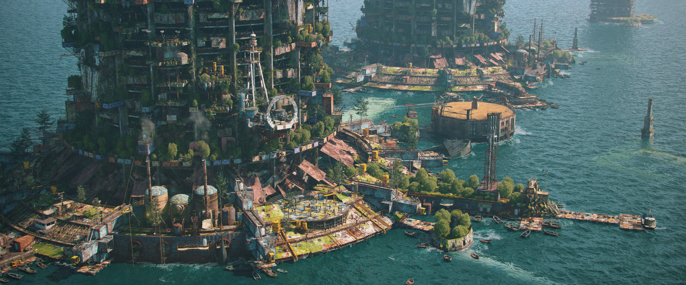

# Subdue

## #100DaysofStory: 031

### Sunday, July 14, 2019

---

Visual Inspiration: Alexandr Melentiev - [City On The Water (Cam 03)](https://www.artstation.com/artwork/ywbgJ)

Musical Inspiration: counsel pop - [fazely industrial estate](https://open.spotify.com/track/575FXJmjel9u9XMXy7lU15)

---

## Subdue

The last time he had been on subduty he was still coming of age.

_Who isn't still?_

---- ∫ ----

The situation rarely demanded subduty and because of the condition of the equipment, it was only done when completely necessary. The sub that all the cadets had to use during the ceremony, Nuuva, which in the Noaic language means something along the lines of "young", was the sketchiest of all of them—which was saying something.

"It's better than no sub at all, Mono," Uvet had explained as the two made their way through the lilting corridors. They were already subsurf, descending to the lowest drop point on the oversized bouy.

The subsurf drop where they were headed was the lowest enclosed section of the bouy, where it connected to the massive chain that anchored it to the sea floor. They were headed for one of the series of outer airlocks that circled the connection point—the upper fixture.

---- ∫ ----

"Is it though? Mono asked as they reached the end of the hallway. Uvet straddled the wheel-handle of a circular portal mechanism that connected the hallway with the hallway below it. He grabbed onto the handle and spun it to release the (hopefully) airtight seal, only succeeding in spinning it a half-rotation before it jammed. He looked up at Mono as he used some force to continue the open-spin. "If the Nuuva had been scrapped a centide ago, which it should have been—" He was interrupted by a loud grunt from Uvet as he strained against the handle, turning it slowly.

"Flukin..." Uvet swore, stood up, stretching his back out before giving the handle a solid kick to dislodge it. "These old pieces of..." He gestured at the floor on the other side of the hole, "help with this, will ya?"

"You sure it's even worth it? Maybe it's rusted shut, or..." Mono broke off what he was saying, looking away down the corridor.

"Or what? This part of the bouy is just ancient—parts aren't as smooth as they once were." Uvet looked blankly at the young boy.

"Nothing," Mono said, moving to the area of floor Uvet had gestured to. "You know a shell of a lot more about these sublevels."

They both kneeled to get a better angle of leverage on the spoked wheel of the locking mechanism. After a few seconds under their combined strength, the handle budged, squeeling its resistance.

"And no..." Uvet said, cords on his neck popping out with the effort, "if the level sprung a leak and is flooded, the mechanism would...not..unnnhhh..." they struggled against the unyielding metal, their grunts mixing with the unhealthy squawk of the door. "...have let us get this far." He jerked his head toward one side of the circular hatch. "...the knobbed spoke would've locked into the topnotch...on the first...rotation...and...we wouldn't be able to...move it...either way."

A long metallic grinding sound ended with a satisfying click.

"Assuming of course," Uvet continued with a short smile, looking at Mono for a reaction, "that the mechanism still works."

---- ∫ ----

They descended, level by level. Gradually, the sounds of the bouy receded above them, to be replaced by the sounds of their progress.

"Anyways, if there were no subs—if the Nuuva had been scrapped centides ago, as you say it should've, there'd be no way to check the fixture all the way down."

The much-younger Mono visibly brightened at the sound of Mono's voice. Something to break the oppressive and unusual silence; a distraction to help drown out the deluge of thoughts that assaulted his mind. The thoughts seemed to fill the silence just as the noise did on the superlevels. He could hear his thoughts clearly without the constant din of the bouy; the desalinators; the powerplant; all of it.

"So then why don't you scrap it?" Mono looked down the hallway, seemingly distant; distracted. "Then you wouldn't have to come down here at all. I don't like it down here—at all. I'va bad feeling..."

"You're joking...?" Uvet said, looking over at his distressed young companion.

"What?" Mono looked back, uncomprehendingly. His expression was slightly confused; worried.

"No subs; no subduty—true." Uvet looked ahead, shaking his head slightly in disbelief. "That doesn't change the fact that the fixture could be damaged or rusting through. No subs; no subduty—no way to know if we're about to be swept along with the currents."

Mono was silent a moment, looking down at the floor a little ways ahead of them as they walked. He tried to make his expression look as bored and nonchalant as possible, with only marginal success. The discomfort was slowly morphing into a deep panic rising from the pit of his abdomen—he heard a slight, high-pitched ringing coming from...he wasn't completely sure. As he focused on the sound, it became louder and louder, threatening to take over his mind entirely. He looked over his shoulder, still trying to look calm and feeling anything but.

"What's so important about this dauv _fixture_—" he drew out the word into a sort of sneer, "—we should go back up—I'm sure it's fine...the swells aren't even that big." His voice cracked slightly on the last word. He walked on, forcing his gaze forward. After several steps he became away of the hard stare and determined silence being directed his way.

They both stopped walking. The last tinny echos of their footsteps died away. Mono seemed to wilt under the combined energy of the stare and the silence that now enveloped them—closing off the world without.

Mono's eyes grew wider; pupils dilated. From Uvet's perspective the boy seemed to visibly shrink in size, unconsciously folding in on himself, making himself smaller.

---- ∫ ----

"Uvet?" The boy said, a distinct note of panic in his voice. "...what's wrong?" He looked back and forth down the corridor a couple of times. "Do you hear the ringing too?" He was rambling, trying to fill the empty space in his universe left by the lack of constant background noise; lack of distraction. He kept rambling, "Almost sounds like when you put yuour ear against the wall on the upper-outer when the heaters start up for the day—but..." He fell silent as Uvet loudly and obviously drew in a breath to speak.

"Your mind is playing tricks. What you're hearing is not a sound—quite the opposite, in fact." The boy seemed to be in a trance, eyes unfocused. "You're experiencing silence for the first time, Mono." He put a hand on the boy's shoulder, startling him. Uvet could feel the boy's muscled tremble.

He knew the feeling.

"The same thing happened to me the first time I escaped the constrant noise of the superlevels." He tried to make his voice sound comforting. "All I can say is embrace it."

"And this _fixture_—" he sneered in comic imitation of the boy's earlier tone, "is the reason we are still here—still alive; still holding our spot of water outside the pull of the currents." His eyes began to burrow into the boy's. "Do you know what would happen—what _did_ happen to hundreds of other bouys just like this one—or nicer..." He let the question draw out into the silence.

---- ∫ ----

"Do you?" He said loudly when the boy didn't reply, the corridor making his voice sound metallic as it echoed.

Uvet took a breath, then another, deeper; a long one. He took his hand from the boy's shoulder, letting it fall to his side.

Mono stook frozen, though Uvet could tell the gears were starting to turn. Now that the boy's mind had something to chew on, he seemed to stop shrinking. His expression changed from one of unconscious fright to one of mild concentration and puzzlement—and unconscious fright, just less of it.

"The Crux..." His eyes grew wide with realization, "I thought they were just a story."

"Just because something is a story doesn't mean it's not the truth." Uvet turned and walked on.

---- ∫ ----