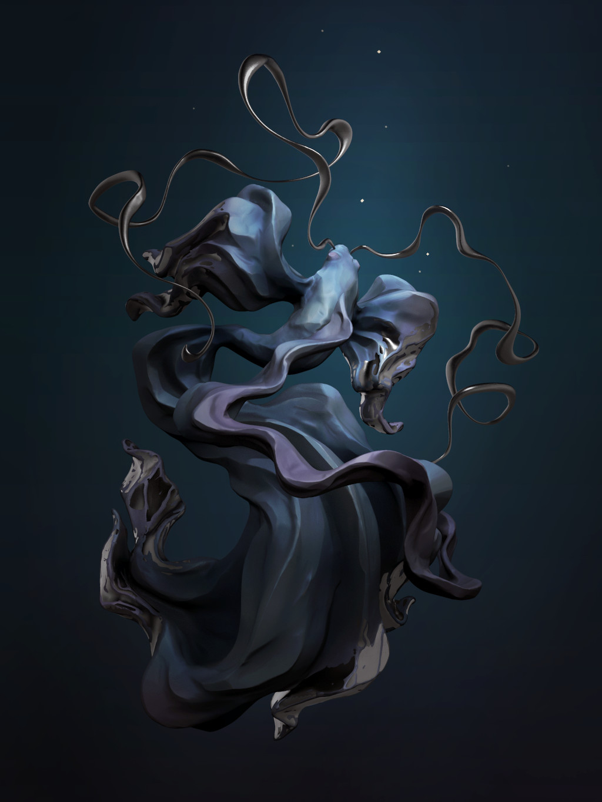

# Focal

## #100DaysofStory: 033

## Tuesday, July 16, 2019

---

Visual Inspiration: Anna Tutova - [Night Fish](https://www.artstation.com/artwork/W2XkZQ)

Musical Inspiration: Jonas Rathsman - [Complex (Serge Devant Remix)](https://open.spotify.com/playlist/0LncUAdqKOvb4S3d6gWBef)

---

## Focal

He looked at the statue of jumping fish at the other end of the hallway, his eyes refocusing and focusing, forcing the light to coalesce.

"What it would be like to sculpt a hard material into the shape of water."

"Your sense of flow must have to be pretty good, to capture one moment of something that is continuous like flowing and splashing water."

"It's called discrete. But yeah, I do agree that is an interesting problem the sculptor had to solve—one that I'm sure took years to get right."

Toleio focused back down the hallway; the sculpture softening, edges becoming blurry. While looking away he would pay some attention to the now-indefinite shape of the statue.

"The most interesting part of that idea to me is the way it makes me view the passage of time for different beings—or material, for that matter."

"Well, then...do you believe that all matter is conscious?" Nialle asked, raising the glass in his hand a looking at it intently. The lurid liquid sloshed around slightly, the top few layers frothing.

"Not all matter is conscious in any meaningful way, in my experience—limited as it may be." Toleio raised his own glass and took a drink of the mazarine-colored liquid. "I was just imagining that if a being or world were made up of more dense material then us or than this world, would we experience time differently?"

---- ∫ ----

He continued to look at his drink. "The concept of time being stretched around dense objects has always struck me as so strange—what about us? We have some mass, so do we bend the time around us in some small way?"

Nialle considered this for a moment. "I don't think the same laws of physics even apply to us—or, more accurately—to black holes, as compared with other, more common forms of matter."

"...like us," Toleio finished. "Well...those fish that were frozen in a slower passage of time than us will probably outlast us both."

---- ∫ ----